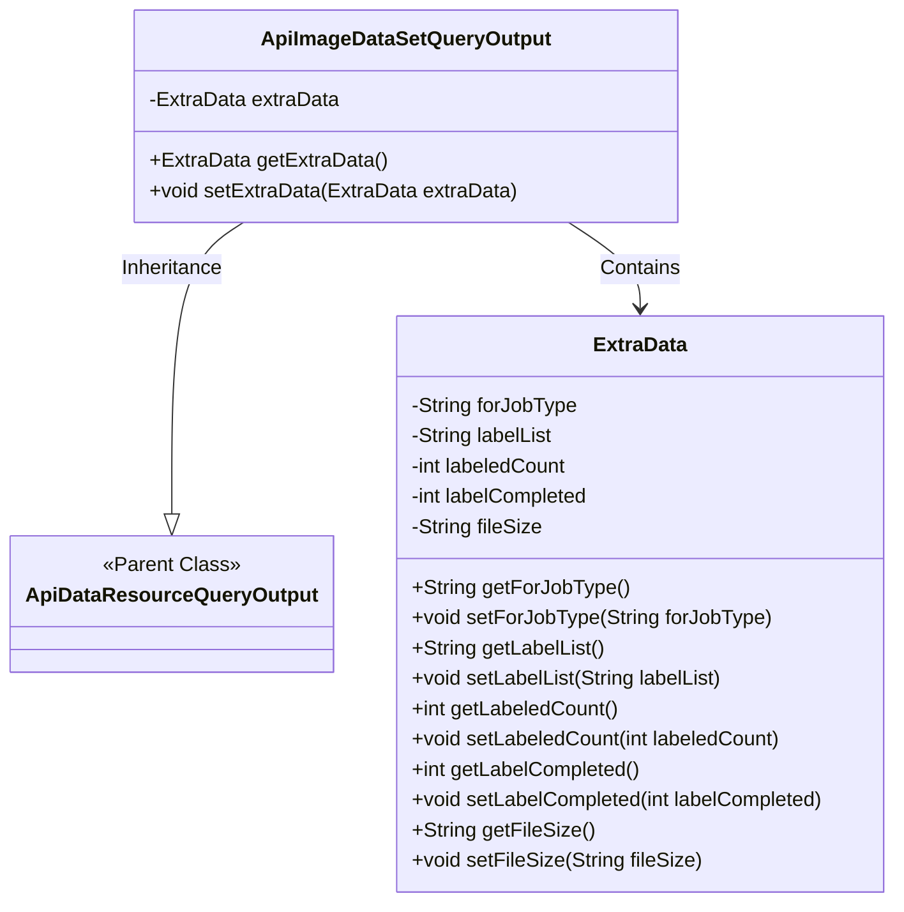
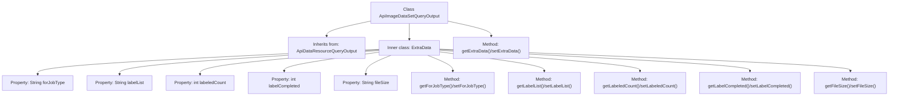

# Basic Information

|      |      |
|------|------|
| Name | ApiImageDataSetQueryOutput |
| Language | .java |
| Code Path | WeFe/manager/manager-service/src/main/java/com/welab/wefe/manager/service/dto/dataresource/ApiImageDataSetQueryOutput.java |
| Package Name | com.welab.wefe.manager.service.dto.dataresource |
| Dependencies | [] |
| Brief Description | ApiImageDataSetQueryOutput inherits from ApiDataResourceQueryOutput and includes the ExtraData inner class, which records information such as task type, label list, annotation count, completion status, and file size. |

# Description

The `ApiImageDataSetQueryOutput` class inherits from `ApiDataResourceQueryOutput` and contains a nested class `ExtraData`. The `ExtraData` class stores additional information related to the image dataset, including task type, label list, annotated count, annotation completion status, and file size. The main class provides getter and setter methods for the `ExtraData` object.

# Class Summary

| Name   | Type  | Description |
|-------|------|-------------|
| ApiImageDataSetQueryOutput | class | The `ApiImageDataSetQueryOutput` class inherits from `ApiDataResourceQueryOutput` and includes an inner class `ExtraData`, which stores information such as task type, label list, annotation count, completion status, and file size. |

## Class ApiImageDataSetQueryOutput

|      |      |
|------|------|
| Access Modifier | public |
| Type | class |
| Name | ApiImageDataSetQueryOutput |
| Description | The `ApiImageDataSetQueryOutput` class inherits from `ApiDataResourceQueryOutput` and includes an inner class `ExtraData`, which stores information such as task type, label list, annotation count, completion status, and file size. |

### UML Class Diagram

This class diagram illustrates that ApiImageDataSetQueryOutput inherits from ApiDataResourceQueryOutput and contains a nested class ExtraData. The ExtraData class encapsulates metadata related to image datasets, including fields such as job type, label list, annotation counts, and file size. ApiImageDataSetQueryOutput holds an instance of ExtraData through composition, providing methods to access and modify the additional data. The overall structure demonstrates object-oriented inheritance and composition relationships.

### Internal Method Call Graph

This code defines an ApiImageDataSetQueryOutput class that inherits from ApiDataResourceQueryOutput, containing an inner class ExtraData for storing additional data information. The ExtraData class encapsulates properties related to job type, label list, annotation counts, and file size, along with corresponding getter/setter methods. The main class manages the ExtraData instance through getExtraData() and setExtraData() methods, with the overall structure reflecting object-oriented encapsulation and composition design principles.

### Field List

| Name  | Type  | Description |
|-------|-------|------|
| extraData | ExtraData | The private variable extraData, of type ExtraData. |

### Method List

| Name  | Type  | Description |
|-------|-------|------|
| getExtraData | ExtraData | The method getExtraData returns the extraData object. |
| setExtraData | void | The method `setExtraData` is used to set the `extraData` property of an object, with the parameter being of type `ExtraData`. |

