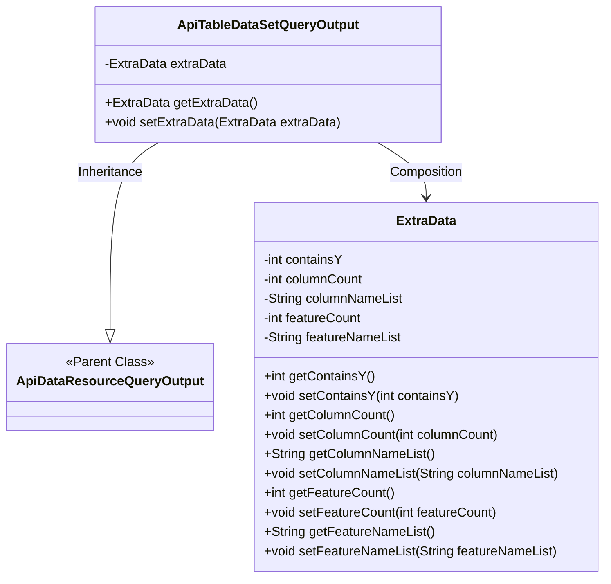
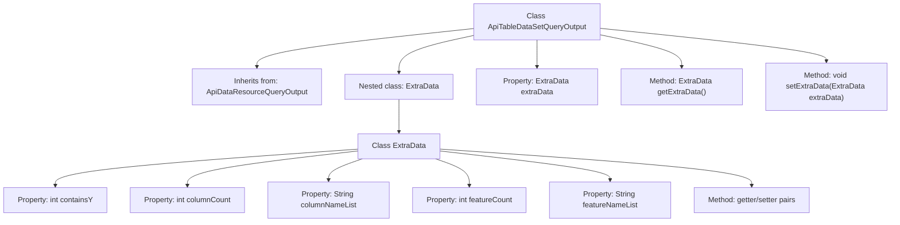

# Basic Information

|      |      |
|------|------|
| Name | ApiTableDataSetQueryOutput |
| Language | .java |
| Code Path | WeFe/manager/manager-service/src/main/java/com/welab/wefe/manager/service/dto/dataresource/ApiTableDataSetQueryOutput.java |
| Package Name | com.welab.wefe.manager.service.dto.dataresource |
| Dependencies | [] |
| Brief Description | ApiTableDataSetQueryOutput inherits from ApiDataResourceQueryOutput and includes the ExtraData inner class, which records the number of columns, number of features, name list, and whether it contains Y. |

# Description

The `ApiTableDataSetQueryOutput` class inherits from `ApiDataResourceQueryOutput` and includes an inner class named `ExtraData`. The `ExtraData` class has five private properties: `containsY` indicates whether Y values are included, `columnCount` records the number of columns, `columnNameList` stores the list of column names, `featureCount` records the number of features, and `featureNameList` stores the list of feature names. Each property has corresponding getter and setter methods. The main class also provides getter and setter methods for `extraData`.

# Class Summary

| Name   | Type  | Description |
|-------|------|-------------|
| ApiTableDataSetQueryOutput | class | The ApiTableDataSetQueryOutput class inherits from ApiDataResourceQueryOutput and includes the ExtraData inner class, which stores information such as column count, column name list, feature count, and feature name list. |

## Class ApiTableDataSetQueryOutput

|      |      |
|------|------|
| Access Modifier | public |
| Type | class |
| Name | ApiTableDataSetQueryOutput |
| Description | The ApiTableDataSetQueryOutput class inherits from ApiDataResourceQueryOutput and includes the ExtraData inner class, which stores information such as column count, column name list, feature count, and feature name list. |

### UML Class Diagram

This class diagram illustrates the structure where ApiTableDataSetQueryOutput inherits from ApiDataResourceQueryOutput and contains a nested ExtraData class. The ExtraData class encapsulates additional dataset query information, including attributes such as whether it contains Y values, column count, column name list, feature count, and feature name list, which are accessed and modified via getter and setter methods. ApiTableDataSetQueryOutput holds an instance of ExtraData through composition, extending the data query output functionality of the parent class. The overall design embodies object-oriented encapsulation and inheritance characteristics, making it suitable for handling structured dataset query result output scenarios.

### Internal Method Call Graph

This code defines an ApiTableDataSetQueryOutput class that inherits from ApiDataResourceQueryOutput, containing a nested static ExtraData class. The ExtraData class encapsulates 5 data fields (containsY, columnCount, etc.) and their corresponding getter/setter methods. The main class manages ExtraData instances through the extraData property and associated access methods. This structure extends the parent class's data query output capabilities by adding table dataset-specific metadata.

### Field List

| Name  | Type  | Description |
|-------|-------|------|
| extraData | ExtraData | The private member variable extraData, of type ExtraData. |

### Method List

| Name  | Type  | Description |
|-------|-------|------|
| getExtraData | ExtraData | Methods to obtain additional data objects, returns the value of the extraData property. |
| setExtraData | void | The method setExtraData is used to set the extraData property, with the parameter being an object of type ExtraData. |

