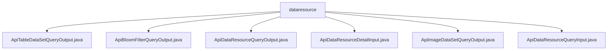

# Basic Information

|      |      |
|------|------|
| Name | dataresource |
| Language | .java |
| Code Path | WeFe/manager/manager-service/src/main/java/com/welab/wefe/manager/service/dto/dataresource |
| Package Name | docs.manager.manager-service.src.main.java.com.welab.wefe.manager.service.dto.dataresource |
| Brief Description | ApiTableDataSetQueryOutput inherits from ApiDataResourceQueryOutput, with the ExtraData class recording column and feature information. ApiBloomFilterQueryOutput inherits from the same class, with ExtraData storing hash functions. ApiDataResourceQueryOutput contains basic resource information. ApiDataResourceDetailInput requires a resource ID and type. ApiImageDataSetQueryOutput inherits from the same class, with ExtraData storing image dataset information. ApiDataResourceQueryInput inherits from PageInput and includes multiple query conditions. |

# Description

## Overview  
The core responsibility of this module is to provide data resource query and management functionalities, supporting a unified interface specification for multiple data types (such as table data, Bloom filters, and image datasets). The interface specification includes an inheritance hierarchy for input and output classes—for example, input classes must inherit from `AbstractApiInput` or `PageInput`, while output classes inherit from `AbstractTimedApiOutput`. Key data structures include the `ExtraData` nested class (for storing type-specific metadata) and the `DataResourceType` enumeration (for identifying resource types). External dependencies include foundational classes from the Welab framework (e.g., `AbstractApiInput`). For instance, `ApiImageDataSetQueryOutput` uses `ExtraData` to store image annotation statuses.  

## Key Business Scenarios  
The module supports full lifecycle management of data resources, with typical scenarios including paginated queries (similar to CRUD patterns), detail retrieval, and typed queries (such as table column information). The interaction model follows a request-response pattern, where input classes encapsulate query conditions (e.g., `ApiDataResourceQueryInput` includes status filtering fields) and output classes carry basic resource information along with type-specific extended data (e.g., `ApiBloomFilterQueryOutput` includes hash function configurations). Integration cases demonstrate polymorphic outputs—for example, image datasets return annotation progress, while Bloom filters return hash algorithms.

### Package Internal Structure View

This flowchart illustrates the structural relationships within the `dataresource` directory of the `manager-service` module in the WeFe project. The `dataresource` node serves as the parent, encompassing six DTO class files that handle different types of data resource queries and output operations. These files primarily define the input and output data structures for API interfaces, covering interaction models for various data resource types such as table datasets, Bloom filters, and image datasets.

# File List

| Name   | Type  | Description |
|-------|------|-------------|
| [ApiTableDataSetQueryOutput.java](ApiTableDataSetQueryOutput.md) | file | ApiTableDataSetQueryOutput inherits from ApiDataResourceQueryOutput and includes the ExtraData inner class, which records the number of columns, number of features, list of names, and whether it contains Y. |
| [ApiBloomFilterQueryOutput.java](ApiBloomFilterQueryOutput.md) | file | ApiBloomFilterQueryOutput extends ApiDataResourceQueryOutput, includes the ExtraData inner class, and provides getter/setter methods for hashFunction. |
| [ApiDataResourceQueryOutput.java](ApiDataResourceQueryOutput.md) | file | The `ApiDataResourceQueryOutput` class inherits from `AbstractTimedApiOutput` and includes attributes such as data resource ID, member information, name, description, tags, data volume, public level, usage statistics, and status. |
| [ApiDataResourceDetailInput.java](ApiDataResourceDetailInput.md) | file | The ApiDataResourceDetailInput class inherits from AbstractApiInput, containing the required fields dataResourceId and dataResourceType, and provides getter and setter methods. |
| [ApiImageDataSetQueryOutput.java](ApiImageDataSetQueryOutput.md) | file | ApiImageDataSetQueryOutput extends ApiDataResourceQueryOutput and includes the inner class ExtraData, which records information such as task type, label list, annotation count, completion status, and file size. |
| [ApiDataResourceQueryInput.java](ApiDataResourceQueryInput.md) | file | The `ApiDataResourceQueryInput` class inherits from `PageInput` and includes fields such as data resource ID, member name, name, tags, and member ID. It supports data type lists, deep learning task types, and status control. |

