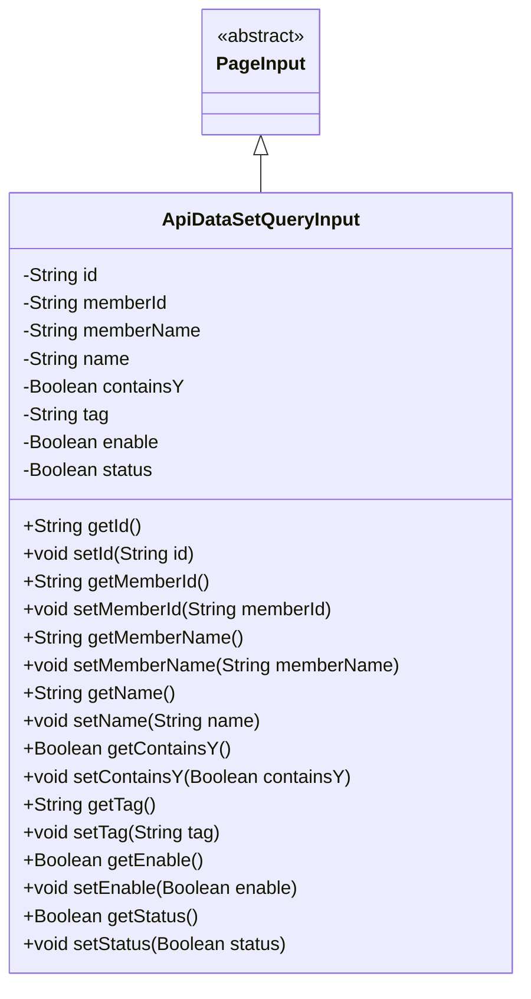

# Basic Information

|      |      |
|------|------|
| Name | ApiDataSetQueryInput |
| Language | .java |
| Code Path | WeFe/manager/manager-service/src/main/java/com/welab/wefe/manager/service/dto/dataset/ApiDataSetQueryInput.java |
| Package Name | com.welab.wefe.manager.service.dto.dataset |
| Dependencies | ['com.welab.wefe.manager.service.dto.base.PageInput'] |
| Brief Description | The ApiDataSetQueryInput class extends PageInput and includes fields such as id, memberId, memberName, name, containsY, tag, enable, status, along with their corresponding getter and setter methods. |

# Description

The `ApiDataSetQueryInput` class inherits from `PageInput` and includes several private fields: `id`, `memberId`, `memberName`, `name`, `containsY`, `tag`, `enable`, and `status`. Each field has corresponding getter and setter methods for retrieving and setting the field values. This class is primarily used to encapsulate input parameters for API dataset queries, supporting pagination functionality.

# Class Summary

| Name   | Type  | Description |
|-------|------|-------------|
| ApiDataSetQueryInput | class | The ApiDataSetQueryInput class extends PageInput and includes fields such as id, memberId, memberName, name, containsY, tag, enable, status, along with their corresponding getter and setter methods. |

## Class ApiDataSetQueryInput

|      |      |
|------|------|
| Access Modifier | public |
| Type | class |
| Name | ApiDataSetQueryInput |
| Description | The ApiDataSetQueryInput class extends PageInput and includes fields such as id, memberId, memberName, name, containsY, tag, enable, status, along with their corresponding getter and setter methods. |

### UML Class Diagram

This class diagram illustrates the structure where the ApiDataSetQueryInput class inherits from the abstract class PageInput. ApiDataSetQueryInput contains 9 private fields (such as id, name, etc.) and corresponding getter/setter methods, encapsulating input parameters for API dataset queries. As a subclass of PageInput, it inherits pagination-related properties and methods, making it suitable for scenarios requiring paginated queries. The class diagram clearly reflects the inheritance relationship and member structure, adhering to the design pattern of JavaBean specifications.

### Internal Method Call Graph

```mermaid
graph TD
    A["Class ApiDataSetQueryInput"]
    B["Inherits from: PageInput"]
    C["Property: String id"]
    D["Property: String memberId"]
    E["Property: String memberName"]
    F["Property: String name"]
    G["Property: Boolean containsY"]
    H["Property: String tag"]
    I["Property: Boolean enable"]
    J["Property: Boolean status"]
    K["Method: String getId()"]
    L["Method: void setId(String id)"]
    M["Method: String getMemberId()"]
    N["Method: void setMemberId(String memberId)"]
    O["Method: String getMemberName()"]
    P["Method: void setMemberName(String memberName)"]
    Q["Method: String getName()"]
    R["Method: void setName(String name)"]
    S["Method: Boolean getContainsY()"]
    T["Method: void setContainsY(Boolean containsY)"]
    U["Method: String getTag()"]
    V["Method: void setTag(String tag)"]
    W["Method: Boolean getEnable()"]
    X["Method: void setEnable(Boolean enable)"]
    Y["Method: Boolean getStatus()"]
    Z["Method: void setStatus(Boolean status)"]

    A --> B
    A --> C
    A --> D
    A --> E
    A --> F
    A --> G
    A --> H
    A --> I
    A --> J
    A --> K
    A --> L
    A --> M
    A --> N
    A --> O
    A --> P
    A --> Q
    A --> R
    A --> S
    A --> T
    A --> U
    A --> V
    A --> W
    A --> X
    A --> Y
    A --> Z
```

This code defines a class named ApiDataSetQueryInput, which inherits from the PageInput class and includes multiple private properties along with their corresponding getter/setter methods. The class is primarily used to encapsulate input parameters for API dataset queries, including string-type properties such as id, memberId, memberName, etc., as well as boolean-type properties like containsY, enable, and status. Each property has corresponding accessor and mutator methods for retrieving and setting property values. This structure is typical of the Java Bean pattern, facilitating data encapsulation and transfer.

### Field List

| Name  | Type  | Description |
|-------|-------|------|
| memberId | String | Declare a private string type variable memberId. |
| enable | Boolean | The private boolean variable `enable` is used to control the functional switch status. |
| name | String | Declare a private string variable name. |
| tag | String | Declare a private string variable tag. |
| id | String | Declare a private string-type variable id. |
| memberName | String | Declare a private string variable memberName. |
| containsY | Boolean | Private boolean variable indicating whether Y is included. |
| status | Boolean | Private boolean state variables. |

### Method List

| Name  | Type  | Description |
|-------|-------|------|
| setTag | void | This is a Java method used to set the tag property of an object. The method takes a string parameter `tag` and assigns it to the `tag` member variable of the current object. |
| getTag | String | Methods to obtain tag values, returning a string-type tag variable. |
| setName | void | The method to set the object name assigns the input parameter `name` to the `name` property of the object. |
| setMemberId | void | The method to set the member ID assigns the input parameter to the class's member variable `memberId`. |
| setMemberName | void | The method to set the member variable `memberName`, with a parameter of type `String`. |
| getName | String | Methods to get the object name, returning the string-type value of the name property. |
| setId | void | Methods for setting the object ID, assigning the parameter id to the id property of the current object. |
| getEnable | Boolean | This is a Java method that returns the value of the boolean variable `enable`. |
| getStatus | Boolean | Methods for obtaining boolean state values. |
| setStatus | void | Methods for setting boolean state values. |
| getMemberId | String | This is a Java method that returns a member ID string. The method is named getMemberId, takes no parameters, and directly returns the value of the member variable memberId. |
| setContainsY | void | This is a Java method used to set the value of a boolean variable named containsY. The method is called setContainsY and accepts a Boolean parameter. |
| getId | String | Methods to obtain the object ID, returning the ID value as a string type. |
| getContainsY | Boolean | The method getContainsY returns a boolean value containsY, which is used to check whether it contains Y. |
| getMemberName | String | Methods to obtain the member name, returning the value of the member variable `memberName`. |
| setEnable | void | This is a Java method used to set the boolean value of the enable property. The method accepts a Boolean parameter and assigns it to the class's member variable enable. |

