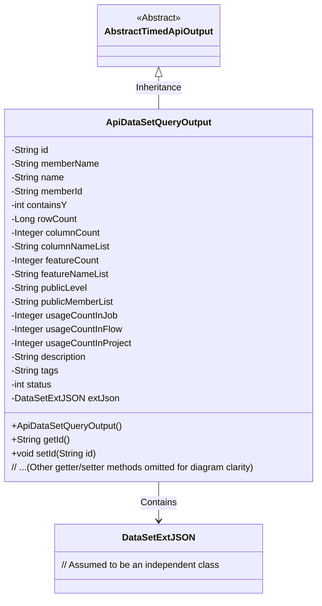

# Basic Information

|      |      |
|------|------|
| Name | ApiDataSetQueryOutput |
| Language | .java |
| Code Path | WeFe/manager/manager-service/src/main/java/com/welab/wefe/manager/service/dto/dataset/ApiDataSetQueryOutput.java |
| Package Name | com.welab.wefe.manager.service.dto.dataset |
| Dependencies | ['com.welab.wefe.common.data.mongodb.entity.union.ext.DataSetExtJSON', 'com.welab.wefe.common.web.dto.AbstractTimedApiOutput'] |
| Brief Description | The `ApiDataSetQueryOutput` class inherits from `AbstractTimedApiOutput` and includes attributes such as dataset ID, name, member information, row and column counts, feature list, public level, usage statistics, description, tags, status, and extended JSON. |

# Description

The `ApiDataSetQueryOutput` class inherits from `AbstractTimedApiOutput` and is used to represent the output results of a dataset query. This class includes multiple attributes, such as dataset ID, member name, dataset name, member ID, a flag indicating whether it contains Y values, row count, column count, column name list, feature count, feature name list, public level, public member list, usage counts in jobs, workflows, and projects, description, tags, status, and extended JSON data. Each attribute has corresponding getter and setter methods for retrieving and setting the attribute values.

# Class Summary

| Name   | Type  | Description |
|-------|------|-------------|
| ApiDataSetQueryOutput | class | The ApiDataSetQueryOutput class inherits from AbstractTimedApiOutput and includes attributes such as dataset ID, name, member information, row and column counts, feature list, public level, usage statistics, description, tags, status, and extended JSON. |

## Class ApiDataSetQueryOutput

|      |      |
|------|------|
| Access Modifier | public |
| Type | class |
| Name | ApiDataSetQueryOutput |
| Description | The ApiDataSetQueryOutput class inherits from AbstractTimedApiOutput and includes attributes such as dataset ID, name, member information, row and column counts, feature list, public level, usage statistics, description, tags, status, and extended JSON. |

### UML Class Diagram

Class diagram description: ApiDataSetQueryOutput inherits from the abstract class AbstractTimedApiOutput, containing over 20 private fields and corresponding getter/setter methods, primarily used to encapsulate dataset query results. The extJson field is associated with the DataSetExtJSON class, representing extended JSON data. The core functionality of this class is to manage dataset metadata, including basic attributes (such as name, row/column counts), usage statistics (e.g., usage counts in projects/jobs), and permission information (such as public level).

### Internal Method Call Graph

```mermaid
graph TD
    A["Class ApiDataSetQueryOutput"]
    B["Inherits from: AbstractTimedApiOutput"]
    C["Property: String id"]
    D["Property: String memberName"]
    E["Property: String name"]
    F["Property: String memberId"]
    G["Property: int containsY"]
    H["Property: Long rowCount"]
    I["Property: Integer columnCount"]
    J["Property: String columnNameList"]
    K["Property: Integer featureCount"]
    L["Property: String featureNameList"]
    M["Property: String publicLevel"]
    N["Property: String publicMemberList"]
    O["Property: Integer usageCountInJob"]
    P["Property: Integer usageCountInFlow"]
    Q["Property: Integer usageCountInProject"]
    R["Property: String description"]
    S["Property: String tags"]
    T["Property: int status"]
    U["Property: DataSetExtJSON extJson"]
    V["Constructor: ApiDataSetQueryOutput()"]
    W["Getter/Setter method group (18 pairs)"]

    A --> B
    A --> C
    A --> D
    A --> E
    A --> F
    A --> G
    A --> H
    A --> I
    A --> J
    A --> K
    A --> L
    A --> M
    A --> N
    A --> O
    A --> P
    A --> Q
    A --> R
    A --> S
    A --> T
    A --> U
    A --> V
    A -.-> W
```

This flowchart illustrates the complete structure of the ApiDataSetQueryOutput class, a Data Transfer Object (DTO) that inherits from AbstractTimedApiOutput. It contains 20 properties and 18 pairs of Getter/Setter methods. The class primarily serves to encapsulate dataset query results, including basic information (e.g., ID, name), statistical data (e.g., row/column counts, usage frequency), access control fields (e.g., public level), and structured extension data (extJson). All properties follow the standard JavaBean pattern with access interfaces, making it suitable for serialized transmission in API layers.

### Field List

| Name  | Type  | Description |
|-------|-------|------|
| columnCount | Integer | Integer variable, recording the number of columns. |
| publicMemberList | String | Private string variable storing the list of public members. |
| columnNameList | String | The field columnNameList is used to store the string of column name lists. |
| containsY | int | Private integer variable used to store the flag indicating whether Y is included. |
| description | String | Private string type variable description. |
| usageCountInFlow | Integer | Private integer variable that records the number of uses in the process. |
| status | int | The private integer variable `status` is used to represent the state. |
| memberId | String | Member ID string variable |
| usageCountInProject | Integer | Usage Statistics Within the Project |
| publicLevel | String | Declare a private string variable publicLevel. |
| name | String | Private string type variable name. |
| rowCount | Long | Private long integer variable rowCount, used to record the number of rows. |
| memberName | String | The member variable memberName, of type String, with private access. |
| extJson | DataSetExtJSON | Extending JSON objects with private datasets. |
| featureCount | Integer | Private integer variable, recording the number of features. |
| tags | String | Private string variable tags, used to store tag information. |
| id | String | Private string type variable id. |
| usageCountInJob | Integer | Private integer variable, recording the number of uses in the job. |
| featureNameList | String | The private string variable featureNameList is used to store the list of feature names. |

### Method List

| Name  | Type  | Description |
|-------|-------|------|
| getMemberId | String | This is a Java method that returns a member ID string. The method is named getMemberId, takes no parameters, and directly returns the value of the member variable memberId. |
| getPublicLevel | String | The method getPublicLevel returns the value of the publicLevel variable, which is of type string. |
| getContainsY | int | This is a Java method that returns the value of the integer variable containsY. |
| getTags | String | Methods to obtain the tags string. |
| setName | void | The method to set the object name assigns the parameter `name` to the `name` property of the object. |
| setRowCount | void | The method to set the number of rows assigns the input parameter rowCount to the class member variable rowCount. |
| getMemberName | String | Methods to get the member name, which returns the value of the member variable memberName. |
| getFeatureNameList | String | Methods to obtain the list of feature names, returns a string-type featureNameList. |
| getFeatureCount | Integer | Method to obtain the number of features, returns the integer variable featureCount. |
| getId | String | This is a Java method that returns the string-type id attribute value. |
| setId | void | Methods for setting object ID: Assign the parameter id to the object's id property. |
| getDescription | String | Methods for obtaining descriptive information, returning the description content as a string type. |
| setPublicMemberList | void | Methods for setting the public member list, assigning the input string to the class's publicMemberList variable. |
| setFeatureCount | void | Set the feature count method, assign the input parameter to the class variable featureCount. |
| setContainsY | void | The method to set the containsY property, with a parameter of type int. |
| setFeatureNameList | void | This is a Java method used to set the value of the featureNameList property. The method takes a string parameter and assigns it to the member variable of the class. |
| getColumnCount | Integer | Methods to obtain the number of columns, returning the integer variable columnCount. |
| getUsageCountInJob | Integer | Get the usage count in the assignment. |
| setUsageCountInFlow | void | This is a Java method used to set the usage count variable in the flow. The method accepts an integer parameter and assigns it to the class member variable `usageCountInFlow`. |
| getUsageCountInProject | Integer | Get the usage count in the project. |
| setDescription | void | Methods for setting object descriptions, assigning input parameters to internal variables. |
| setUsageCountInJob | void | Set the number of uses in the assignment. |
| setColumnCount | void | The method to set the number of columns involves assigning the parameter columnCount to the class member variable columnCount. |
| getColumnNameList | String | This method returns a list of column name strings. |
| setTags | void | This is a Java method used to set the `tags` property of an object to the string parameter `tags` passed in. |
| setUsageCountInProject | void | The method to set the number of uses within the project, with the parameter being an integer value. |
| getUsageCountInFlow | Integer | Get the number of uses in the process. |
| setPublicLevel | void | Method to set the public level, which assigns the input parameter publicLevel to the class member variable of the same name. |
| getName | String | This is a Java method that returns the value of the string variable named `name`. |
| getExtJson | DataSetExtJSON | Methods for Obtaining External JSON Datasets. |
| getPublicMemberList | String | The method to obtain the public member list returns the `publicMemberList` variable. |
| setMemberName | void | This is a Java method used to set the value of the member variable `memberName`. The method takes a string parameter `memberName` and assigns it to the member variable of the same name in the current object. |
| setMemberId | void | The method to set the member ID assigns the input string to the member variable memberId. |
| getRowCount | Long | Methods to obtain the number of rows, returning the value of the long integer variable rowCount. |
| setColumnNameList | void | Methods for setting the column name list, assigning the input parameters to the member variable columnNameList of the class. |
| setExtJson | void | The method `setExtJson` is used to set the `extJson` property, with the parameter being of type `DataSetExtJSON`. |
| getStatus | int | Methods to obtain the current status value, returns an integer variable status. |
| setStatus | void | Methods for setting status values, which assign the input parameter `status` to the `status` property of the current object. |

