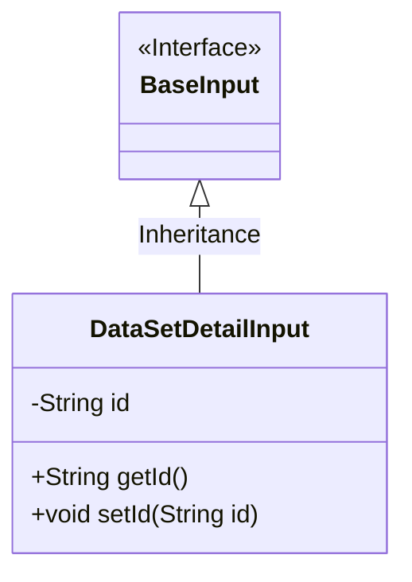
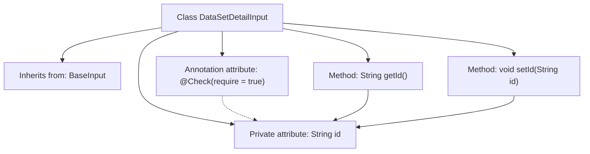

# Basic Information

|      |      |
|------|------|
| Name | DataSetDetailInput |
| Language | .java |
| Code Path | WeFe/manager/manager-service/src/main/java/com/welab/wefe/manager/service/dto/dataset/DataSetDetailInput.java |
| Package Name | com.welab.wefe.manager.service.dto.dataset |
| Dependencies | ['com.welab.wefe.common.fieldvalidate.annotation.Check', 'com.welab.wefe.manager.service.dto.base.BaseInput'] |
| Brief Description | The DataSetDetailInput class extends BaseInput, containing the required field id along with its getter and setter methods. |

# Description

This is a Java class named `DataSetDetailInput`, which extends the `BaseInput` class. It contains a private string-type field `id`, marked as a required field using the `@Check` annotation. The class provides two public methods, `getId` and `setId`, for retrieving and setting the value of the `id` field. The overall structure of the class is simple, primarily designed to encapsulate input parameters for dataset detail queries, where `id` is a mandatory identifier field.

# Class Summary

| Name   | Type  | Description |
|-------|------|-------------|
| DataSetDetailInput | class | The DataSetDetailInput class inherits from BaseInput and includes a required string-type id property along with its getter and setter methods. |

## Class DataSetDetailInput

|      |      |
|------|------|
| Access Modifier | public |
| Type | class |
| Name | DataSetDetailInput |
| Description | The DataSetDetailInput class inherits from BaseInput and includes a required string-type id property along with its getter and setter methods. |

### UML Class Diagram

This code demonstrates a simple class inheritance structure. The DataSetDetailInput class inherits from the BaseInput interface and contains a private String field 'id' along with its corresponding getter and setter methods. The class diagram clearly illustrates the inheritance relationship, where BaseInput is marked as an interface and DataSetDetailInput serves as its implementation class. The 'id' field follows JavaBean specifications for encapsulation, providing access control through public methods. The entire design adheres to fundamental object-oriented encapsulation principles.

### Internal Method Call Graph

This code defines a class named DataSetDetailInput, which inherits from the BaseInput class. The class contains a private String attribute id with a @Check annotation, where require is set to true indicating that id is mandatory. The class provides two public methods, getId() and setId(), for retrieving and setting the value of the id attribute, respectively. The flowchart clearly illustrates the class inheritance relationship, the association between attributes and methods, and the binding between the annotation and the attribute.

### Field List

| Name  | Type  | Description |
|-------|-------|------|
| id | String | Required field id, type is String. |

### Method List

| Name  | Type  | Description |
|-------|-------|------|
| getId | String | The method getId returns the value of the id variable of type string. |
| setId | void | Methods for setting the object ID, assigning the parameter id to the id property of the current object. |

