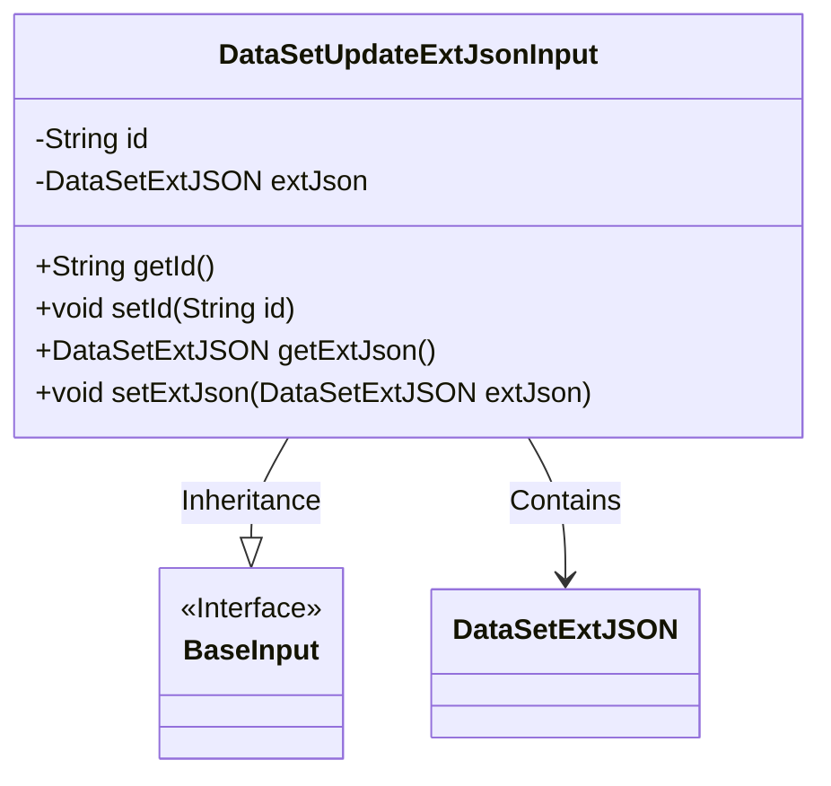
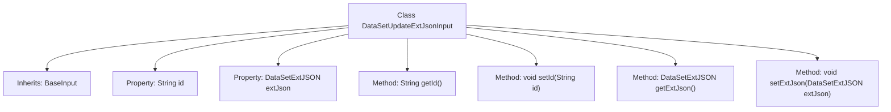

# Basic Information

|      |      |
|------|------|
| Name | DataSetUpdateExtJsonInput |
| Language | .java |
| Code Path | WeFe/manager/manager-service/src/main/java/com/welab/wefe/manager/service/dto/dataset/DataSetUpdateExtJsonInput.java |
| Package Name | com.welab.wefe.manager.service.dto.dataset |
| Dependencies | ['com.welab.wefe.common.data.mongodb.entity.union.ext.DataSetExtJSON', 'com.welab.wefe.common.fieldvalidate.annotation.Check', 'com.welab.wefe.manager.service.dto.base.BaseInput'] |
| Brief Description | The DataSetUpdateExtJsonInput class inherits from BaseInput, containing a mandatory id field and an optional extJson field, with getter and setter methods provided. |

# Description

This is a Java class named `DataSetUpdateExtJsonInput`, which extends the `BaseInput` class. The class contains two private attributes: `id` and `extJson`. The `id` attribute is marked as required and is of type `String`, while the `extJson` attribute is of type `DataSetExtJSON`. The class provides getter and setter methods for these two attributes to retrieve and set their values.

# Class Summary

| Name   | Type  | Description |
|-------|------|-------------|
| DataSetUpdateExtJsonInput | class | The dataset update extends the JSON input class, including mandatory ID and optional extended JSON fields, providing getter and setter methods. |

## Class DataSetUpdateExtJsonInput

|      |      |
|------|------|
| Access Modifier | public |
| Type | class |
| Name | DataSetUpdateExtJsonInput |
| Description | The dataset update extends the JSON input class, including mandatory ID and optional extended JSON fields, providing getter and setter methods. |

### UML Class Diagram

Class diagram description: The DataSetUpdateExtJsonInput class inherits from the BaseInput interface and contains private attributes id and extJson, where extJson is of type DataSetExtJSON. This class provides standard getter and setter methods for accessing and modifying these two attributes. BaseInput serves as an interface marking the basic input specification, while DataSetExtJSON acts as an independent class for storing extended JSON data.

### Internal Method Call Graph

This code defines a `DataSetUpdateExtJsonInput` class that inherits from `BaseInput`, containing two private properties `id` and `extJson` for storing the dataset ID and extended JSON data, respectively. The class provides four methods: `getId` and `setId` for getting and setting the ID, and `getExtJson` and `setExtJson` for getting and setting the extended JSON data. The `id` property is annotated with `@Check(require = true)`, indicating that this field must exist during validation. The overall structure is clear, primarily used to encapsulate input parameters for dataset updates.

### Field List

| Name  | Type  | Description |
|-------|-------|------|
| extJson | DataSetExtJSON | Extending JSON objects with private datasets. |
| id | String | Required field id, type is String. |

### Method List

| Name  | Type  | Description |
|-------|-------|------|
| getExtJson | DataSetExtJSON | Methods for obtaining external JSON datasets, returning the extJson object. |
| setId | void | Methods for setting the object ID: assign the parameter `id` to the `id` property of the object. |
| getId | String | This is a Java method that returns a string-type id value. |
| setExtJson | void | The method `setExtJson` is used to set the `extJson` property value of type `DataSetExtJSON`. |

