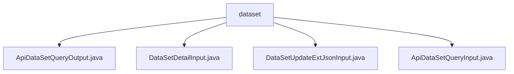

# Basic Information

|      |      |
|------|------|
| Name | dataset |
| Language | .java |
| Code Path | WeFe/manager/manager-service/src/main/java/com/welab/wefe/manager/service/dto/dataset |
| Package Name | docs.manager.manager-service.src.main.java.com.welab.wefe.manager.service.dto.dataset |
| Brief Description | The `ApiDataSetQueryOutput` class represents the dataset query result, containing attributes such as ID, name, row count, and column count. The `DataSetDetailInput` class encapsulates the input for dataset detail queries, where the `id` is mandatory. The `DataSetUpdateExtJsonInput` class is used to update the dataset's extended JSON, including the `id` and `extJson` attributes. The `ApiDataSetQueryInput` class encapsulates the input parameters for dataset queries, supporting pagination. |

# Description

## Overview  
The core responsibility of this module is to manage dataset metadata, providing functionalities such as dataset querying, detail retrieval, and extended attribute updates. The interface specifications uniformly adopt Java classes to encapsulate inputs and outputs, with input classes inheriting from BaseInput or PageInput, and output classes inheriting from AbstractTimedApiOutput. Key data structures include DataSetExtJSON (extended JSON), pagination parameters, and a timestamped response template.  

External dependencies include annotation validation from the Spring framework (e.g., @Check) and basic pagination components. For instance, ApiDataSetQueryInput implements paginated queries using PageInput, while DataSetDetailInput enforces mandatory ID fields via @Check. All interactions access properties through standard getter/setter methods, following a POJO-like data encapsulation pattern.  

## Primary Business Scenarios  
The module primarily supports three business flows: 1) Paginated dataset queries (e.g., with member filtering and Y-value flags), 2) Detail retrieval by ID, and 3) Updates to extended JSON attributes. Typical applications include data dashboard displays (using ApiDataSetQueryOutput to return multidimensional statistical information) and workflow configuration (relying on extJson to store business parameters).  

API types encompass query classes (e.g., ApiDataSetQueryInput) and update classes (e.g., DataSetUpdateExtJsonInput). Integration examples manifest as chained calls: first paginating to query dataset IDs, then retrieving details or updating extended fields. All interactions follow an anemic model design, with state controlled via enable/status fields.

### Package Internal Structure View

This flowchart illustrates the file structure relationships under the dataset directory in the manager-service project. The root node "dataset" contains four DTO class files, which handle dataset query output, dataset detail input, dataset extended JSON update input, and dataset query input functionalities respectively. All files reside at the same level without nested subdirectory structures.

# File List

| Name   | Type  | Description |
|-------|------|-------------|
| [ApiDataSetQueryOutput.java](ApiDataSetQueryOutput.md) | file | The ApiDataSetQueryOutput class inherits from AbstractTimedApiOutput and includes attributes such as dataset ID, name, member information, row/column counts, feature list, public level, usage statistics, description, tags, status, and extended JSON. |
| [DataSetDetailInput.java](DataSetDetailInput.md) | file | The DataSetDetailInput class inherits from BaseInput and includes the required field id along with its getter and setter methods. |
| [DataSetUpdateExtJsonInput.java](DataSetUpdateExtJsonInput.md) | file | The DataSetUpdateExtJsonInput class extends BaseInput, containing a mandatory id field and an optional extJson field, with getter and setter methods provided. |
| [ApiDataSetQueryInput.java](ApiDataSetQueryInput.md) | file | The ApiDataSetQueryInput class inherits from PageInput and includes fields such as id, memberId, memberName, name, containsY, tag, enable, status, along with their corresponding getter and setter methods. |

