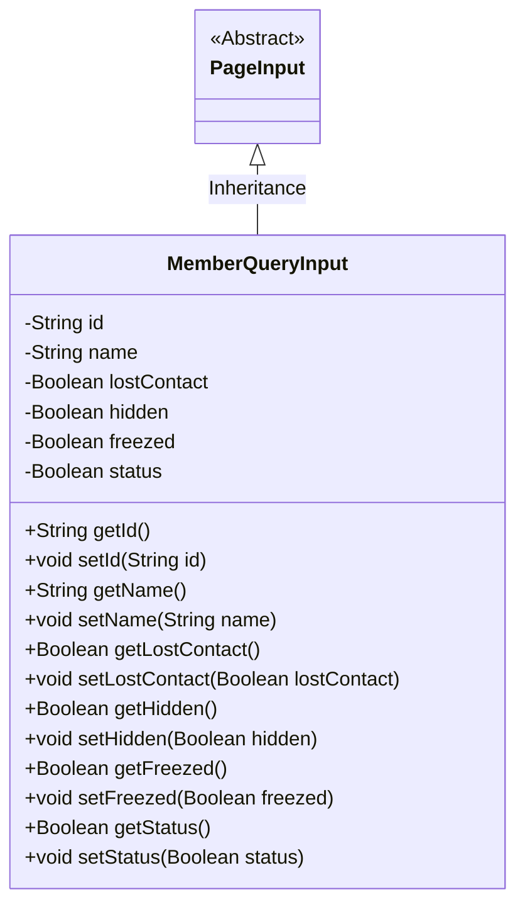

# Basic Information

|      |      |
|------|------|
| Name | MemberQueryInput |
| Language | .java |
| Code Path | WeFe/manager/manager-service/src/main/java/com/welab/wefe/manager/service/dto/member/MemberQueryInput.java |
| Package Name | com.welab.wefe.manager.service.dto.member |
| Dependencies | ['com.welab.wefe.manager.service.dto.base.PageInput'] |
| Brief Description | Member query input class, containing fields such as ID, name, lost contact, hidden, frozen, and status, along with their getter and setter methods. |

# Description

The `MemberQueryInput` class inherits from `PageInput` and is used to encapsulate the input parameters for member queries. It includes two string-type fields, `id` and `name`, as well as four boolean-type fields: `lostContact`, `hidden`, `freezed`, and `status`. Each field has corresponding getter and setter methods for accessing and modifying the property values. This class is primarily used to pass member query conditions and supports pagination query functionality.

# Class Summary

| Name   | Type  | Description |
|-------|------|-------------|
| MemberQueryInput | class | Member query input class, inherits pagination input, includes boolean attributes such as ID, name, lost contact, hidden, frozen, status, and corresponding getter/setter methods. |

## Class MemberQueryInput

|      |      |
|------|------|
| Access Modifier | public |
| Type | class |
| Name | MemberQueryInput |
| Description | Member query input class, inherits pagination input, includes boolean attributes such as ID, name, lost contact, hidden, frozen, status, and corresponding getter/setter methods. |

### UML Class Diagram

Class diagram description: The MemberQueryInput class inherits from the abstract class PageInput, containing private fields such as id and name along with corresponding getter/setter methods, used to encapsulate member query input parameters. This class utilizes Boolean-type fields (lostContact/hidden, etc.) to represent different member statuses, providing flexible status query capabilities. The inheritance relationship indicates its reuse of PageInput's pagination functionality.

### Internal Method Call Graph

```mermaid
graph TD
    A["Class MemberQueryInput"]
    B["Inherits from: PageInput"]
    C["Property: String id"]
    D["Property: String name"]
    E["Property: Boolean lostContact"]
    F["Property: Boolean hidden"]
    G["Property: Boolean freezed"]
    H["Property: Boolean status"]
    I["Method: String getId()"]
    J["Method: void setId(String id)"]
    K["Method: String getName()"]
    L["Method: void setName(String name)"]
    M["Method: Boolean getLostContact()"]
    N["Method: void setLostContact(Boolean lostContact)"]
    O["Method: Boolean getHidden()"]
    P["Method: void setHidden(Boolean hidden)"]
    Q["Method: Boolean getFreezed()"]
    R["Method: void setFreezed(Boolean freezed)"]
    S["Method: Boolean getStatus()"]
    T["Method: void setStatus(Boolean status)"]

    A --> B
    A --> C
    A --> D
    A --> E
    A --> F
    A --> G
    A --> H
    A --> I
    A --> J
    A --> K
    A --> L
    A --> M
    A --> N
    A --> O
    A --> P
    A --> Q
    A --> R
    A --> S
    A --> T
```

This flowchart illustrates the structure of the MemberQueryInput class, a Java class that inherits from PageInput, containing 6 private properties and their corresponding getter/setter methods. The properties include id, name, and four Boolean-type status flags (lostContact, hidden, freezed, status). Each property has standard accessor and mutator methods for encapsulated data access. The class diagram clearly reflects the data encapsulation characteristics and inheritance relationship of this POJO (Plain Old Java Object).

### Field List

| Name  | Type  | Description |
|-------|-------|------|
| status | Boolean | Boolean type state variables |
| lostContact | Boolean | Private boolean variable indicating whether the connection is lost. |
| id | String | Declare a private string-type variable id. |
| freezed | Boolean | Private boolean variable indicating whether it is frozen. |
| hidden | Boolean | The boolean field `hidden` indicates whether it is hidden. |
| name | String | Private string variable name |

### Method List

| Name  | Type  | Description |
|-------|-------|------|
| setName | void | Methods for setting the object name, assigning the input parameter 'name' to the object's name property. |
| getHidden | Boolean | This is a Java method that returns the boolean value of the hidden property. |
| setLostContact | void | Set the Boolean method for device offline status. |
| getId | String | This is a Java method that returns the string-type id attribute value. |
| getLostContact | Boolean | This is a Java method that returns the boolean value of the lostContact variable. |
| setHidden | void | Methods for setting hidden attributes, with a boolean parameter `hidden` to control whether the object is hidden. |
| getName | String | The method returns the name attribute value of string type. |
| setId | void | Methods for setting the object ID: assign the parameter id to the id property of the object. |
| getFreezed | Boolean | The method returns a boolean value `freezed`, indicating the frozen state. |
| setFreezed | void | Defined a public method setFreezed for setting the boolean value of the freezed property. |
| getStatus | Boolean | This is a Java method that returns a boolean status value. |
| setStatus | void | Methods for setting boolean state values. |

