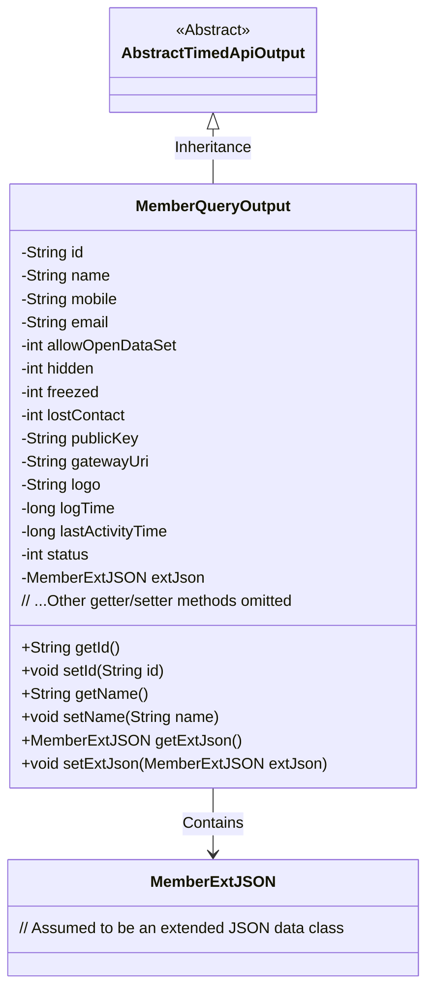

# Basic Information

|      |      |
|------|------|
| Name | MemberQueryOutput |
| Language | .java |
| Code Path | WeFe/manager/manager-service/src/main/java/com/welab/wefe/manager/service/dto/member/MemberQueryOutput.java |
| Package Name | com.welab.wefe.manager.service.dto.member |
| Dependencies | ['com.welab.wefe.common.data.mongodb.entity.union.ext.MemberExtJSON', 'com.welab.wefe.common.web.dto.AbstractTimedApiOutput'] |
| Brief Description | The MemberQueryOutput class inherits from AbstractTimedApiOutput and includes attributes such as member ID, name, contact information, status flag, public key, gateway URI, LOGO, timestamp, and extended JSON. |

# Description

The `MemberQueryOutput` class inherits from `AbstractTimedApiOutput` and includes various attributes for member information query output. Key fields consist of basic information such as `id`, `name`, `mobile`, and `email`, as well as status flags like `allowOpenDataSet`, `hidden`, `freezed`, and `lostContact`. Additionally, it contains extended information such as `publicKey`, `gatewayUri`, and `logo`, with `logTime` and `lastActivityTime` recording timestamps, `status` indicating the state, and `extJson` storing additional JSON data. Each field has corresponding getter and setter methods for accessing and modifying property values.

# Class Summary

| Name   | Type  | Description |
|-------|------|-------------|
| MemberQueryOutput | class | The MemberQueryOutput class inherits from AbstractTimedApiOutput and includes attributes such as member ID, name, contact information, status flag, public key, gateway URI, logo, timestamp, and extended JSON, along with their corresponding getter/setter methods. |

## Class MemberQueryOutput

|      |      |
|------|------|
| Access Modifier | public |
| Type | class |
| Name | MemberQueryOutput |
| Description | The MemberQueryOutput class inherits from AbstractTimedApiOutput and includes attributes such as member ID, name, contact information, status flag, public key, gateway URI, logo, timestamp, and extended JSON, along with their corresponding getter/setter methods. |

### UML Class Diagram

Class diagram description: MemberQueryOutput inherits from the abstract class AbstractTimedApiOutput and contains basic member information fields (e.g., id, name, mobile) along with various status flags (e.g., hidden, freezed). Extended JSON data is stored via the MemberExtJSON object. All fields are accessed through getter/setter methods, reflecting the standard JavaBean design pattern.

### Internal Method Call Graph

This flowchart illustrates the complete structure of the MemberQueryOutput class, including properties inherited from AbstractTimedApiOutput and 14 self-defined fields along with corresponding getter/setter methods. It represents a typical Java Data Transfer Object (DTO) design for encapsulating member query result data, containing basic information (id/name), contact details (mobile/email), status flags (hidden/freezed), system parameters (publicKey/gatewayUri), and extended data (extJson) as structured fields. All properties are exposed through standard accessor methods, complying with JavaBean specifications.

### Field List

| Name  | Type  | Description |
|-------|-------|------|
| extJson | MemberExtJSON | Member extended JSON data object. |
| freezed | int | The variable `freezed` is a private integer type, used to store the frozen state or related numerical values. |
| allowOpenDataSet | int | Private integer variable used to control dataset access permissions. |
| email | String | Declare a private string variable email. |
| gatewayUri | String | The private string variable gatewayUri is used to store the gateway URI address. |
| name | String | Declare a private string variable named name. |
| publicKey | String | Private string variable publicKey |
| mobile | String | Private string variable mobile |
| hidden | int | Private integer variable hidden |
| status | int | The private integer variable `status` is used to store status information. |
| id | String | Private string type variable id |
| lostContact | int | The private integer variable `lostContact` is used to record the number of times or the state of lost contact. |
| logTime | long | Log timestamp, recording the specific time when an event occurred. |
| lastActivityTime | long | Private long integer variable, recording the last activity time. |
| logo | String | The private string variable `logo` is used to store identification information. |

### Method List

| Name  | Type  | Description |
|-------|-------|------|
| getId | String | This is a Java method that returns the string-type id attribute value. |
| getStatus | int | Methods to obtain status values, returns the integer variable status. |
| getName | String | The method getName returns the value of the string name. |
| getPublicKey | String | Methods to obtain the public key, returning the value of the publicKey variable. |
| setPublicKey | void | The method to set the public key assigns the input string to the `publicKey` member variable of the class. |
| setHidden | void | Methods for setting hidden state, where the parameter is an integer `hidden`, assigned to the `hidden` property of the current object. |
| setLogo | void | Methods for setting the logo string. |
| getLostContact | int | The method to obtain the number of lost contacts returns the value of the lostContact variable. |
| getExtJson | MemberExtJSON | Method to retrieve member extension JSON data, returns the extJson object. |
| getLogo | String | This is a Java method that returns a string-type logo value. |
| getHidden | int | Methods to obtain the hidden value, returns an integer variable hidden. |
| getGatewayUri | String | Methods to obtain the gateway URI, returns the gatewayUri string. |
| setEmail | void | This is a Java method used to set the email property of an object. The method takes a string parameter email and assigns it to the email field of the current object. |
| setId | void | Methods for setting object ID: Assign the parameter id to the id property of the object. |
| setLastActivityTime | void | Method to set the last activity time, which assigns the passed lastActivityTime to the member variable of the class. |
| setName | void | This is a Java method used to set the name property of an object. The method takes a string parameter name and assigns it to the name field of the current object. |
| setGatewayUri | void | Methods for setting the gateway URI, assigning the parameter value to the class member variable `gatewayUri`. |
| setExtJson | void | Methods for setting member extended JSON data. |
| setLostContact | void | The method to set the lost contact status, with the parameter as lostContact, assigns the value to the member variable. |
| getMobile | String | Methods to obtain a phone number, returns a string variable named mobile. |
| setLogTime | void | The method setLogTime is used to set the value of the logTime attribute, with the parameter being a long integer logTime. |
| getAllowOpenDataSet | int | Get the allowed values for opening datasets. |
| getLastActivityTime | long | Method to obtain the last activity time, returns the value of the variable lastActivityTime. |
| setMobile | void | The method to set the mobile number assigns the parameter "mobile" to the "mobile" property of the current object. |
| setAllowOpenDataSet | void | The method `setAllowOpenDataSet` is used to set the value of `allowOpenDataSet`, with the parameter being of integer type. |
| getFreezed | int | Get the integer value of a freezed variable. |
| getEmail | String | This is a Java method that returns the value of the string-type email variable. |
| getLogTime | long | Methods for obtaining log time, returning the value of the long integer variable logTime. |
| setFreezed | void | Define the method `setFreezed` to set the value of the `freezed` variable. |
| setStatus | void | This is a Java method used to set the state value of an object. The method is named setStatus, which takes an integer parameter status and assigns it to the status property of the current object. |

