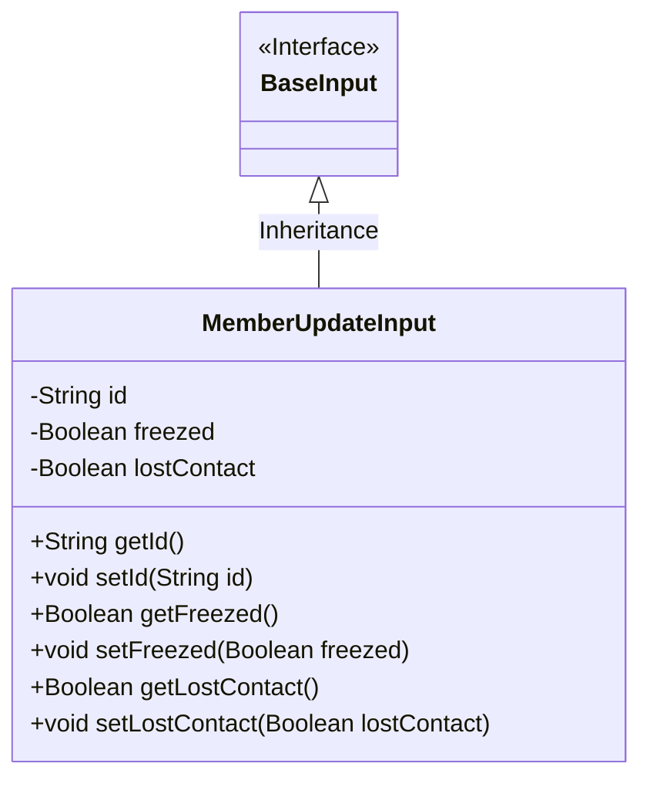
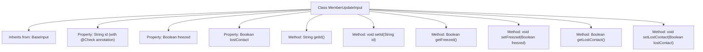

# Basic Information

|      |      |
|------|------|
| Name | MemberUpdateInput |
| Language | .java |
| Code Path | WeFe/manager/manager-service/src/main/java/com/welab/wefe/manager/service/dto/member/MemberUpdateInput.java |
| Package Name | com.welab.wefe.manager.service.dto.member |
| Dependencies | ['com.welab.wefe.common.fieldvalidate.annotation.Check', 'com.welab.wefe.manager.service.dto.base.BaseInput'] |
| Brief Description | The MemberUpdateInput class inherits from BaseInput and includes required id and optional freezed, lostContact boolean fields along with their getter/setter methods. |

# Description

The content defines a Java class named MemberUpdateInput, which inherits from the BaseInput class. This class contains three private fields: id, freezed, and lostContact. The id field is marked as mandatory with the @Check annotation. The class provides corresponding getter and setter methods for each field to access and modify the field values. The functionality of this class is to encapsulate the input data for member update operations.

# Class Summary

| Name   | Type  | Description |
|-------|------|-------------|
| MemberUpdateInput | class | Member update input class, inherits from the base input class, includes mandatory ID and optional frozen/lost contact status fields along with their getter/setter methods. |

## Class MemberUpdateInput

|      |      |
|------|------|
| Access Modifier | public |
| Type | class |
| Name | MemberUpdateInput |
| Description | Member update input class, inherits from the base input class, includes mandatory ID and optional frozen/lost contact status fields along with their getter/setter methods. |

### UML Class Diagram

This code demonstrates a member information update input class MemberUpdateInput, which inherits from the base input interface BaseInput. The class contains three private fields: a required id string, a freezed boolean indicating whether the account is frozen, and a lostContact boolean indicating whether contact is lost, along with standard getter and setter methods for each field. The class diagram clearly illustrates the inheritance relationship and member structure, embodying the Java Bean design pattern.

### Internal Method Call Graph

This code demonstrates a MemberUpdateInput class that inherits from the BaseInput class, containing three properties: id (with validation annotation), freezed, and lostContact, along with corresponding getter and setter methods. The flowchart clearly presents the class inheritance relationship, property definitions, and method structure. The id property is specifically annotated with @Check(require=true) to indicate mandatory validation in business logic. All methods follow standard JavaBean-style accessor patterns for encapsulating object state read/write operations.

### Field List

| Name  | Type  | Description |
|-------|-------|------|
| lostContact | Boolean | The field `lostContact` indicates whether contact has been lost, with a boolean type. |
| id | String | The required field id is marked with the @Check annotation for mandatory validation. |
| freezed | Boolean | Boolean type field, indicating whether it is frozen. |

### Method List

| Name  | Type  | Description |
|-------|-------|------|
| getLostContact | Boolean | This is a Java method that returns the boolean value of the lostContact variable. |
| setId | void | Methods for setting the object ID: assign the parameter id to the id property of the object. |
| getFreezed | Boolean | This is a Java method that returns the value of the boolean variable freezed. |
| setFreezed | void | This is a Java method used to set the freezed property value of an object, which accepts a boolean parameter freezed and assigns it to the member variable. |
| setLostContact | void | Define a method to set the lostContact boolean property. |
| getId | String | This is a Java method that returns a string-type id value. |

