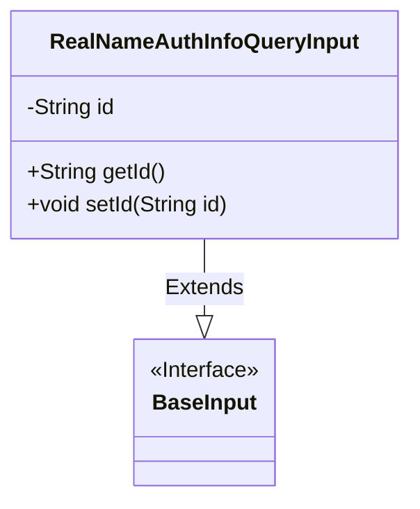
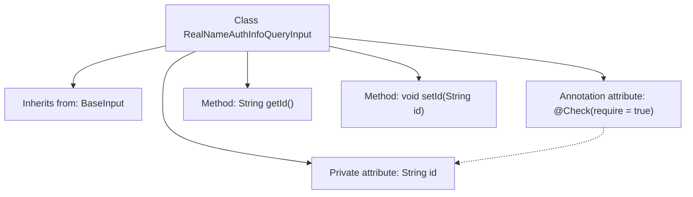

# Basic Information

|      |      |
|------|------|
| Name | RealNameAuthInfoQueryInput |
| Language | .java |
| Code Path | WeFe/manager/manager-service/src/main/java/com/welab/wefe/manager/service/dto/member/RealNameAuthInfoQueryInput.java |
| Package Name | com.welab.wefe.manager.service.dto.member |
| Dependencies | ['com.welab.wefe.common.fieldvalidate.annotation.Check', 'com.welab.wefe.manager.service.dto.base.BaseInput'] |
| Brief Description | The RealNameAuthInfoQueryInput class inherits from BaseInput and includes the required field id along with its getter and setter methods. |

# Description

The content defines a Java class named RealNameAuthInfoQueryInput, which inherits from the BaseInput class. This class contains a private string-type field named id, marked as a required field using the @Check annotation. It provides two public methods, getId and setId, for retrieving and setting the value of the id field. The overall class structure is concise and primarily designed to handle input parameters for real-name authentication information queries.

# Class Summary

| Name   | Type  | Description |
|-------|------|-------------|
| RealNameAuthInfoQueryInput | class | The class RealNameAuthInfoQueryInput extends BaseInput and includes a required string property id along with its getter and setter methods. |

## Class RealNameAuthInfoQueryInput

|      |      |
|------|------|
| Access Modifier | public |
| Type | class |
| Name | RealNameAuthInfoQueryInput |
| Description | The class RealNameAuthInfoQueryInput extends BaseInput and includes a required string property id along with its getter and setter methods. |

### UML Class Diagram

This class diagram illustrates the inheritance structure where the RealNameAuthInfoQueryInput class extends the BaseInput interface. RealNameAuthInfoQueryInput contains a private String field 'id' along with corresponding public getter and setter methods. BaseInput is marked as an interface, serving as the parent class to provide fundamental input specifications. The design implements simple data encapsulation, extending basic input functionality through inheritance, making it suitable for scenarios requiring real-name authentication information queries. The class structure clearly demonstrates standard JavaBean conventions while achieving declarative programming for parameter validation through annotations (@Check).

### Internal Method Call Graph

This code demonstrates a class named RealNameAuthInfoQueryInput, which inherits from the BaseInput class. The class contains a private String attribute `id` annotated with `@Check`, along with corresponding getter and setter methods. The `@Check` annotation indicates that this attribute is mandatory. The flowchart clearly illustrates the class inheritance relationship, attribute definition, method structure, and the association between the annotation and the attribute.

### Field List

| Name  | Type  | Description |
|-------|-------|------|
| id | String | The code snippet defines a private string variable `id` and adds a non-null check annotation `@Check(require=true)`. |

### Method List

| Name  | Type  | Description |
|-------|-------|------|
| getId | String | This is a Java method that returns a string-type id value. |
| setId | void | Methods for setting the object ID: Assign the parameter `id` to the `id` property of the object. |

