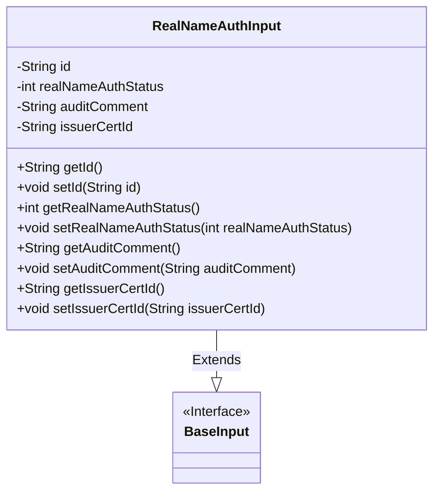

# Basic Information

|      |      |
|------|------|
| Name | RealNameAuthInput |
| Language | .java |
| Code Path | WeFe/manager/manager-service/src/main/java/com/welab/wefe/manager/service/dto/member/RealNameAuthInput.java |
| Package Name | com.welab.wefe.manager.service.dto.member |
| Dependencies | ['com.welab.wefe.common.fieldvalidate.annotation.Check', 'com.welab.wefe.manager.service.dto.base.BaseInput'] |
| Brief Description | The RealNameAuthInput class includes mandatory ID and real-name authentication status, optional review comments and issuing ID, and provides getter and setter methods for each field. |

# Description

The `RealNameAuthInput` class inherits from `BaseInput` and includes four attributes: a required `id` string and an integer `realNameAuthStatus` (-1 for authentication failed / 0 for not authenticated / 1 for authentication in progress / 2 for authenticated), as well as optional `auditComment` string and `issuerCertId` string. It provides getter and setter methods for each attribute.

# Class Summary

| Name   | Type  | Description |
|-------|------|-------------|
| RealNameAuthInput | class | The RealNameAuthInput class inherits from BaseInput, containing required fields id and realNameAuthStatus (authentication status), as well as optional fields auditComment and issuerCertId, providing getter and setter methods for each field. |

## Class RealNameAuthInput

|      |      |
|------|------|
| Access Modifier | public |
| Type | class |
| Name | RealNameAuthInput |
| Description | The RealNameAuthInput class inherits from BaseInput, containing required fields id and realNameAuthStatus (authentication status), as well as optional fields auditComment and issuerCertId, providing getter and setter methods for each field. |

### UML Class Diagram

Class diagram description: This diagram illustrates the structure where the real-name authentication input class `RealNameAuthInput` extends the base input interface `BaseInput`. `RealNameAuthInput` contains four private fields: ID number (id), authentication status (realNameAuthStatus), audit comment (auditComment), and issuing authority ID (issuerCertId), with the first two fields annotated with `@Check` to indicate mandatory fields. The class provides standard getter and setter methods for each field to encapsulate field access.

### Internal Method Call Graph

```mermaid
graph TD
    A["Class RealNameAuthInput"]
    B["Inherits from: BaseInput"]
    C["Property: String id (Required)"]
    D["Property: int realNameAuthStatus (Required)"]
    E["Property: String auditComment"]
    F["Property: String issuerCertId"]
    G["Method: String getId()"]
    H["Method: void setId(String id)"]
    I["Method: int getRealNameAuthStatus()"]
    J["Method: void setRealNameAuthStatus(int status)"]
    K["Method: String getAuditComment()"]
    L["Method: void setAuditComment(String comment)"]
    M["Method: String getIssuerCertId()"]
    N["Method: void setIssuerCertId(String certId)"]

    A --> B
    A --> C
    A --> D
    A --> E
    A --> F
    A --> G
    A --> H
    A --> I
    A --> J
    A --> K
    A --> L
    A --> M
    A --> N
```

This code defines a class named RealNameAuthInput, which inherits from the BaseInput class and is primarily used to handle input data related to real-name authentication. The class contains four properties: the required id and realNameAuthStatus (representing user ID and authentication status respectively), and the optional auditComment (review comments) and issuerCertId (issuing authority ID). Each property has corresponding getter and setter methods for retrieving and setting property values. The realNameAuthStatus property has explicit annotations explaining its value meanings: -1 indicates authentication failure, 0 indicates unauthenticated, 1 indicates authentication in progress, and 2 indicates authenticated.

### Field List

| Name  | Type  | Description |
|-------|-------|------|
| auditComment | String | The private string variable auditComment is used to store audit comments. |
| id | String | Mandatory validation field id, cannot be empty. |
| realNameAuthStatus | int | The private integer variable realNameAuthStatus must be validated and cannot be null. |
| issuerCertId | String | Declare a private string variable issuerCertId to store the issuer certificate ID. |

### Method List

| Name  | Type  | Description |
|-------|-------|------|
| getRealNameAuthStatus | int | Method to obtain real-name authentication status, returns an integer status value. |
| getId | String | Methods to obtain the object ID, returning the id value as a string type. |
| setRealNameAuthStatus | void | Method to set real-name authentication status, with the parameter being the authentication status value. |
| setAuditComment | void | This is a Java method used to set the value of the auditComment property. The method accepts a string parameter named auditComment and assigns it to the class member variable of the same name. |
| getIssuerCertId | String | The method to obtain the issuer certificate ID, returns the issuerCertId string. |
| setIssuerCertId | void | The method for setting the issuer certificate ID assigns the parameter `issuerCertId` to the class member variable `issuerCertId`. |
| getAuditComment | String | Method to obtain audit comments, returns the auditComment string. |
| setId | void | Methods for setting object ID, assigning the parameter id to the object's id property. |

