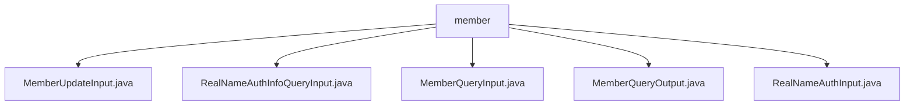

# Basic Information

|      |      |
|------|------|
| Name | member |
| Language | .java |
| Code Path | WeFe/manager/manager-service/src/main/java/com/welab/wefe/manager/service/dto/member |
| Package Name | docs.manager.manager-service.src.main.java.com.welab.wefe.manager.service.dto.member |
| Brief Description | The MemberUpdateInput class inherits from BaseInput and includes fields such as id, freezed, and lostContact, with id being mandatory. The RealNameAuthInfoQueryInput class inherits from BaseInput and contains only the mandatory id field. The MemberQueryInput class inherits from PageInput and includes fields such as id and name, supporting paginated queries. The MemberQueryOutput class inherits from AbstractTimedApiOutput and contains fields such as basic member information and status. The RealNameAuthInput class inherits from BaseInput and includes fields such as id and realNameAuthStatus. |

# Description

## Overview  
The core responsibility of this module is to manage member information, including operations such as updates, queries, and real-name authentication, similar to a CRUD service model. The interface specifications uniformly inherit from base classes (BaseInput/PageInput), use the `@Check` annotation to mark mandatory fields, and access properties through standard getter/setter methods. Key data structures include `MemberUpdateInput` (id/freezed status), `MemberQueryInput` (pagination query conditions), `MemberQueryOutput` (extended member information), and the `RealNameAuth` series of classes (authentication status enum). External dependencies are limited to the Java basic annotation library. For example, `MemberQueryOutput` includes extended fields such as `gatewayUri`, while `RealNameAuthInput` defines authentication status codes ranging from -1 to 2.

## Main Business Scenarios  
The business process revolves around member lifecycle management: updating status (e.g., the `freezed` field), paginated queries (inheriting `PageInput`), and real-name authentication (e.g., `RealNameAuthInfoQueryInput`). The interaction mode employs DTO objects for data transfer and supports status enums (similar to a ticket state machine). Functional completeness is reflected in covering basic CRUD, conditional filtering, and authentication review. Typical applications include backend management systems querying member lists (using `MemberQueryInput`/`Output`) and updating freeze statuses. API types include parameter encapsulation classes (e.g., `RealNameAuthInput`) and paginated response classes.

### Package Internal Structure View

This flowchart illustrates the structural relationships of the member directory under the manager-service module in the WeFe project. All Java files are directly subordinate to the member directory, including five DTO class files such as MemberUpdateInput and RealNameAuthInfoQueryInput. These files constitute the input/output data transfer objects for the member management service, handling business scenarios like member information updates and real-name authentication queries.

# File List

| Name   | Type  | Description |
|-------|------|-------------|
| [MemberUpdateInput.java](MemberUpdateInput.md) | file | The MemberUpdateInput class inherits from BaseInput, containing a mandatory id field and optional boolean fields freezed and lostContact, along with their corresponding getter/setter methods. |
| [RealNameAuthInfoQueryInput.java](RealNameAuthInfoQueryInput.md) | file | The RealNameAuthInfoQueryInput class inherits from BaseInput and includes the required field id along with its getter and setter methods. |
| [MemberQueryInput.java](MemberQueryInput.md) | file | Member query input class, containing fields such as ID, name, lost contact, hidden, frozen, and status, along with their getter and setter methods. |
| [MemberQueryOutput.java](MemberQueryOutput.md) | file | The MemberQueryOutput class inherits from AbstractTimedApiOutput and includes attributes such as member ID, name, contact information, status flag, public key, gateway URI, LOGO, timestamp, and extended JSON. |
| [RealNameAuthInput.java](RealNameAuthInput.md) | file | The RealNameAuthInput class includes mandatory ID and real-name authentication status, optional review comments and issuing ID, and provides getter and setter methods for each field. |

