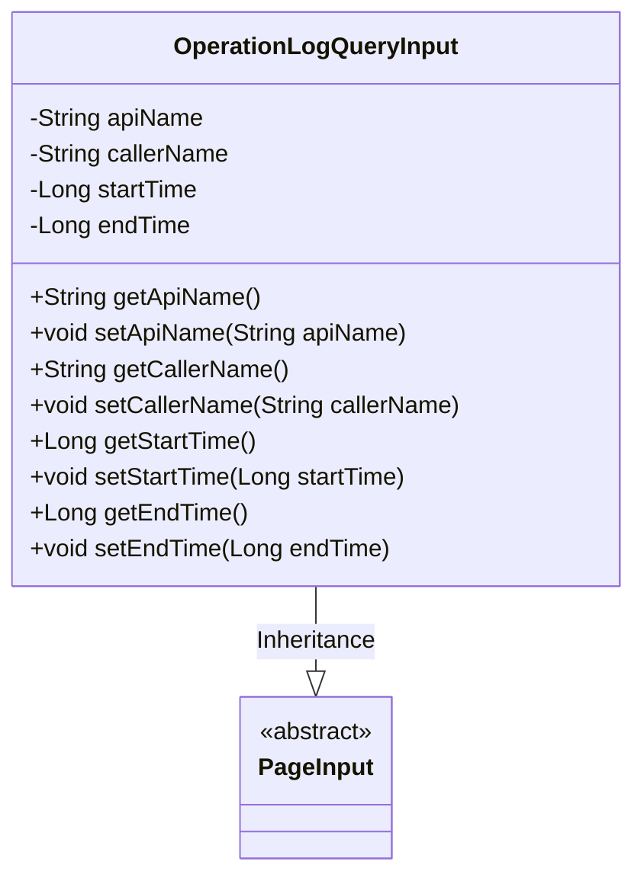

# Basic Information

|      |      |
|------|------|
| Name | OperationLogQueryInput |
| Language | .java |
| Code Path | WeFe/manager/manager-service/src/main/java/com/welab/wefe/manager/service/dto/operation/OperationLogQueryInput.java |
| Package Name | com.welab.wefe.manager.service.dto.operation |
| Dependencies | ['com.welab.wefe.manager.service.dto.base.PageInput'] |
| Brief Description | The OperationLogQueryInput class inherits from PageInput and includes the apiName, callerName, startTime, and endTime attributes along with their corresponding getter and setter methods. |

# Description

The `OperationLogQueryInput` class inherits from `PageInput` and is used for querying operation log input parameters. It contains four private fields: `apiName` represents the interface name, `callerName` represents the caller name, and `startTime` and `endTime` represent the time range. Getter and setter methods are provided for each field to access and modify these parameters.

# Class Summary

| Name   | Type  | Description |
|-------|------|-------------|
| OperationLogQueryInput | class | Operation log query input class, including fields such as API name, caller name, start/end time, and corresponding getter/setter methods. |

## Class OperationLogQueryInput

|      |      |
|------|------|
| Access Modifier | public |
| Type | class |
| Name | OperationLogQueryInput |
| Description | Operation log query input class, including fields such as API name, caller name, start/end time, and corresponding getter/setter methods. |

### UML Class Diagram

This class diagram illustrates the structure where the OperationLogQueryInput class inherits from the abstract class PageInput. OperationLogQueryInput contains four private fields (apiName, callerName, startTime, and endTime) along with their corresponding getter and setter methods. This class is used to encapsulate input parameters for operation log queries, inheriting the basic pagination functionality from PageInput. The diagram clearly reflects the inheritance relationship between the classes and the attribute structure of OperationLogQueryInput.

### Internal Method Call Graph

```mermaid
graph TD
    A["Class OperationLogQueryInput"]
    B["Inherits from: PageInput"]
    C["Property: String apiName"]
    D["Property: String callerName"]
    E["Property: Long startTime"]
    F["Property: Long endTime"]
    G["Method: getApiName()"]
    H["Method: setApiName(String)"]
    I["Method: getCallerName()"]
    J["Method: setCallerName(String)"]
    K["Method: getStartTime()"]
    L["Method: setStartTime(Long)"]
    M["Method: getEndTime()"]
    N["Method: setEndTime(Long)"]

    A --> B
    A --> C
    A --> D
    A --> E
    A --> F
    A --> G
    A --> H
    A --> I
    A --> J
    A --> K
    A --> L
    A --> M
    A --> N
```

This code defines a class named OperationLogQueryInput, which inherits from the PageInput class. The class contains four private properties: apiName, callerName, startTime, and endTime, representing the API name, caller name, start time, and end time respectively. Each property has corresponding getter and setter methods for retrieving and setting the property values. This class is likely used to encapsulate input parameters for querying operation logs, facilitating paginated queries and time range filtering.

### Field List

| Name  | Type  | Description |
|-------|-------|------|
| startTime | Long | Declare a private long variable startTime. |
| endTime | Long | Private long integer variable, recording the end time. |
| callerName | String | private String variable callerName |
| apiName | String | Private string variable apiName |

### Method List

| Name  | Type  | Description |
|-------|-------|------|
| getStartTime | Long | Method to get the start time, returns a long integer value startTime. |
| setApiName | void | This is a Java method used to set the apiName property value of a class. The method takes a string parameter and assigns it to the member variable apiName of the class. |
| getApiName | String | This is a Java method that returns the apiName property value of type String. |
| setCallerName | void | The method to set the caller name assigns the parameter callerName to the class member variable callerName. |
| getCallerName | String | Methods to obtain the caller's name, returning a string-type callerName. |
| setStartTime | void | The method to set the start time accepts a long integer parameter startTime and assigns it to the member variable. |
| getEndTime | Long | The method to obtain the end time, which returns a long integer value endTime. |
| setEndTime | void | The method setEndTime is used to set the end time, with the parameter being a Long type endTime. |

