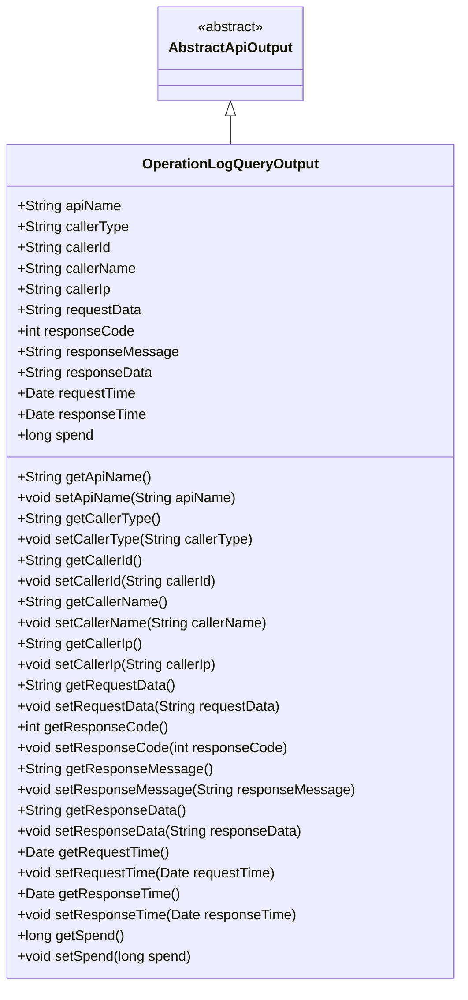

# Basic Information

|      |      |
|------|------|
| Name | OperationLogQueryOutput |
| Language | .java |
| Code Path | WeFe/manager/manager-service/src/main/java/com/welab/wefe/manager/service/dto/operation/OperationLogQueryOutput.java |
| Package Name | com.welab.wefe.manager.service.dto.operation |
| Dependencies | ['com.welab.wefe.common.web.dto.AbstractApiOutput', 'java.util.Date'] |
| Brief Description | The OperationLogQueryOutput class records API operation logs, containing fields such as interface name, caller information, request and response data, timestamps, and time consumption, while providing getter and setter methods for each attribute. |

# Description

The OperationLogQueryOutput class inherits from AbstractApiOutput and is used to record the query output of API operation logs. It includes fields such as interface name, caller type, ID, name, IP address, request parameters, response code, message, response content, request time, response time, and duration. Each field has corresponding getter and setter methods for retrieving and setting property values. This class comprehensively records key information of API calls, facilitating subsequent analysis and monitoring.

# Class Summary

| Name   | Type  | Description |
|-------|------|-------------|
| OperationLogQueryOutput | class | The OperationLogQueryOutput class inherits from AbstractApiOutput and includes fields such as interface name, caller information, request/response data and time, time consumption, along with their corresponding getter/setter methods. |

## Class OperationLogQueryOutput

|      |      |
|------|------|
| Access Modifier | public |
| Type | class |
| Name | OperationLogQueryOutput |
| Description | The OperationLogQueryOutput class inherits from AbstractApiOutput and includes fields such as interface name, caller information, request/response data and time, time consumption, along with their corresponding getter/setter methods. |

### UML Class Diagram

This class diagram illustrates that the OperationLogQueryOutput class inherits from the abstract class AbstractApiOutput, primarily used for recording query output results of API operation logs. The class contains 13 public fields and corresponding getter/setter methods, documenting critical information such as API name, caller details, request/response data, timestamps, and processing time. All fields are public attributes encapsulated through the standard JavaBean pattern, making it suitable as a DTO for transmitting complete API call log data between systems.

### Internal Method Call Graph

```mermaid
graph TD
    A["Class OperationLogQueryOutput"]
    B["Inherits: AbstractApiOutput"]
    C["Property: String apiName"]
    D["Property: String callerType"]
    E["Property: String callerId"]
    F["Property: String callerName"]
    G["Property: String callerIp"]
    H["Property: String requestData"]
    I["Property: int responseCode"]
    J["Property: String responseMessage"]
    K["Property: String responseData"]
    L["Property: Date requestTime"]
    M["Property: Date responseTime"]
    N["Property: long spend"]
    O["Method: getApiName/setApiName"]
    P["Method: getCallerType/setCallerType"]
    Q["Method: getCallerId/setCallerId"]
    R["Method: getCallerName/setCallerName"]
    S["Method: getCallerIp/setCallerIp"]
    T["Method: getRequestData/setRequestData"]
    U["Method: getResponseCode/setResponseCode"]
    V["Method: getResponseMessage/setResponseMessage"]
    W["Method: getResponseData/setResponseData"]
    X["Method: getRequestTime/setRequestTime"]
    Y["Method: getResponseTime/setResponseTime"]
    Z["Method: getSpend/setSpend"]

    A --> B
    A --> C
    A --> D
    A --> E
    A --> F
    A --> G
    A --> H
    A --> I
    A --> J
    A --> K
    A --> L
    A --> M
    A --> N
    A --> O
    A --> P
    A --> Q
    A --> R
    A --> S
    A --> T
    A --> U
    A --> V
    A --> W
    A --> X
    A --> Y
    A --> Z
```

This code defines a class named OperationLogQueryOutput, which inherits from AbstractApiOutput and is primarily used to record query outputs for API operation logs. The class contains 13 properties, documenting API name, caller type, caller ID, caller name, caller IP, request parameters, response code, response message, response data, request time, response time, and processing duration. Each property has corresponding getter and setter methods for retrieving and assigning values. The main purpose of this class is to encapsulate API operation log information, facilitating the transfer and processing of such data within the system.

### Field List

| Name  | Type  | Description |
|-------|-------|------|
| apiName | String | Define a public variable apiName of type string. |
| requestData | String | Declare a public string variable requestData. |
| responseMessage | String | Declared a public string variable named responseMessage. |
| responseData | String | Declare a public string variable responseData. |
| responseTime | Date | Declare a variable named responseTime of type Date to store the response time. |
| requestTime | Date | Declare a public Date type variable named requestTime. |
| callerType | String | Define a string-type variable callerType to store caller type information. |
| callerName | String | Declare a public string variable callerName. |
| callerId | String | Declare a public string variable callerId. |
| responseCode | int | Define an integer variable responseCode to store the response code. |
| spend | long | The variable `spend` is of type long integer, used to store expenditure amounts. |
| callerIp | String | Declare a public string variable callerIp to store the caller's IP address. |

### Method List

| Name  | Type  | Description |
|-------|-------|------|
| setResponseData | void | The method to set the response data assigns the input string to the `responseData` member variable of the class. |
| getApiName | String | This is a Java method that returns the value of the apiName property as a string. |
| getCallerIp | String | Methods to obtain the caller's IP address, returning a string-type callerIp. |
| getCallerId | String | Methods to obtain the caller ID, returning a string-type callerId value. |
| getResponseTime | Date | Methods for obtaining response time, returning a Date type value. |
| setResponseCode | void | Methods for setting HTTP response status codes, with the parameter being an integer responseCode. |
| getResponseData | String | Methods to obtain response data, returning a string-type variable `responseData`. |
| getRequestTime | Date | Methods to obtain the request time, returning a Date type. |
| setApiName | void | Defined a public method `setApiName` for setting the value of the class member variable `apiName`. |
| getResponseMessage | String | Methods to obtain the response message, returning a string-type responseMessage. |
| getRequestData | String | Methods for obtaining request data, returns requestData of string type. |
| setCallerId | void | The method to set the caller ID assigns the parameter callerId to the class member variable callerId. |
| getSpend | long | Method to obtain the consumption amount, returns a long integer value spend. |
| setRequestData | void | Define a public method `setRequestData` that accepts a string parameter `requestData` and assigns it to the property of the same name in the current object. |
| getCallerType | String | Methods to obtain the caller type, returning a string `callerType`. |
| getResponseCode | int | Methods to Obtain HTTP Response Status Codes. |
| setCallerIp | void | Methods for setting the caller's IP address. |
| setRequestTime | void | The method to set the request time assigns the passed Date object to the class's `requestTime` property. |
| setResponseMessage | void | This is a Java method used to set the value of the class's responseMessage property. The method accepts a string parameter named responseMessage and assigns it to the class's member variable of the same name. |
| setResponseTime | void | Define the method setResponseTime, used to set the response time responseTime, with a parameter of type Date. |
| setCallerName | void | The method to set the caller name assigns the input parameter to the class member variable `callerName`. |
| getCallerName | String | Methods to obtain the caller name, returning a string-type callerName. |
| setCallerType | void | Method for setting the caller type, which assigns the input parameter to the class member variable callerType. |
| setSpend | void | This is a Java method used to set the value of the class member variable "spend," with the parameter type being long. |

