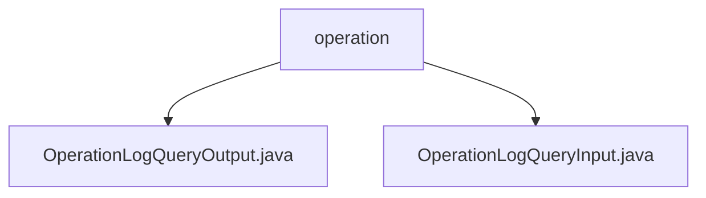

# Basic Information

|      |      |
|------|------|
| Name | operation |
| Language | .java |
| Code Path | WeFe/manager/manager-service/src/main/java/com/welab/wefe/manager/service/dto/operation |
| Package Name | docs.manager.manager-service.src.main.java.com.welab.wefe.manager.service.dto.operation |
| Brief Description | The OperationLogQueryOutput class inherits from AbstractApiOutput, recording API operation log query outputs, including fields such as interface name, caller, request parameters, and response information. The OperationLogQueryInput class inherits from PageInput and is used to query operation logs, containing fields like interface name, caller name, and time range. |

# Description

## Overview  
The core responsibility of this module is to provide query functionality for operation logs, including input parameter encapsulation and output result records. The interface specification follows the standard DTO pattern, with inputs inheriting PageInput to support pagination and outputs inheriting AbstractApiOutput to include complete call logs. The key data structures are OperationLogQueryInput (containing API name, caller, and time range) and OperationLogQueryOutput (containing 21 monitoring fields, similar to an audit log template). External dependencies only involve the base parent classes AbstractApiOutput and PageInput. For example, the output class records full-link information such as request parameters, response codes, and time consumption.

## Main Business Scenarios  
It primarily supports paginated querying of API operation logs based on conditions, with typical scenarios including fault troubleshooting and behavior auditing. The interaction mode involves the frontend passing query conditions (e.g., time range + interface name), and the backend returning paginated log details. Functional completeness is reflected in the input's support for fuzzy queries and the output's coverage of full lifecycle data for calls. Integration examples can achieve precise log retrieval by combining callerName and apiName, similar to the query logic of a database audit system.

### Package Internal Structure View

This flowchart illustrates two Java files under the operation directory: OperationLogQueryOutput.java and OperationLogQueryInput.java. These files belong to the DTO layer of the manager-service project, handling the input and output data structures for operation log queries, demonstrating a simple hierarchical relationship between business logic and data interaction.

# File List

| Name   | Type  | Description |
|-------|------|-------------|
| [OperationLogQueryOutput.java](OperationLogQueryOutput.md) | file | The OperationLogQueryOutput class records API operation logs, including fields such as interface name, caller information, request/response data, timestamps, and time consumption, and provides getter and setter methods for each attribute. |
| [OperationLogQueryInput.java](OperationLogQueryInput.md) | file | The OperationLogQueryInput class extends PageInput and includes attributes such as apiName, callerName, startTime, endTime along with their corresponding getter/setter methods. |

