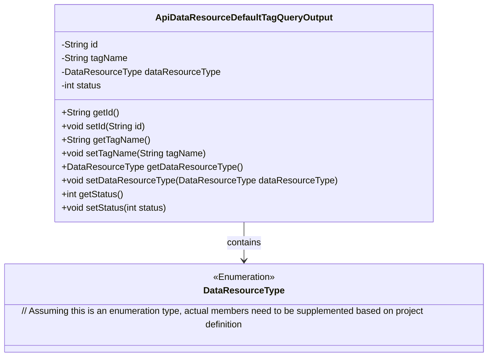

# Basic Information

|      |      |
|------|------|
| Name | ApiDataResourceDefaultTagQueryOutput |
| Language | .java |
| Code Path | WeFe/manager/manager-service/src/main/java/com/welab/wefe/manager/service/dto/tag/ApiDataResourceDefaultTagQueryOutput.java |
| Package Name | com.welab.wefe.manager.service.dto.tag |
| Dependencies | ['com.welab.wefe.common.wefe.enums.DataResourceType'] |
| Brief Description | The ApiDataResourceDefaultTagQueryOutput class includes attributes such as id, tagName, dataResourceType, and status, providing corresponding getter and setter methods. |

# Description

The content defines a Java class named `ApiDataResourceDefaultTagQueryOutput`, which includes four private attributes: `id` (String type), `tagName` (String type), `dataResourceType` (DataResourceType type), and `status` (integer type). The class provides corresponding getter and setter methods for each attribute to retrieve and set their values. This class may be used to represent the default tag query result data returned by an API.

# Class Summary

| Name   | Type  | Description |
|-------|------|-------------|
| ApiDataResourceDefaultTagQueryOutput | class | The ApiDataResourceDefaultTagQueryOutput class includes the id, tagName, dataResourceType, and status attributes, along with their corresponding getter and setter methods. |

## Class ApiDataResourceDefaultTagQueryOutput

|      |      |
|------|------|
| Access Modifier | public |
| Type | class |
| Name | ApiDataResourceDefaultTagQueryOutput |
| Description | The ApiDataResourceDefaultTagQueryOutput class includes the id, tagName, dataResourceType, and status attributes, along with their corresponding getter and setter methods. |

### UML Class Diagram

This class diagram describes the structure of the `ApiDataResourceDefaultTagQueryOutput` data entity class, which contains four private fields: ID, tag name, resource type enumeration, and status, with properties exposed through public getter/setter methods. The `DataResourceType` exists as an enumeration type and forms a composition relationship with the main class. This design is typically used for structured encapsulation of API response data, complying with JavaBean specifications to facilitate serialized transmission and state management. The use of enumeration fields enhances type safety.

### Internal Method Call Graph

```mermaid
graph TD
    A["Class ApiDataResourceDefaultTagQueryOutput"]
    B["Property: String id"]
    C["Property: String tagName"]
    D["Property: DataResourceType dataResourceType"]
    E["Property: int status"]
    F["Method: String getId()"]
    G["Method: void setId(String id)"]
    H["Method: String getTagName()"]
    I["Method: void setTagName(String tagName)"]
    J["Method: DataResourceType getDataResourceType()"]
    K["Method: void setDataResourceType(DataResourceType dataResourceType)"]
    L["Method: int getStatus()"]
    M["Method: void setStatus(int status)"]

    A --> B
    A --> C
    A --> D
    A --> E
    A --> F
    A --> G
    A --> H
    A --> I
    A --> J
    A --> K
    A --> L
    A --> M
```

This code defines a class named `ApiDataResourceDefaultTagQueryOutput`, which contains four private properties: `id`, `tagName`, `dataResourceType`, and `status`, along with corresponding getter and setter methods for each property. The class is primarily used to encapsulate API data resource default tag query output information, allowing property values to be retrieved via getter methods and modified via setter methods. The flowchart clearly illustrates the hierarchical relationships between the class and its properties and methods.

### Field List

| Name  | Type  | Description |
|-------|-------|------|
| dataResourceType | DataResourceType | The variable for private data resource type is `dataResourceType`. |
| tagName | String | Private string variable tagName. |
| id | String | Private string type variable id. |
| status | int | Private integer variable status, used to store status information. |

### Method List

| Name  | Type  | Description |
|-------|-------|------|
| setTagName | void | This is a Java method used to set the tagName property value of an object. The method takes a string parameter tagName and assigns it to the property of the same name in the current object. |
| setDataResourceType | void | The method for setting the data resource type assigns the input parameter to the class member variable `dataResourceType`. |
| setStatus | void | Methods for setting status values, assigning the input parameter status to the status property of the current object. |
| getDataResourceType | DataResourceType | Methods for obtaining the data resource type, returns the value of the dataResourceType field. |
| getTagName | String | Methods to obtain the tag name, returns the tagName as a string type. |
| getId | String | This is a Java method that returns a string-type id value. |
| setId | void | Methods for setting object ID: Assign the parameter id to the id property of the current object. |
| getStatus | int | Method returns status value. |

