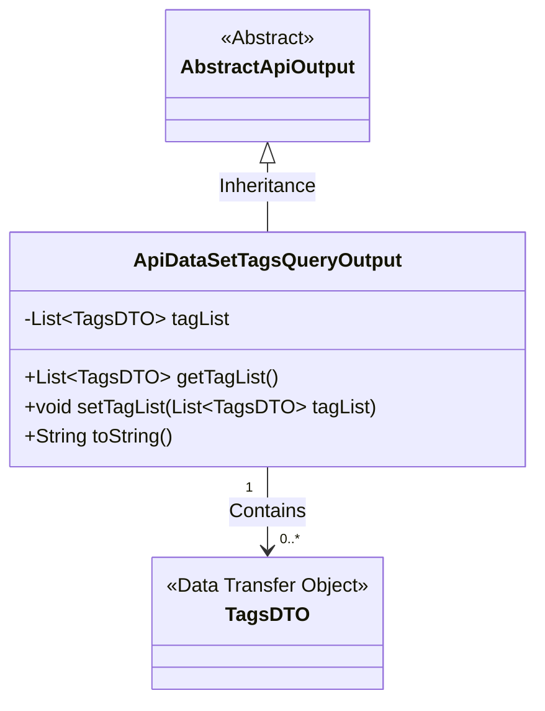
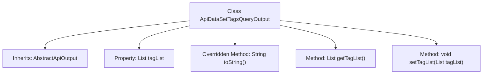

# Basic Information

|      |      |
|------|------|
| Name | ApiDataSetTagsQueryOutput |
| Language | .java |
| Code Path | WeFe/manager/manager-service/src/main/java/com/welab/wefe/manager/service/dto/tag/ApiDataSetTagsQueryOutput.java |
| Package Name | com.welab.wefe.manager.service.dto.tag |
| Dependencies | ['com.welab.wefe.common.web.dto.AbstractApiOutput', 'java.util.List'] |
| Brief Description | The ApiDataSetTagsQueryOutput class extends AbstractApiOutput, containing the tagList property and corresponding getter/setter methods, with the toString method returning the contents of tagList. |

# Description

This is a Java class named ApiDataSetTagsQueryOutput, which extends AbstractApiOutput. The class contains a private member variable tagList, which is a list of TagsDTO objects. It provides a toString method to return a string representation including tagList. Additionally, it offers getTagList and setTagList methods for retrieving and setting the value of tagList. This class is primarily used to handle the output results of API dataset tag queries.

# Class Summary

| Name   | Type  | Description |
|-------|------|-------------|
| ApiDataSetTagsQueryOutput | class | The ApiDataSetTagsQueryOutput class extends AbstractApiOutput, containing the tagList property and corresponding getter/setter methods, with the toString method returning the contents of tagList. |

## Class ApiDataSetTagsQueryOutput

|      |      |
|------|------|
| Access Modifier | public |
| Type | class |
| Name | ApiDataSetTagsQueryOutput |
| Description | The ApiDataSetTagsQueryOutput class extends AbstractApiOutput, containing the tagList property and corresponding getter/setter methods, with the toString method returning the contents of tagList. |

### UML Class Diagram

This class diagram illustrates the structure where ApiDataSetTagsQueryOutput inherits from the abstract class AbstractApiOutput and contains a list of TagsDTO objects. As a data encapsulation class, ApiDataSetTagsQueryOutput stores multiple tag data objects through the tagList field, providing standard getter/setter methods and an overridden toString() implementation. The TagsDTO, marked as a Data Transfer Object, exemplifies the typical design pattern of data encapsulation and transfer in layered architectures.

### Internal Method Call Graph

This code defines a class named ApiDataSetTagsQueryOutput that inherits from AbstractApiOutput. The class contains a tagList property for storing a list of TagsDTO type, along with corresponding getter and setter methods. Additionally, it overrides the toString method to return a string representation including tagList. The flowchart clearly illustrates the class inheritance relationship and the associations between properties and methods.

### Field List

| Name  | Type  | Description |
|-------|-------|------|
| tagList | List<TagsDTO> | Private tag list, which is a collection of TagsDTO objects. |

### Method List

| Name  | Type  | Description |
|-------|-------|------|
| toString | String | Java overrides the toString method to return a string containing tagList. |
| getTagList | List<TagsDTO> | The method to retrieve the list of tags returns a list of type TagsDTO. |
| setTagList | void | Method for setting the tag list, which assigns the input tag list to the tagList property of the current object. |

