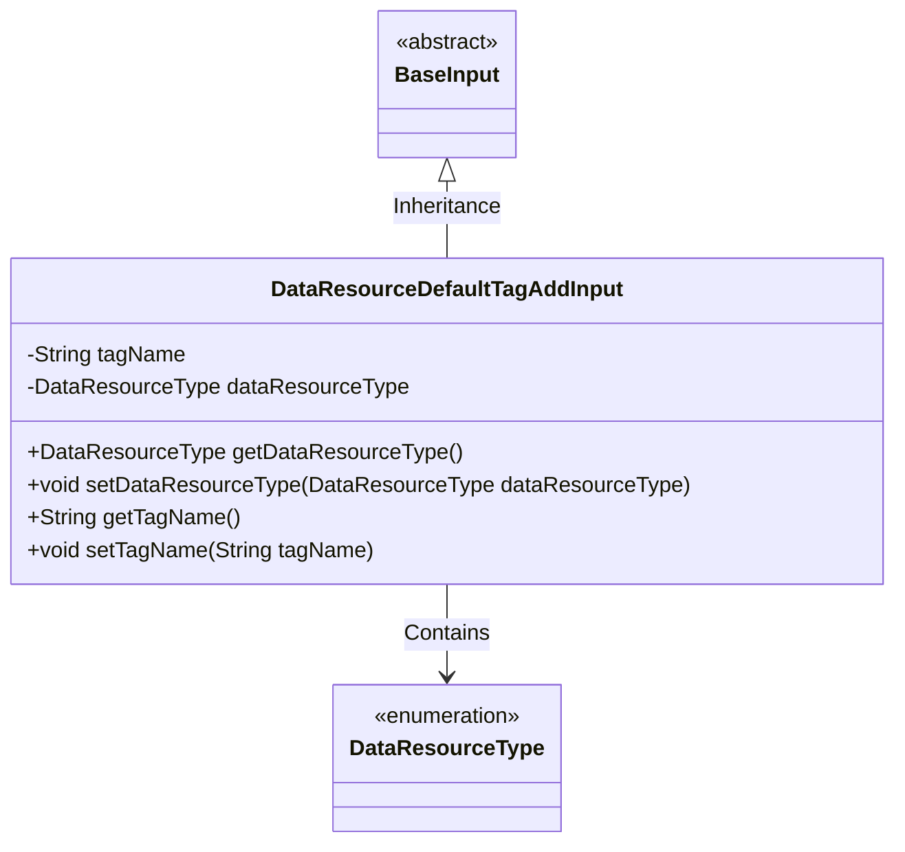
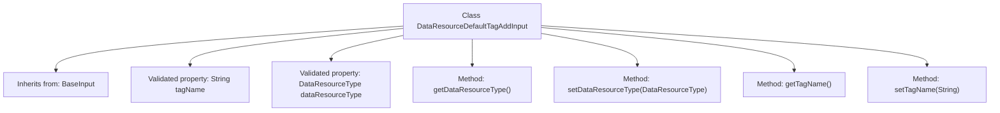

# Basic Information

|      |      |
|------|------|
| Name | DataResourceDefaultTagAddInput |
| Language | .java |
| Code Path | WeFe/manager/manager-service/src/main/java/com/welab/wefe/manager/service/dto/tag/DataResourceDefaultTagAddInput.java |
| Package Name | com.welab.wefe.manager.service.dto.tag |
| Dependencies | ['com.welab.wefe.common.fieldvalidate.annotation.Check', 'com.welab.wefe.common.wefe.enums.DataResourceType', 'com.welab.wefe.manager.service.dto.base.BaseInput'] |
| Brief Description | The DataResourceDefaultTagAddInput class extends BaseInput, containing the required fields tagName and dataResourceType along with their getter/setter methods. |

# Description

This is a Java class named DataResourceDefaultTagAddInput, which extends the BaseInput class. It contains two mandatory fields: tagName (String type) and dataResourceType (DataResourceType enum type). The class provides getter and setter methods for these fields to retrieve and set their values. The class uses the @Check annotation to mark these fields as required.

# Class Summary

| Name   | Type  | Description |
|-------|------|-------------|
| DataResourceDefaultTagAddInput | class | The input class DataResourceDefaultTagAddInput inherits from BaseInput, containing the required fields tagName and dataResourceType along with their getter/setter methods. |

## Class DataResourceDefaultTagAddInput

|      |      |
|------|------|
| Access Modifier | public |
| Type | class |
| Name | DataResourceDefaultTagAddInput |
| Description | The input class DataResourceDefaultTagAddInput inherits from BaseInput, containing the required fields tagName and dataResourceType along with their getter/setter methods. |

### UML Class Diagram

This code demonstrates the structure of a DataResourceDefaultTagAddInput class, which inherits from the BaseInput base class. The class contains two private fields: tagName (tag name) and dataResourceType (data resource type enumeration), along with corresponding getter and setter methods. The fields are marked as required via the @Check annotation, and DataResourceType is an enumeration representing different data resource types. The class diagram clearly illustrates the inheritance relationship and type dependencies.

### Internal Method Call Graph

This flowchart illustrates the structure of the DataResourceDefaultTagAddInput class, which inherits from BaseInput. It contains two properties with @Check validation annotations (tagName and dataResourceType) along with their corresponding getter/setter methods. All methods are directly linked to the main class node, with inheritance relationships clearly marked by arrows. The properties are annotated with validation requirements, and the methods fully cover field operations, demonstrating the standard Java Bean design pattern.

### Field List

| Name  | Type  | Description |
|-------|-------|------|
| dataResourceType | DataResourceType | The mandatory validation field dataResourceType cannot be empty. |
| tagName | String | Validation declaration for the required field tagName. |

### Method List

| Name  | Type  | Description |
|-------|-------|------|
| getDataResourceType | DataResourceType | Methods for obtaining the data resource type, returns dataResourceType. |
| setDataResourceType | void | The method for setting the data resource type assigns the input parameter to the class member variable `dataResourceType`. |
| getTagName | String | Methods to obtain the tag name, returning a string-type tagName value. |
| setTagName | void | This is a Java method used to set the tagName property value of an object. The method takes a string parameter tagName and assigns it to the member variable of the same name in the current object. |

