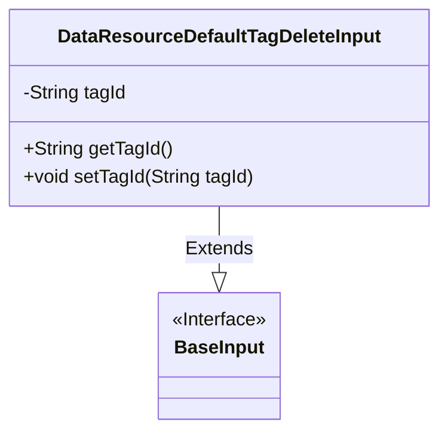
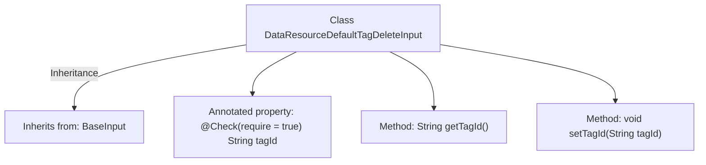

# Basic Information

|      |      |
|------|------|
| Name | DataResourceDefaultTagDeleteInput |
| Language | .java |
| Code Path | WeFe/manager/manager-service/src/main/java/com/welab/wefe/manager/service/dto/tag/DataResourceDefaultTagDeleteInput.java |
| Package Name | com.welab.wefe.manager.service.dto.tag |
| Dependencies | ['com.welab.wefe.common.fieldvalidate.annotation.Check', 'com.welab.wefe.manager.service.dto.base.BaseInput'] |
| Brief Description | The Java class `DataResourceDefaultTagDeleteInput` extends `BaseInput` and includes a required field `tagId` along with its getter and setter methods. |

# Description

The DataResourceDefaultTagDeleteInput class inherits from BaseInput and includes a mandatory tagId string property, which is accessed and modified through getter and setter methods. This class is used to handle input data for deleting default tags.

# Class Summary

| Name   | Type  | Description |
|-------|------|-------------|
| DataResourceDefaultTagDeleteInput | class | The Java class DataResourceDefaultTagDeleteInput extends BaseInput and includes the required field tagId along with its getter and setter methods. |

## Class DataResourceDefaultTagDeleteInput

|      |      |
|------|------|
| Access Modifier | public |
| Type | class |
| Name | DataResourceDefaultTagDeleteInput |
| Description | The Java class DataResourceDefaultTagDeleteInput extends BaseInput and includes the required field tagId along with its getter and setter methods. |

### UML Class Diagram

This code demonstrates a simple class inheritance relationship where `DataResourceDefaultTagDeleteInput` extends the `BaseInput` interface. The class contains a private string attribute `tagId` along with corresponding getter and setter methods. The `@Check` annotation marks this field as mandatory, reflecting the design intent of data validation. The class diagram clearly illustrates this inheritance relationship and attribute encapsulation structure.

### Internal Method Call Graph

This flowchart illustrates the structure of the DataResourceDefaultTagDeleteInput class, which inherits from BaseInput. It primarily includes a tagId property annotated with @Check and corresponding getter/setter methods. The annotation indicates tagId is a required field, reflecting the design intent of input validation. The class structure is simple and clear, compliant with JavaBean specifications, making it suitable for data transfer scenarios.

### Field List

| Name  | Type  | Description |
|-------|-------|------|
| tagId | String | Required field tagId, type is String. |

### Method List

| Name  | Type  | Description |
|-------|-------|------|
| getTagId | String | Methods to obtain the tag ID, returns the tagId as a string type. |
| setTagId | void | This is a Java method used to set the tagId property value of an object. The method takes a string parameter tagId and assigns it to the member variable of the same name in the object. |

