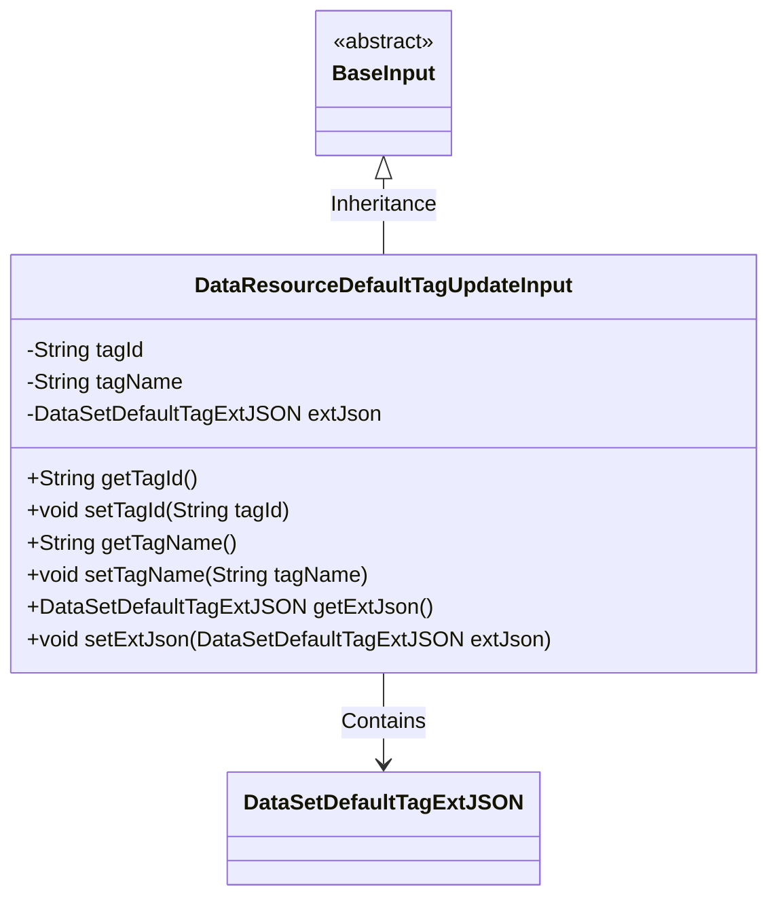
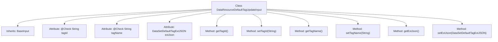

# Basic Information

|      |      |
|------|------|
| Name | DataResourceDefaultTagUpdateInput |
| Language | .java |
| Code Path | WeFe/manager/manager-service/src/main/java/com/welab/wefe/manager/service/dto/tag/DataResourceDefaultTagUpdateInput.java |
| Package Name | com.welab.wefe.manager.service.dto.tag |
| Dependencies | ['com.welab.wefe.common.data.mongodb.entity.union.ext.DataSetDefaultTagExtJSON', 'com.welab.wefe.common.fieldvalidate.annotation.Check', 'com.welab.wefe.manager.service.dto.base.BaseInput'] |
| Brief Description | The DataResourceDefaultTagUpdateInput class extends BaseInput, containing the mandatory fields tagId and tagName, along with the optional field extJson, and provides getter and setter methods for each field. |

# Description

This Java class defines an input model for updating default data resource tags, extending from BaseInput. It includes three fields: the mandatory tagId and tagName strings, and an optional extJson object. Standard getter and setter methods are provided for accessing and modifying these field values. Annotations ensure that tagId and tagName are required fields.

# Class Summary

| Name   | Type  | Description |
|-------|------|-------------|
| DataResourceDefaultTagUpdateInput | class | The DataResourceDefaultTagUpdateInput class inherits from BaseInput, containing the required tagId and tagName fields, as well as the optional extJson field, providing getter and setter methods for each field. |

## Class DataResourceDefaultTagUpdateInput

|      |      |
|------|------|
| Access Modifier | public |
| Type | class |
| Name | DataResourceDefaultTagUpdateInput |
| Description | The DataResourceDefaultTagUpdateInput class inherits from BaseInput, containing the required tagId and tagName fields, as well as the optional extJson field, providing getter and setter methods for each field. |

### UML Class Diagram

This class diagram illustrates that the DataResourceDefaultTagUpdateInput class inherits from the abstract BaseInput class and contains three private fields: tagId, tagName, and extJson. Among these, tagId and tagName are mandatory fields (marked by the @Check annotation), while extJson is an optional field. The class provides standard getter and setter methods to access these fields. DataSetDefaultTagExtJSON is an independent data class referenced by the DataResourceDefaultTagUpdateInput class. The overall structure reflects the standard Java Bean design pattern for data transfer and validation.

### Internal Method Call Graph

This flowchart illustrates the structure of the `DataResourceDefaultTagUpdateInput` class, an input class inheriting from `BaseInput`. It contains three attributes (two annotated with `@Check`) and corresponding getter/setter methods. The class primarily encapsulates tag update request data, where `tagId` and `tagName` are mandatory fields, and `extJson` stores extended JSON data. All methods revolve around read-write operations for these three attributes, forming a standard JavaBean structure.

### Field List

| Name  | Type  | Description |
|-------|-------|------|
| tagName | String | Required field: tagName of string type. |
| tagId | String | The code snippet defines a private string variable tagId and marks it as a required field using the @Check annotation. |
| extJson | DataSetDefaultTagExtJSON | The default label extension JSON field for private datasets. |

### Method List

| Name  | Type  | Description |
|-------|-------|------|
| getTagName | String | The method returns a tagName value of string type. |
| setExtJson | void | The method `setExtJson` is used to set the `extJson` property, with the parameter being of type `DataSetDefaultTagExtJSON`. |
| setTagName | void | This is a Java method used to set the tagName property value of an object. The method takes a string parameter tagName and assigns it to the member variable of the same name in the current object. |
| setTagId | void | The method to set the tag ID assigns the input parameter tagId to the tagId property of the current object. |
| getExtJson | DataSetDefaultTagExtJSON | Methods to obtain extended JSON data, returning a DataSetDefaultTagExtJSON object. |
| getTagId | String | Methods to obtain the tag ID, returns the tagId as a string type. |

