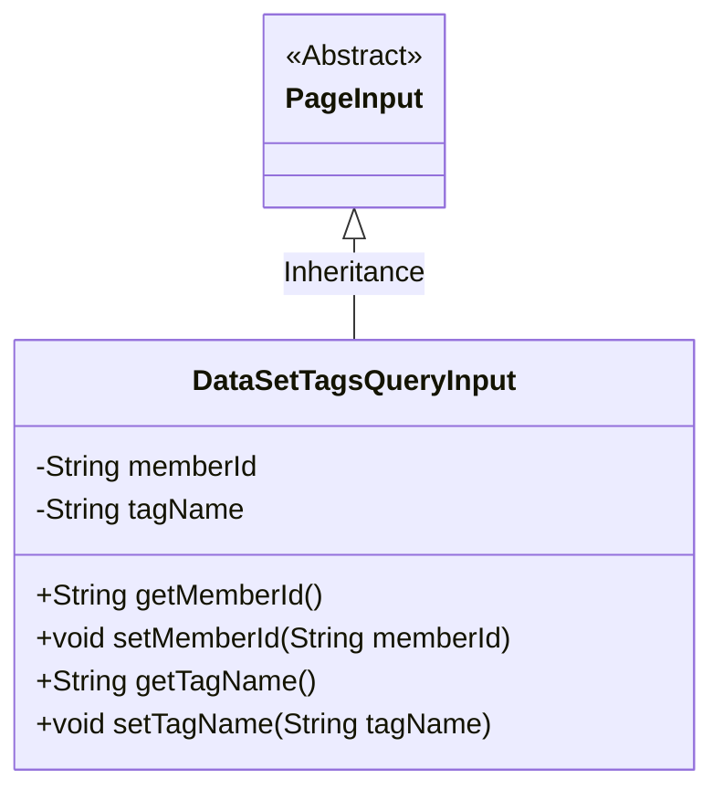
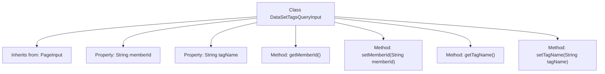

# Basic Information

|      |      |
|------|------|
| Name | DataSetTagsQueryInput |
| Language | .java |
| Code Path | WeFe/manager/manager-service/src/main/java/com/welab/wefe/manager/service/dto/tag/DataSetTagsQueryInput.java |
| Package Name | com.welab.wefe.manager.service.dto.tag |
| Dependencies | ['com.welab.wefe.manager.service.dto.base.PageInput'] |
| Brief Description | The DataSetTagsQueryInput class inherits from PageInput and includes properties for member ID and tag name along with their corresponding getter/setter methods. |

# Description

The `DataSetTagsQueryInput` class inherits from `PageInput` and contains two private string-type properties: `memberId` and `tagName`, representing the member ID and tag name, respectively. This class provides getter and setter methods for these two properties to access and modify their values.

# Class Summary

| Name   | Type  | Description |
|-------|------|-------------|
| DataSetTagsQueryInput | class | Dataset label query input class, inherits pagination input, includes member ID and label name fields along with corresponding getter/setter methods. |

## Class DataSetTagsQueryInput

|      |      |
|------|------|
| Access Modifier | public |
| Type | class |
| Name | DataSetTagsQueryInput |
| Description | Dataset label query input class, inherits pagination input, includes member ID and label name fields along with corresponding getter/setter methods. |

### UML Class Diagram

This class diagram illustrates the inheritance relationship where DataSetTagsQueryInput extends the abstract class PageInput. DataSetTagsQueryInput contains two private attributes, memberId and tagName, along with their corresponding getter and setter methods. This class is designed to encapsulate input parameters for dataset tag queries. By inheriting from PageInput, it gains foundational support for pagination functionality while extending specific fields for tag queries, namely member ID and tag name, making it suitable for scenarios requiring paginated queries.

### Internal Method Call Graph

This code defines a class named `DataSetTagsQueryInput`, which inherits from the `PageInput` class. It includes two private string properties `memberId` and `tagName`, along with their corresponding getter and setter methods. The flowchart illustrates the class's inheritance relationship, property declarations, and method definitions, clearly presenting the basic structure and member relationships of the class. This class is primarily used to encapsulate input parameters for dataset tag queries, enabling secure access and modification of properties through getter and setter methods.

### Field List

| Name  | Type  | Description |
|-------|-------|------|
| tagName | String | Private string variable tagName. |
| memberId | String | Member ID string variable |

### Method List

| Name  | Type  | Description |
|-------|-------|------|
| getTagName | String | The method returns a string-type tagName value. |
| getMemberId | String | This is a Java method that returns a member ID string. The method name is getMemberId, and the return type is String. |
| setMemberId | void | Methods for setting member ID, assigning the input parameter to the class's member variable memberId. |
| setTagName | void | This is a Java method used to set the tagName property value of an object. The method takes a string parameter tagName and assigns it to the member variable of the same name in the current object. |

