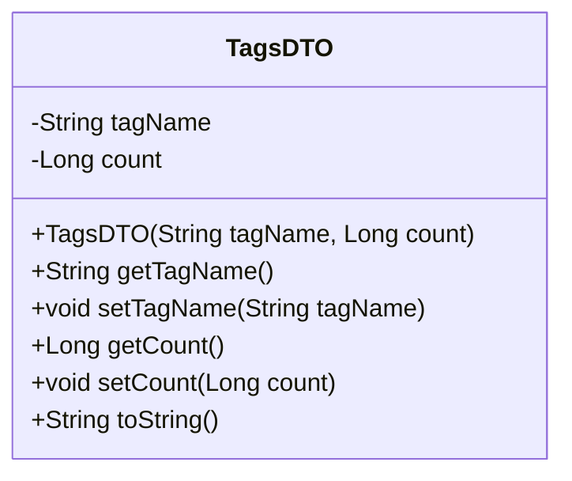
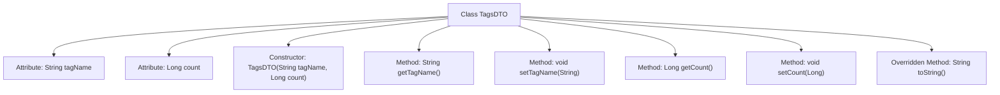

# Basic Information

|      |      |
|------|------|
| Name | TagsDTO |
| Language | .java |
| Code Path | WeFe/manager/manager-service/src/main/java/com/welab/wefe/manager/service/dto/tag/TagsDTO.java |
| Package Name | com.welab.wefe.manager.service.dto.tag |
| Dependencies | [] |
| Brief Description | The TagsDTO class contains the tagName and count attributes, providing a constructor, getter/setter methods, and a toString method for storing and manipulating tag data. |

# Description

TagsDTO is a Java class used for storing tag information, containing two private fields: tagName (a String type representing the tag name) and count (a long type representing the tag count). The class provides a parameterized constructor for initializing these two fields. It also includes getter and setter methods for accessing and modifying the values of these fields. Additionally, the class overrides the toString method to return a string representation of the object in a specific format, including the tag name and count information.

# Class Summary

| Name   | Type  | Description |
|-------|------|-------------|
| TagsDTO | class | The TagsDTO class includes the tagName and count attributes, providing a constructor, getter/setter methods, and a toString method for storing and manipulating tag data. |

## Class TagsDTO

|      |      |
|------|------|
| Access Modifier | public |
| Type | class |
| Name | TagsDTO |
| Description | The TagsDTO class includes the tagName and count attributes, providing a constructor, getter/setter methods, and a toString method for storing and manipulating tag data. |

### UML Class Diagram

This code defines a class named TagsDTO, which represents a tag data object. The class contains two private attributes: tagName (String type) and count (Long type), representing the tag name and count respectively. It provides a complete constructor, getter/setter methods, and overrides the toString() method to format the object's output. This is a typical Data Transfer Object (DTO) design, used to transfer tag and its count information between different layers.

### Internal Method Call Graph

This code defines a class named TagsDTO for encapsulating tag name and count data. The class contains two private attributes (tagName and count) with initialization and access control through constructor and setter/getter methods. The overridden toString method provides formatted string output for debugging and logging purposes. The flowchart clearly illustrates the class structure and relationships between attributes and methods, conforming to the Data Transfer Object design pattern.

### Field List

| Name  | Type  | Description |
|-------|-------|------|
| tagName | String | Declare a private string variable tagName. |
| count | Long | Private long integer variable count, used to store the count value. |

### Method List

| Name  | Type  | Description |
|-------|-------|------|
| getTagName | String | Methods to obtain the tag name, returns the tagName as a string type. |
| toString | String | Java overrides the toString method to return a string containing tagName and count. |
| setTagName | void | This is a Java method used to set the label name property of an object. The method accepts a string parameter `tagName` and assigns it to the `tagName` member variable of the current object. |
| getCount | Long | Methods to obtain the count value, returns a long integer variable count. |
| setCount | void | Methods for setting the count attribute, with the parameter being of type Long. |

