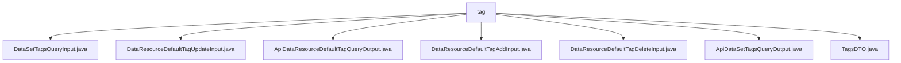

# Basic Information

|      |      |
|------|------|
| Name | tag |
| Language | .java |
| Code Path | WeFe/manager/manager-service/src/main/java/com/welab/wefe/manager/service/dto/tag |
| Package Name | docs.manager.manager-service.src.main.java.com.welab.wefe.manager.service.dto.tag |
| Brief Description | The DataSetTagsQueryInput class includes memberId and tagName attributes. The DataResourceDefaultTagUpdateInput class contains required tagId, tagName, and optional extJson. The ApiDataResourceDefaultTagQueryOutput class includes attributes such as id and tagName. The DataResourceDefaultTagAddInput class contains required tagName and dataResourceType. The DataResourceDefaultTagDeleteInput class includes required tagId. The ApiDataSetTagsQueryOutput class contains the tagList attribute. The TagsDTO class stores tagName and count information. |

# Description

## Overview  
The core responsibility of this module is to manage CRUD operations and queries for data resource tags, similar to a tag management system. The interface specifications include paginated queries (DataSetTagsQueryInput), additions, deletions, and modifications (e.g., DataResourceDefaultTagAddInput), and result outputs (e.g., ApiDataSetTagsQueryOutput). Key data structures include TagsDTO (containing tagName and count) and the DataResourceType enumeration. External dependencies are limited to Java's core libraries. For example, mandatory validation via tagId/tagName is implemented for tag updates.  

## Main Business Scenarios  
The complete workflow covers tag creation (DataResourceDefaultTagAddInput), queries (paginated/default tags), updates (extJson extension field), and deletions (specified by tagId). The interaction model adopts a standard DTO layering approach, such as ApiDataSetTagsQueryOutput wrapping a list of TagsDTO. Typical scenarios include: tagging data resources (similar to Git tags) and counting tag usage (TagsDTO.count). API types cover CRUD operations, such as implementing tag removal via DataResourceDefaultTagDeleteInput.

### Package Internal Structure View

This flowchart illustrates the hierarchical relationships of tag-related DTO classes in the WeFe management service. All 7 Java files are directly located under the tag directory, including dataset tag query input classes, input/output classes for default tag operations on data resources, and the tag data transfer object. Together, these files form the data transfer layer structure for the tag management functionality.

# File List

| Name   | Type  | Description |
|-------|------|-------------|
| [DataSetTagsQueryInput.java](DataSetTagsQueryInput.md) | file | The `DataSetTagsQueryInput` class inherits from `PageInput` and includes properties for member ID and tag name, along with their corresponding getter and setter methods. |
| [DataResourceDefaultTagUpdateInput.java](DataResourceDefaultTagUpdateInput.md) | file | The DataResourceDefaultTagUpdateInput class extends BaseInput, containing the mandatory fields tagId and tagName, along with the optional field extJson, and provides getter and setter methods for each field. |
| [ApiDataResourceDefaultTagQueryOutput.java](ApiDataResourceDefaultTagQueryOutput.md) | file | The ApiDataResourceDefaultTagQueryOutput class includes attributes such as id, tagName, dataResourceType, and status, providing corresponding getter and setter methods. |
| [DataResourceDefaultTagAddInput.java](DataResourceDefaultTagAddInput.md) | file | The DataResourceDefaultTagAddInput class extends BaseInput, containing the required fields tagName and dataResourceType along with their getter and setter methods. |
| [DataResourceDefaultTagDeleteInput.java](DataResourceDefaultTagDeleteInput.md) | file | The Java class DataResourceDefaultTagDeleteInput extends BaseInput and includes the required field tagId along with its getter and setter methods. |
| [ApiDataSetTagsQueryOutput.java](ApiDataSetTagsQueryOutput.md) | file | The ApiDataSetTagsQueryOutput class extends AbstractApiOutput, containing the tagList property and corresponding getter/setter methods, with the toString method returning the contents of tagList. |
| [TagsDTO.java](TagsDTO.md) | file | The TagsDTO class includes the tagName and count attributes, providing a constructor, getter/setter methods, and a toString method for storing and manipulating tag data. |

