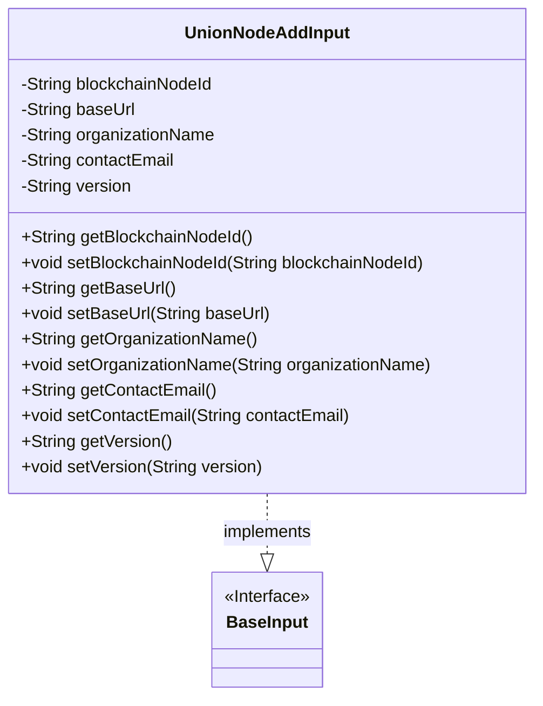

# Basic Information

|      |      |
|------|------|
| Name | UnionNodeAddInput |
| Language | .java |
| Code Path | WeFe/manager/manager-service/src/main/java/com/welab/wefe/manager/service/dto/union/UnionNodeAddInput.java |
| Package Name | com.welab.wefe.manager.service.dto.union |
| Dependencies | ['com.welab.wefe.common.fieldvalidate.annotation.Check', 'com.welab.wefe.manager.service.dto.base.BaseInput'] |
| Brief Description | The `UnionNodeAddInput` class inherits from `BaseInput`, containing the required fields `blockchainNodeId` and `baseUrl`, as well as the optional fields `organizationName`, `contactEmail`, and `version`. It provides getter and setter methods for each field. |

# Description

The `UnionNodeAddInput` class inherits from `BaseInput` and includes five fields: the mandatory blockchain node ID and base URL, as well as optional fields for institution name, contact email, and version number. Each field has corresponding getter and setter methods for retrieving and setting the field values.

# Class Summary

| Name   | Type  | Description |
|-------|------|-------------|
| UnionNodeAddInput | class | The `UnionNodeAddInput` class inherits from `BaseInput` and includes the required fields `blockchainNodeId` and `baseUrl`, as well as the optional fields `organizationName`, `contactEmail`, and `version`. It provides getter and setter methods for each field. |

## Class UnionNodeAddInput

|      |      |
|------|------|
| Access Modifier | public |
| Type | class |
| Name | UnionNodeAddInput |
| Description | The `UnionNodeAddInput` class inherits from `BaseInput` and includes the required fields `blockchainNodeId` and `baseUrl`, as well as the optional fields `organizationName`, `contactEmail`, and `version`. It provides getter and setter methods for each field. |

### UML Class Diagram

This code defines a `UnionNodeAddInput` class that implements the `BaseInput` interface. The class contains five private fields: `blockchainNodeId`, `baseUrl`, `organizationName`, `contactEmail`, and `version`, with the first two fields marked as required using the `@Check` annotation. Each field has corresponding getter and setter methods for accessing and modifying these properties. This class is primarily used to encapsulate the input parameters required when adding a blockchain node, including the node ID, base URL, organization name, contact email, and version information.

### Internal Method Call Graph

```mermaid
graph TD
    A["Class UnionNodeAddInput"]
    B["Inherits: BaseInput"]
    C["Validated Property: String blockchainNodeId"]
    D["Validated Property: String baseUrl"]
    E["Property: String organizationName"]
    F["Property: String contactEmail"]
    G["Property: String version"]
    H["Method: getBlockchainNodeId()"]
    I["Method: setBlockchainNodeId()"]
    J["Method: getBaseUrl()"]
    K["Method: setBaseUrl()"]
    L["Method: getOrganizationName()"]
    M["Method: setOrganizationName()"]
    N["Method: getContactEmail()"]
    O["Method: setContactEmail()"]
    P["Method: getVersion()"]
    Q["Method: setVersion()"]

    A --> B
    A --> C
    A --> D
    A --> E
    A --> F
    A --> G
    A --> H
    A --> I
    A --> J
    A --> K
    A --> L
    A --> M
    A --> N
    A --> O
    A --> P
    A --> Q
```

This flowchart illustrates the complete structure of the UnionNodeAddInput class, which inherits from BaseInput. It contains five String-type properties (with blockchainNodeId and baseUrl annotated for non-null validation) along with corresponding getter/setter methods. All properties and methods are connected to the main class via arrows, clearly demonstrating the data encapsulation structure and access control mechanism. Notably, the two @Check-annotated mandatory fields reflect the design intent for input validation.

### Field List

| Name  | Type  | Description |
|-------|-------|------|
| organizationName | String | Defined a private string variable organizationName for storing the organization name. |
| blockchainNodeId | String | The code defines a private String variable named blockchainNodeId and marks this field as mandatory with the @Check annotation. |
| version | String | Declare a private string variable version. |
| contactEmail | String | Define a private string variable contactEmail. |
| baseUrl | String | The code snippet defines a private string variable named baseUrl and marks it as a mandatory item requiring verification. |

### Method List

| Name  | Type  | Description |
|-------|-------|------|
| getVersion | String | Methods to obtain the version number, returns the value of the version variable as a string type. |
| getBaseUrl | String | Methods to obtain the baseUrl, directly returning the value of baseUrl. |
| setBlockchainNodeId | void | Methods for setting the blockchain node ID, assigning the parameter value to the member variable blockchainNodeId. |
| getContactEmail | String | Methods to obtain the contact email, returns the value of the contactEmail variable. |
| setOrganizationName | void | The method to set the organization name assigns the input parameter to the class member variable `organizationName`. |
| setBaseUrl | void | The method to set the base URL involves assigning the parameter `baseUrl` to the class member variable `baseUrl`. |
| setContactEmail | void | The method to set the contact email is to assign the parameter contactEmail to the class member variable contactEmail. |
| getBlockchainNodeId | String | Methods to obtain the blockchain node ID, directly returning the stored node ID string. |
| getOrganizationName | String | Methods to obtain the organization name, returns the organizationName of string type. |
| setVersion | void | The method to set the version number assigns the input parameter `version` to the `version` property of the current object. |

