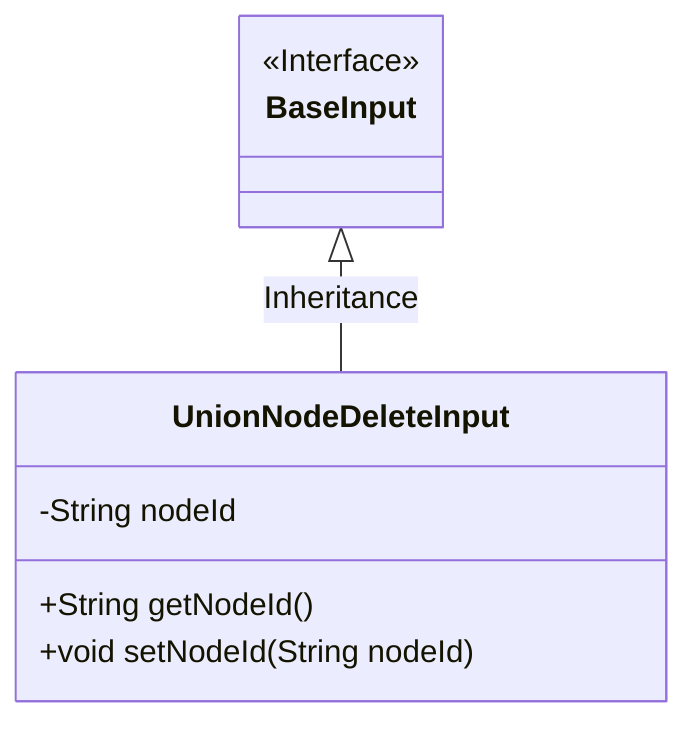
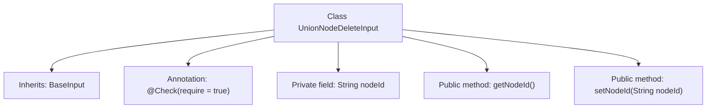

# Basic Information

|      |      |
|------|------|
| Name | UnionNodeDeleteInput |
| Language | .java |
| Code Path | WeFe/manager/manager-service/src/main/java/com/welab/wefe/manager/service/dto/union/UnionNodeDeleteInput.java |
| Package Name | com.welab.wefe.manager.service.dto.union |
| Dependencies | ['com.welab.wefe.common.fieldvalidate.annotation.Check', 'com.welab.wefe.manager.service.dto.base.BaseInput'] |
| Brief Description | The UnionNodeDeleteInput class extends BaseInput and includes the required field nodeId along with its getter and setter methods. |

# Description

The UnionNodeDeleteInput class inherits from BaseInput and includes a required private string property nodeId, along with corresponding getter and setter methods. This class is used to handle input data for node deletion operations.

# Class Summary

| Name   | Type  | Description |
|-------|------|-------------|
| UnionNodeDeleteInput | class | The UnionNodeDeleteInput class inherits from BaseInput, containing the required field nodeId and its getter/setter methods. |

## Class UnionNodeDeleteInput

|      |      |
|------|------|
| Access Modifier | public |
| Type | class |
| Name | UnionNodeDeleteInput |
| Description | The UnionNodeDeleteInput class inherits from BaseInput, containing the required field nodeId and its getter/setter methods. |

### UML Class Diagram

This code demonstrates an inheritance relationship where the `UnionNodeDeleteInput` class inherits from the `BaseInput` interface. The `UnionNodeDeleteInput` contains a private field `nodeId` along with its corresponding getter and setter methods. The class diagram clearly reflects this hierarchical structure, with `BaseInput` marked as an interface using `<<Interface>>`, and `UnionNodeDeleteInput` as an implementation class connected to the base class via a solid line with a hollow arrowhead. This design encapsulates input parameters for node deletion operations, enforcing type constraints through inheritance.

### Internal Method Call Graph

This code demonstrates a `UnionNodeDeleteInput` class that inherits from `BaseInput`, containing a `nodeId` field annotated with `@Check` and corresponding getter/setter methods. The flowchart clearly illustrates the class inheritance, field declaration, and method definitions, where the annotation marks `nodeId` as a required field. The setter method is used for property assignment, while the getter retrieves the field value. The entire structure reflects fundamental Java encapsulation features and input validation mechanisms.

### Field List

| Name  | Type  | Description |
|-------|-------|------|
| nodeId | String | Required field nodeId, type String, marked as mandatory with @Check annotation. |

### Method List

| Name  | Type  | Description |
|-------|-------|------|
| getNodeId | String | Methods to obtain the node ID, returns a nodeId string. |
| setNodeId | void | Methods for setting the node ID: Assign the parameter `nodeId` to the `nodeId` property of the current object. |

