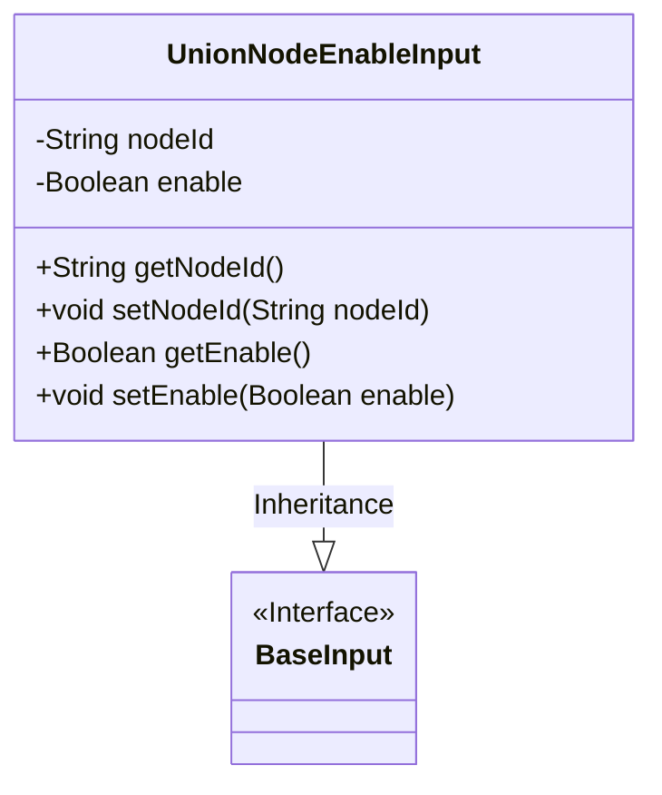
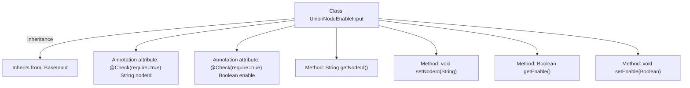

# Basic Information

|      |      |
|------|------|
| Name | UnionNodeEnableInput |
| Language | .java |
| Code Path | WeFe/manager/manager-service/src/main/java/com/welab/wefe/manager/service/dto/union/UnionNodeEnableInput.java |
| Package Name | com.welab.wefe.manager.service.dto.union |
| Dependencies | ['com.welab.wefe.common.fieldvalidate.annotation.Check', 'com.welab.wefe.manager.service.dto.base.BaseInput'] |
| Brief Description | The UnionNodeEnableInput class inherits from BaseInput, containing required fields nodeId and enable, and provides getter and setter methods. |

# Description

The `UnionNodeEnableInput` class inherits from `BaseInput` and includes two mandatory fields: `nodeId` (string type) and `enable` (boolean type). This class provides getter and setter methods for these two fields to retrieve and set the node ID and enable status. All fields are marked as requiring validation via the `@Check` annotation.

# Class Summary

| Name   | Type  | Description |
|-------|------|-------------|
| UnionNodeEnableInput | class | The UnionNodeEnableInput class inherits from BaseInput, containing required fields nodeId and enable, and provides getter and setter methods. |

## Class UnionNodeEnableInput

|      |      |
|------|------|
| Access Modifier | public |
| Type | class |
| Name | UnionNodeEnableInput |
| Description | The UnionNodeEnableInput class inherits from BaseInput, containing required fields nodeId and enable, and provides getter and setter methods. |

### UML Class Diagram

Class Diagram Description: The diagram illustrates an inheritance relationship where the UnionNodeEnableInput class extends the BaseInput interface. UnionNodeEnableInput contains private fields nodeId and enable, along with their corresponding getter and setter methods. The @Check annotation marks these fields as mandatory, reflecting the requirement for input parameter validation. This design is commonly used in business scenarios that demand strict parameter verification.

### Internal Method Call Graph

This flowchart illustrates the structure of the UnionNodeEnableInput class, which inherits from the BaseInput class. It contains two mandatory attributes nodeId and enable marked with @Check annotations, along with corresponding getter and setter methods. The diagram clearly presents the class inheritance relationship, attribute characteristics, and method composition, adhering to the JavaBean design pattern. The mandatory constraints indicated by annotations are also accurately reflected.

### Field List

| Name  | Type  | Description |
|-------|-------|------|
| enable | Boolean | The code snippet defines a private boolean variable named enable, and marks this field as required using the @Check annotation. |
| nodeId | String | The code snippet defines a private string variable named nodeId, marked as requiring validation (@Check(require = true)). |

### Method List

| Name  | Type  | Description |
|-------|-------|------|
| getNodeId | String | Methods to obtain the node ID, returning a nodeId string. |
| setNodeId | void | Methods for setting node ID, assigning the input parameter `nodeId` to the `nodeId` property of the current object. |
| getEnable | Boolean | Public method to obtain the enable boolean value. |
| setEnable | void | This is a Java method used to set the boolean value of the enable property. The method accepts a Boolean parameter and assigns it to the class's member variable enable. |

