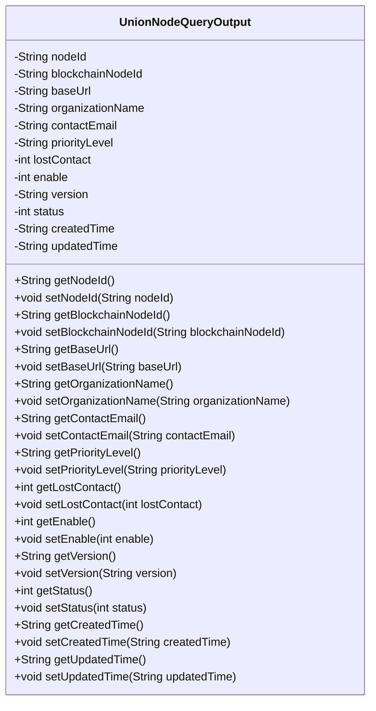

# Basic Information

|      |      |
|------|------|
| Name | UnionNodeQueryOutput |
| Language | .java |
| Code Path | WeFe/manager/manager-service/src/main/java/com/welab/wefe/manager/service/dto/union/UnionNodeQueryOutput.java |
| Package Name | com.welab.wefe.manager.service.dto.union |
| Dependencies | [] |
| Brief Description | The UnionNodeQueryOutput class includes attributes such as node ID, blockchain node ID, base URL, organization name, contact email, priority, offline status, enabled status, version, status code, creation and update times, along with their corresponding getter and setter methods. |

# Description

The `UnionNodeQueryOutput` class is a data model used to represent the query output of blockchain nodes. It includes attributes such as node identifier, blockchain node ID, base URL, organization name, contact email, priority, offline status, enabled status, version number, status code, creation time, and update time. Each attribute has corresponding getter and setter methods for retrieving and setting the attribute values. This class is primarily used to encapsulate node query results, facilitating the transfer and processing of node information within the system.

# Class Summary

| Name   | Type  | Description |
|-------|------|-------------|
| UnionNodeQueryOutput | class | The UnionNodeQueryOutput class includes attributes such as node ID, blockchain node ID, base URL, organization name, contact email, priority, offline status, enabled status, version, status code, creation and update times, along with their corresponding getter and setter methods. |

## Class UnionNodeQueryOutput

|      |      |
|------|------|
| Access Modifier | public |
| Type | class |
| Name | UnionNodeQueryOutput |
| Description | The UnionNodeQueryOutput class includes attributes such as node ID, blockchain node ID, base URL, organization name, contact email, priority, offline status, enabled status, version, status code, creation and update times, along with their corresponding getter and setter methods. |

### UML Class Diagram

This code defines a class named UnionNodeQueryOutput, which is a typical Java Bean class used to encapsulate query result data of blockchain nodes. The class contains 12 private fields representing node ID, blockchain node ID, base URL, organization name, contact email, priority level, lost contact status, enable status, version number, status code, creation time, and update time, along with corresponding getter and setter methods for each field. This design pattern is commonly used for Data Transfer Objects (DTOs) to facilitate the transfer of structured data between different layers.

### Internal Method Call Graph

```mermaid
graph TD
    A["Class UnionNodeQueryOutput"]
    B["Property: String nodeId"]
    C["Property: String blockchainNodeId"]
    D["Property: String baseUrl"]
    E["Property: String organizationName"]
    F["Property: String contactEmail"]
    G["Property: String priorityLevel"]
    H["Property: int lostContact"]
    I["Property: int enable"]
    J["Property: String version"]
    K["Property: int status"]
    L["Property: String createdTime"]
    M["Property: String updatedTime"]
    N["Method: getNodeId/setNodeId"]
    O["Method: getBlockchainNodeId/setBlockchainNodeId"]
    P["Method: getBaseUrl/setBaseUrl"]
    Q["Method: getOrganizationName/setOrganizationName"]
    R["Method: getContactEmail/setContactEmail"]
    S["Method: getPriorityLevel/setPriorityLevel"]
    T["Method: getLostContact/setLostContact"]
    U["Method: getEnable/setEnable"]
    V["Method: getVersion/setVersion"]
    W["Method: getStatus/setStatus"]
    X["Method: getCreatedTime/setCreatedTime"]
    Y["Method: getUpdatedTime/setUpdatedTime"]

    A --> B
    A --> C
    A --> D
    A --> E
    A --> F
    A --> G
    A --> H
    A --> I
    A --> J
    A --> K
    A --> L
    A --> M
    A --> N
    A --> O
    A --> P
    A --> Q
    A --> R
    A --> S
    A --> T
    A --> U
    A --> V
    A --> W
    A --> X
    A --> Y
```

This code defines a Java class named `UnionNodeQueryOutput`, primarily used to represent the query output results of consortium blockchain nodes. The class contains 12 private properties for storing node ID, blockchain node ID, base URL, organization name, contact email, priority level, lost contact status, enable status, version number, status code, creation time, and update time. Corresponding getter and setter methods are provided for each property to enable reading and modification. This class is a typical Data Transfer Object (DTO) used for transmitting node query results within the system.

### Field List

| Name  | Type  | Description |
|-------|-------|------|
| contactEmail | String | Define a private string variable contactEmail to store the contact email address. |
| enable | int | The private integer variable `enable` is used to control the function switch status. |
| status | int | The private integer variable `status` is used to store status information. |
| blockchainNodeId | String | Blockchain node ID, private string type. |
| lostContact | int | Private integer variable, recording the number of lost contact occurrences. |
| version | String | Declare a private string variable version. |
| organizationName | String | Private string variable storing organization name. |
| baseUrl | String | Define a private string variable baseUrl. |
| createdTime | String | Declare a private string variable named createdTime to store the creation time. |
| updatedTime | String | The string-type variable updatedTime is used to store the update time. |
| priorityLevel | String | The private string variable `priorityLevel` represents the priority level. |
| nodeId | String | Private string type variable nodeId. |

### Method List

| Name  | Type  | Description |
|-------|-------|------|
| setBaseUrl | void | The method to set the base URL assigns the passed-in `baseUrl` to the class member variable `this.baseUrl`. |
| getPriorityLevel | String | This is a Java method that returns a string-type priorityLevel value. |
| getNodeId | String | The method returns the node ID string. |
| setPriorityLevel | void | Methods for setting priority, assigning the input parameter to the priorityLevel member variable of the class. |
| setStatus | void | This is a Java method used to set the state value of an object. The method takes an integer parameter `status` and assigns it to the `status` property of the object. |
| getBaseUrl | String | The method returns the baseUrl string. |
| setVersion | void | Methods for setting the version number: assign the passed string parameter to the object's version property. |
| getUpdatedTime | String | Methods to obtain the update time, returning the value of the updatedTime variable as a string type. |
| setContactEmail | void | The method to set the contact email assigns the parameter `contactEmail` to the class member variable `contactEmail`. |
| setOrganizationName | void | The method to set the organization name assigns the input parameter to the class member variable `organizationName`. |
| getVersion | String | Methods to obtain the version number, returning the value of the version variable as a string type. |
| setCreatedTime | void | The method for setting the creation time assigns the input string to the `createdTime` property of the object. |
| setEnable | void | Function to set the enabled state, with an integer parameter `enable`, which is assigned to the member variable `enable`. |
| getStatus | int | The method returns a status value named status. |
| getLostContact | int | Method to obtain the number of lost contacts, returns the value of the lostContact variable. |
| getEnable | int | Get the integer value of the enable variable. |
| setNodeId | void | Methods for setting the node ID, assigning the input parameter `nodeId` to the `nodeId` property of the current object. |
| setBlockchainNodeId | void | Methods for setting the blockchain node ID, assigning the parameter value to the class member variable `blockchainNodeId`. |
| getBlockchainNodeId | String | Methods to obtain the blockchain node ID, returning a string-type variable `blockchainNodeId`. |
| getOrganizationName | String | The method returns the organization name string. |
| getContactEmail | String | Methods to obtain the contact email, returns the value of the contactEmail variable. |
| getCreatedTime | String | Method to get creation time, returns the createdTime value as a string. |
| setLostContact | void | This is a Java method used to set the value of the lostContact variable. The method accepts an integer parameter and assigns it to the class's member variable lostContact. |
| setUpdatedTime | void | The method `setUpdatedTime` is used to set the value of the `updatedTime` property, with the parameter being of string type. |

