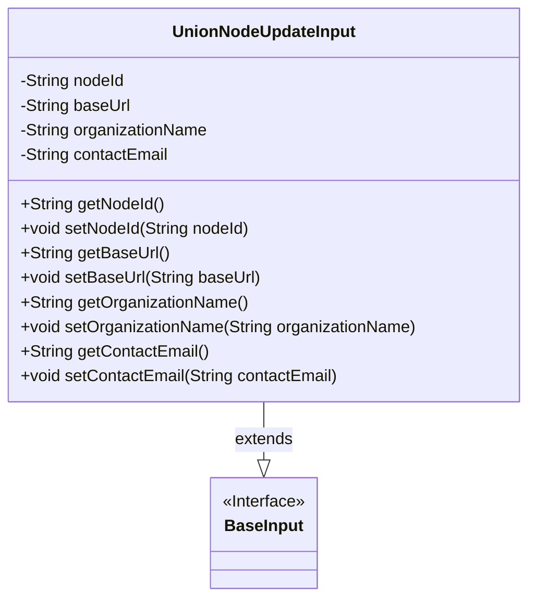

# Basic Information

|      |      |
|------|------|
| Name | UnionNodeUpdateInput |
| Language | .java |
| Code Path | WeFe/manager/manager-service/src/main/java/com/welab/wefe/manager/service/dto/union/UnionNodeUpdateInput.java |
| Package Name | com.welab.wefe.manager.service.dto.union |
| Dependencies | ['com.welab.wefe.common.fieldvalidate.annotation.Check', 'com.welab.wefe.manager.service.dto.base.BaseInput'] |
| Brief Description | The UnionNodeUpdateInput class inherits from BaseInput, containing a required nodeId field and optional baseUrl, organizationName, and contactEmail fields, providing getter and setter methods for each attribute. |

# Description

The `UnionNodeUpdateInput` class inherits from `BaseInput` and includes four private string properties: `nodeId`, `baseUrl`, `organizationName`, and `contactEmail`. Among these, `nodeId` is marked as a required field. The class provides corresponding getter and setter methods for each property to retrieve and set their values.

# Class Summary

| Name   | Type  | Description |
|-------|------|-------------|
| UnionNodeUpdateInput | class | The `UnionNodeUpdateInput` class extends `BaseInput` and includes required `nodeId` along with optional `baseUrl`, `organizationName`, and `contactEmail` fields, along with their corresponding getter/setter methods. |

## Class UnionNodeUpdateInput

|      |      |
|------|------|
| Access Modifier | public |
| Type | class |
| Name | UnionNodeUpdateInput |
| Description | The `UnionNodeUpdateInput` class extends `BaseInput` and includes required `nodeId` along with optional `baseUrl`, `organizationName`, and `contactEmail` fields, along with their corresponding getter/setter methods. |

### UML Class Diagram

This code demonstrates a `UnionNodeUpdateInput` class that inherits from the `BaseInput` interface. The class contains four private string fields: `nodeId` (a required field), `baseUrl`, `organizationName`, and `contactEmail`, along with corresponding getter and setter methods for each field. The `@Check` annotation marks `nodeId` as a required field, reflecting input validation design. The class diagram clearly illustrates the inheritance relationship and the structure of class members, with a total character count of approximately 100 words.

### Internal Method Call Graph

```mermaid
graph TD
    A["Class UnionNodeUpdateInput"]
    B["Inherits from: BaseInput"]
    C["Private attribute: String nodeId"]
    D["Private attribute: String baseUrl"]
    E["Private attribute: String organizationName"]
    F["Private attribute: String contactEmail"]
    G["Method: getNodeId()"]
    H["Method: setNodeId(String nodeId)"]
    I["Method: getBaseUrl()"]
    J["Method: setBaseUrl(String baseUrl)"]
    K["Method: getOrganizationName()"]
    L["Method: setOrganizationName(String organizationName)"]
    M["Method: getContactEmail()"]
    N["Method: setContactEmail(String contactEmail)"]

    A --> B
    A --> C
    A --> D
    A --> E
    A --> F
    A --> G
    A --> H
    A --> I
    A --> J
    A --> K
    A --> L
    A --> M
    A --> N
```

This code defines a class named UnionNodeUpdateInput, which inherits from the BaseInput class. The class contains four private String attributes: nodeId, baseUrl, organizationName, and contactEmail, with the nodeId attribute annotated with @Check(require=true), indicating that this field must exist during validation. The class provides corresponding getter and setter methods for each attribute to retrieve and modify their values. This is a typical Java Bean class, primarily used for encapsulating data and providing methods to access and modify the data.

### Field List

| Name  | Type  | Description |
|-------|-------|------|
| contactEmail | String | Private string variable used to store the contact email. |
| baseUrl | String | Declare a private string variable baseUrl to store the base URL address. |
| organizationName | String | Private string variable storing the organization name. |
| nodeId | String | The private string-type variable nodeId requires non-null validation. |

### Method List

| Name  | Type  | Description |
|-------|-------|------|
| getOrganizationName | String | The method to obtain the organization name, which returns a string-type variable organizationName. |
| setBaseUrl | void | The method to set the base URL assigns the input parameter `baseUrl` to the class member variable `baseUrl`. |
| getBaseUrl | String | The method returns the baseUrl string. |
| setNodeId | void | Set the node ID by assigning the parameter nodeId to the nodeId property of the current object. |
| getNodeId | String | Methods to obtain the node ID, returns a nodeId string. |
| setOrganizationName | void | The method to set the organization name assigns the input parameter to the class member variable organizationName. |
| getContactEmail | String | This is a Java method that returns the value of a string variable named contactEmail. |
| setContactEmail | void | The method to set the contact email assigns the parameter contactEmail to the class member variable contactEmail. |

