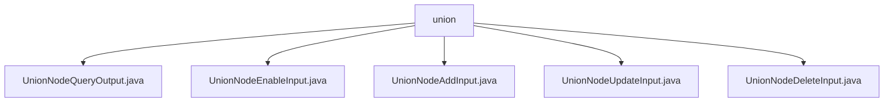

# Basic Information

|      |      |
|------|------|
| Name | union |
| Language | .java |
| Code Path | WeFe/manager/manager-service/src/main/java/com/welab/wefe/manager/service/dto/union |
| Package Name | docs.manager.manager-service.src.main.java.com.welab.wefe.manager.service.dto.union |
| Brief Description | UnionNodeQueryOutput encapsulates the node query results, including attributes such as ID and URL. UnionNodeEnableInput handles the node activation status, containing the nodeId and enable fields. UnionNodeAddInput is used to add a node, with mandatory ID and URL fields. UnionNodeUpdateInput updates node information, requiring nodeId. UnionNodeDeleteInput processes node deletion, requiring nodeId. |

# Description

## Overview  
The core responsibility of this module is to manage blockchain node information, providing a unified data model for operations such as node querying, enabling/disabling, adding, updating, and deleting. The interface specification adheres to the BaseInput base class validation mechanism, ensuring the validity of mandatory fields through the @Check annotation. Key data structures include attributes such as node identifiers, base URLs, organizational information, and status flags, resembling the resource management model of microservices. The only external dependency is a generic validation framework. For example, UnionNodeQueryOutput encapsulates complete node information, while UnionNodeEnableInput is specifically designed for status switching.  

## Primary Business Scenarios  
The module supports full lifecycle node management: queries return composite data in UnionNodeQueryOutput, additions validate core fields like URLs using UnionNodeAddInput, and updates modify non-ID attributes via UnionNodeUpdateInput. A typical workflow, such as disabling a node, requires UnionNodeEnableInput to ensure the mandatory transmission of nodeId and enable status. All operations revolve around nodeId, similar to a database primary key constraint. For instance, deletion scenarios only require passing nodeId in UnionNodeDeleteInput.

### Package Internal Structure View

This flowchart illustrates the structure of 5 DTO files under the union directory in the WeFe management service. All files are directly subordinate to the union node, including data transfer objects related to operations such as node query output, enable input, add input, update input, and delete input, reflecting a design pattern of unified interface parameter management.

# File List

| Name   | Type  | Description |
|-------|------|-------------|
| [UnionNodeQueryOutput.java](UnionNodeQueryOutput.md) | file | The UnionNodeQueryOutput class includes attributes such as node ID, blockchain node ID, base URL, organization name, contact email, priority, offline status, enabled status, version, status code, creation and update times, along with their corresponding getter and setter methods. |
| [UnionNodeEnableInput.java](UnionNodeEnableInput.md) | file | The `UnionNodeEnableInput` class inherits from `BaseInput`, containing the required fields `nodeId` and `enable`, and provides getter and setter methods. |
| [UnionNodeAddInput.java](UnionNodeAddInput.md) | file | The `UnionNodeAddInput` class inherits from `BaseInput`, containing the required fields `blockchainNodeId` and `baseUrl`, as well as optional fields `organizationName`, `contactEmail`, and `version`. It provides getter and setter methods for each field. |
| [UnionNodeUpdateInput.java](UnionNodeUpdateInput.md) | file | The UnionNodeUpdateInput class inherits from BaseInput, containing the required nodeId field and optional baseUrl, organizationName, and contactEmail fields, providing getter and setter methods for each attribute. |
| [UnionNodeDeleteInput.java](UnionNodeDeleteInput.md) | file | The UnionNodeDeleteInput class extends BaseInput and includes the required field nodeId along with its getter and setter methods. |

