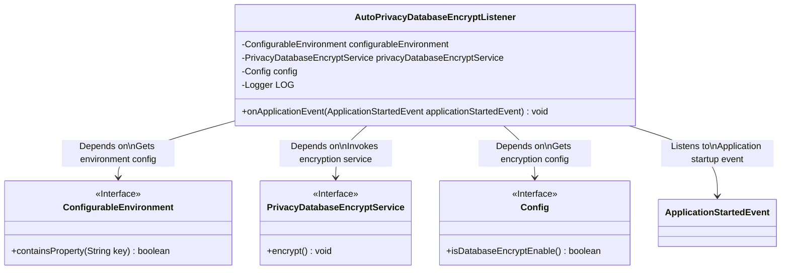
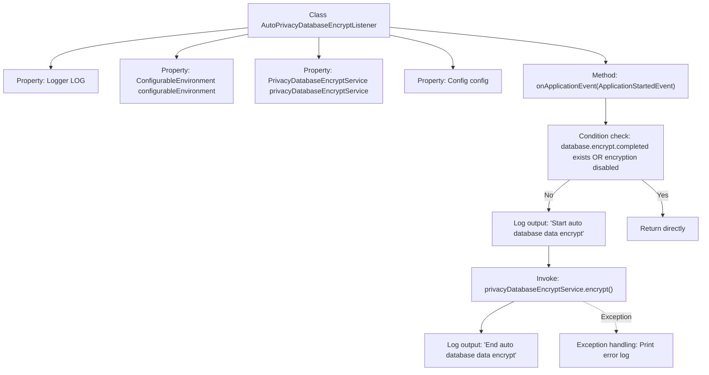
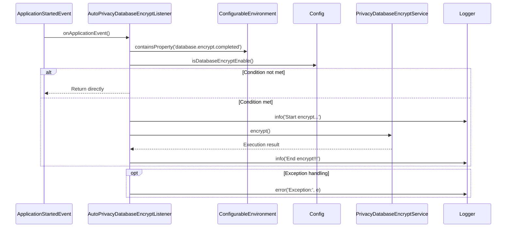

# Basic Information

|      |      |
|------|------|
| Name | AutoPrivacyDatabaseEncryptListener |
| Language | .java |
| Code Path | WeFe/manager/manager-service/src/main/java/com/welab/wefe/manager/service/listener/AutoPrivacyDatabaseEncryptListener.java |
| Package Name | com.welab.wefe.manager.service.listener |
| Dependencies | ['com.welab.wefe.manager.service.config.Config', 'com.welab.wefe.manager.service.service.PrivacyDatabaseEncryptService', 'org.slf4j.Logger', 'org.slf4j.LoggerFactory', 'org.springframework.beans.factory.annotation.Autowired', 'org.springframework.boot.context.event.ApplicationStartedEvent', 'org.springframework.context.ApplicationListener', 'org.springframework.core.env.ConfigurableEnvironment', 'org.springframework.stereotype.Component'] |
| Brief Description | AutoPrivacyDatabaseEncryptListener monitors application startup events, automatically encrypts database data after checking configurations, logs activities, and handles exceptions. |

# Description

This is a Spring component class named AutoPrivacyDatabaseEncryptListener, which implements the ApplicationListener interface to listen for application startup events. The class contains three auto-wired dependencies: ConfigurableEnvironment, PrivacyDatabaseEncryptService, and Config. The core logic resides in the onApplicationEvent method, where it checks whether database encryption has been completed or if encryption is enabled upon application startup. If encryption is not completed and the feature is enabled, it invokes the privacy database encryption service to perform the encryption operation, logging both the start and completion. Any exceptions encountered will be logged as errors.

# Class Summary

| Name   | Type  | Description |
|-------|------|-------------|
| AutoPrivacyDatabaseEncryptListener | class | This is a Spring component class that listens for application startup events, automatically executes privacy data encryption services when database encryption is incomplete and configuration is enabled, and logs operation records and exceptions. |

## Class AutoPrivacyDatabaseEncryptListener

|      |      |
|------|------|
| Access Modifier | @Component;public |
| Type | class |
| Name | AutoPrivacyDatabaseEncryptListener |
| Description | This is a Spring component class that listens for application startup events, automatically executes privacy data encryption services when database encryption is incomplete and configuration is enabled, and logs operation records and exceptions. |

### UML Class Diagram

This code demonstrates a Spring component `AutoPrivacyDatabaseEncryptListener` that implements the `ApplicationListener` interface to monitor application startup events. Upon application launch, the component checks environment configurations and encryption settings, invoking the encryption service to process database data if conditions are met. The class diagram clearly illustrates the component's relationships with the configurable environment, encryption service, configuration interface, and application startup event, reflecting typical event-listening and dependency injection patterns in Spring applications.

### Internal Method Call Graph

This code implements a Spring event listener that automatically performs database encryption during application startup. The flowchart illustrates the class structure and method call chain, while the sequence diagram details the interaction process after event triggering. The core logic involves: checking configuration conditions → executing encryption service → recording operation logs, incorporating exception handling and conditional short-circuit mechanisms, demonstrating a typical Spring event-driven design pattern.

### Field List

| Name  | Type  | Description |
|-------|-------|------|
| config | Config | Automatically inject Config configuration instance. |
| configurableEnvironment | ConfigurableEnvironment | Use @Autowired to automatically inject the ConfigurableEnvironment object for environment-related configuration operations. |
| LOG = LoggerFactory.getLogger(AutoPrivacyDatabaseEncryptListener.class) | Logger | The private static log constant LOG defined in the class AutoPrivacyDatabaseEncryptListener. |
| privacyDatabaseEncryptService | PrivacyDatabaseEncryptService | Use @Autowired to automatically inject an instance of the privacy database encryption service. |

### Method List

| Name  | Type  | Description |
|-------|-------|------|
| onApplicationEvent | void | Handle application startup events by checking the database encryption configuration. Return if no encryption is required; otherwise, perform encryption and log the result, recording errors if exceptions occur. |

