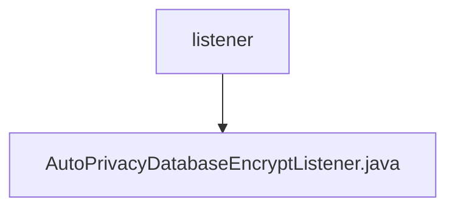

# Basic Information

|      |      |
|------|------|
| Name | listener |
| Language | .java |
| Code Path | WeFe/manager/manager-service/src/main/java/com/welab/wefe/manager/service/listener |
| Package Name | docs.manager.manager-service.src.main.java.com.welab.wefe.manager.service.listener |
| Brief Description | AutoPrivacyDatabaseEncryptListener monitors application startup events, automatically encrypts database data after checking configurations, logs activities, and handles exceptions. |

# Description

This is a Spring component class named AutoPrivacyDatabaseEncryptListener, which implements the ApplicationListener interface for monitoring application startup events. The class contains three auto-wired dependencies: ConfigurableEnvironment, PrivacyDatabaseEncryptService, and Config. The main logic resides in the onApplicationEvent method, where it checks whether database encryption has been completed or if the encryption feature is enabled upon application startup. If encryption is not completed and the feature is enabled, it invokes the privacy database encryption service to perform the encryption operation and logs the start and end events. If an exception occurs, it logs an error message.

### Package Internal Structure View

This flowchart illustrates the directory structure of listeners in the manager-service project. The parent node "listener" contains a child node "AutoPrivacyDatabaseEncryptListener.java", indicating this is a listener class file implementing automatic privacy database encryption functionality. The entire structure is concise and clear, reflecting the basic composition of the listener module in the project.

# File List

| Name   | Type  | Description |
|-------|------|-------------|
| [AutoPrivacyDatabaseEncryptListener.java](AutoPrivacyDatabaseEncryptListener.md) | file | AutoPrivacyDatabaseEncryptListener monitors application startup events, automatically encrypts database data after checking configurations, logs activities, and handles exceptions. |

