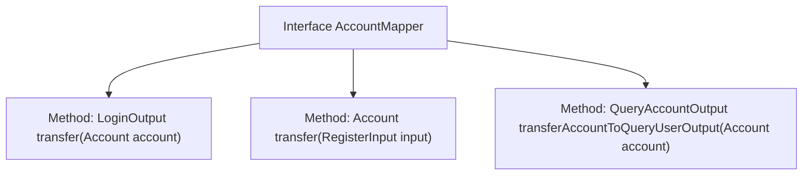

# Basic Information

|      |      |
|------|------|
| Name | AccountMapper |
| Language | .java |
| Code Path | WeFe/manager/manager-service/src/main/java/com/welab/wefe/manager/service/mapper/AccountMapper.java |
| Package Name | com.welab.wefe.manager.service.mapper |
| Dependencies | ['com.welab.wefe.common.data.mongodb.entity.manager.Account', 'com.welab.wefe.manager.service.dto.account.LoginOutput', 'com.welab.wefe.manager.service.dto.account.QueryAccountOutput', 'com.welab.wefe.manager.service.dto.account.RegisterInput', 'org.mapstruct.Mapper'] |
| Brief Description | The Mapper interface defines three methods: LoginOutput converts to Account, Account converts to RegisterInput, and QueryAccountOutput converts to Account. |

# Description

This is a Java interface named AccountMapper, marked with the @Mapper annotation. The interface defines three methods: the first method, transfer, takes an Account object parameter and returns a LoginOutput type; the second method with the same name, transfer, accepts a RegisterInput type parameter and returns an Account object; the third method, transferAccountToQueryUserOutput, takes an Account parameter and returns a QueryAccountOutput type. This interface is primarily used for conversion mapping between different types of objects.

# Class Summary

| Name   | Type  | Description |
|-------|------|-------------|
| AccountMapper | interface | The AccountMapper interface defines three methods: converting Account to LoginOutput, RegisterInput to Account, and Account to QueryAccountOutput. |


## Class AccountMapper

|      |      |
|------|------|
| Access Modifier | @Mapper;public |
| Type | interface |
| Name | AccountMapper |
| Description | The AccountMapper interface defines three methods: converting Account to LoginOutput, RegisterInput to Account, and Account to QueryAccountOutput. |


### UML Class Diagram

```mermaid
classDiagram
    class Account {
        // Account class attributes not displayed in code
    }
    class RegisterInput {
        // RegisterInput class attributes not displayed in code
    }
    class LoginOutput {
        // LoginOutput class attributes not displayed in code
    }
    class QueryAccountOutput {
        // QueryAccountOutput class attributes not displayed in code
    }
    <<Interface>> AccountMapper {
        +LoginOutput transfer(Account account)
        +Account transfer(RegisterInput input)
        +QueryAccountOutput transferAccountToQueryUserOutput(Account account)
    }
    AccountMapper --> Account : dependency
    AccountMapper --> RegisterInput : dependency
    AccountMapper --> LoginOutput : dependency
    AccountMapper --> QueryAccountOutput : dependency
```

This class diagram illustrates the AccountMapper interface and its dependencies. AccountMapper is a mapping interface marked with @Mapper annotation, containing three methods: two overloaded transfer() methods handling conversions from Account to LoginOutput and RegisterInput to Account respectively, along with transferAccountToQueryUserOutput() method converting Account to QueryAccountOutput. The diagram clearly shows unidirectional dependency relationships between the interface and four data classes.


### Internal Method Call Graph



This flowchart illustrates the structure of the AccountMapper interface, which is a MyBatis mapper interface containing three core data transformation methods. The first method converts an Account object to LoginOutput, the second transforms RegisterInput into an Account object, and the third converts Account to QueryAccountOutput. These methods primarily handle type conversion between different DTOs (Data Transfer Objects), demonstrating the core functionality of object mapping.

### Field List

| Name  | Type  | Description |
|-------|-------|------|

### Method List

| Name  | Type  | Description |
|-------|-------|------|
| transferAccountToQueryUserOutput | QueryAccountOutput | Convert account information to the query user output format. |
| transfer | LoginOutput | The method `transfer` takes an `Account` object as a parameter and returns a result of type `LoginOutput`, which is used for data transfer processing after account login. |
| transfer | Account | Register an account transfer function, with the input parameter being of type RegisterInput. |


