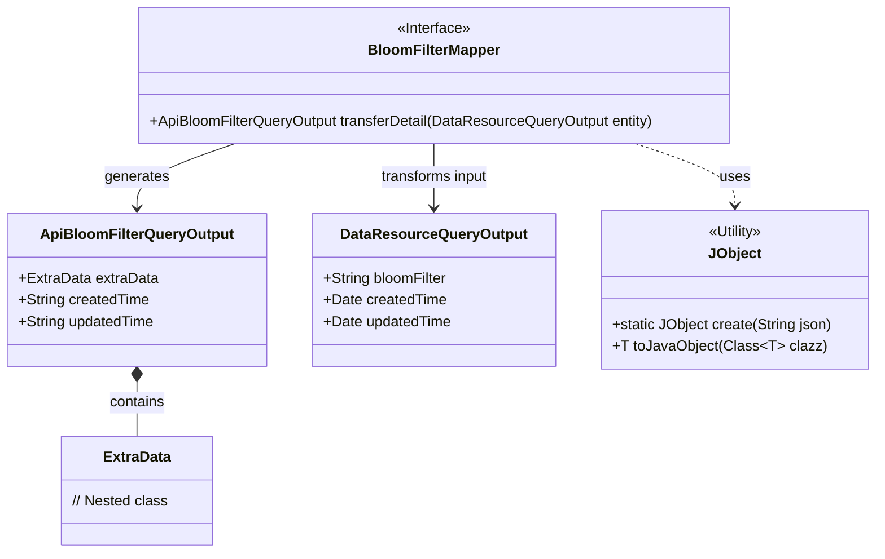
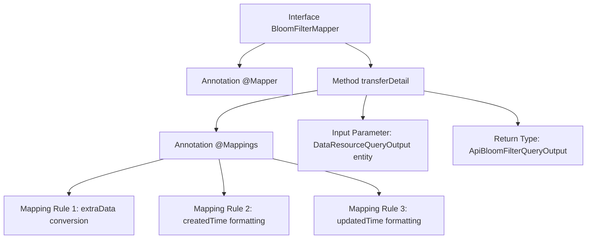

# Basic Information

|      |      |
|------|------|
| Name | BloomFilterMapper |
| Language | .java |
| Code Path | WeFe/manager/manager-service/src/main/java/com/welab/wefe/manager/service/mapper/BloomFilterMapper.java |
| Package Name | com.welab.wefe.manager.service.mapper |
| Dependencies | ['com.welab.wefe.common.data.mongodb.dto.dataresource.DataResourceQueryOutput', 'com.welab.wefe.common.util.DateUtil', 'com.welab.wefe.manager.service.dto.dataresource.ApiBloomFilterQueryOutput', 'org.mapstruct.Mapper', 'org.mapstruct.Mapping', 'org.mapstruct.Mappings'] |
| Brief Description | The BloomFilterMapper interface uses the @Mapper annotation and defines field mapping rules via @Mappings, including JObject conversion for extraData and date formatting, to transform DataResourceQueryOutput into ApiBloomFilterQueryOutput. |

# Description

This is a Java interface named BloomFilterMapper, marked with the @Mapper annotation. The interface defines a transferDetail method, which configures three field mapping rules through the @Mappings annotation: 1) converting the BloomFilter field of the entity object to JObject and mapping it to the extraData field; 2) mapping the createdTime field according to the specified date format; 3) mapping the updatedTime field in the same date format. The method accepts a parameter of type DataResourceQueryOutput and returns a result of type ApiBloomFilterQueryOutput.

# Class Summary

| Name   | Type  | Description |
|-------|------|-------------|
| BloomFilterMapper | interface | The BloomFilterMapper interface uses the @Mapper annotation and defines field mapping rules through @Mappings, including JObject conversion for extraData and date formatting, to transform DataResourceQueryOutput into ApiBloomFilterQueryOutput. |

## Class BloomFilterMapper

|      |      |
|------|------|
| Access Modifier | @Mapper;public |
| Type | interface |
| Name | BloomFilterMapper |
| Description | The BloomFilterMapper interface uses the @Mapper annotation and defines field mapping rules through @Mappings, including JObject conversion for extraData and date formatting, to transform DataResourceQueryOutput into ApiBloomFilterQueryOutput. |

### UML Class Diagram

This code describes a BloomFilterMapper interface using MapStruct for object mapping, with the primary function of converting a DataResourceQueryOutput object into an ApiBloomFilterQueryOutput object. The conversion process involves date formatting and JSON parsing, where the JObject utility class is used to transform the bloomFilter string into an ExtraData object. The class diagram clearly illustrates the relationships between the interface and data objects, as well as the usage of the utility class.

### Internal Method Call Graph

This flowchart illustrates the structure of the BloomFilterMapper interface, highlighting the transferDetail method with multiple mapping rules. Three field conversion logics are defined via the @Mappings annotation: extraData undergoes type conversion through JObject, while two timestamp fields are formatted according to specified patterns. The entire mapping process converts a DataResourceQueryOutput object into an ApiBloomFilterQueryOutput object, demonstrating a typical annotation-based configuration approach for MyBatis mappers.

### Field List

| Name  | Type  | Description |
|-------|-------|------|

### Method List

| Name  | Type  | Description |
|-------|-------|------|
| transferDetail | ApiBloomFilterQueryOutput | Mapping Configuration: Convert DataResourceQueryOutput to ApiBloomFilterQueryOutput, including JObject conversion for extraData, and date formatting for createdTime and updatedTime. |

