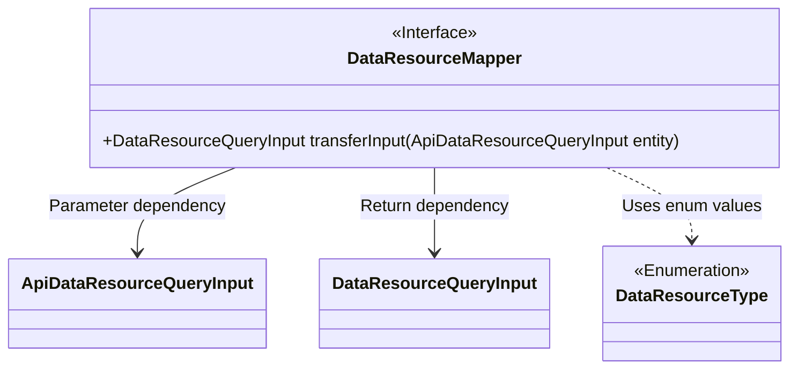
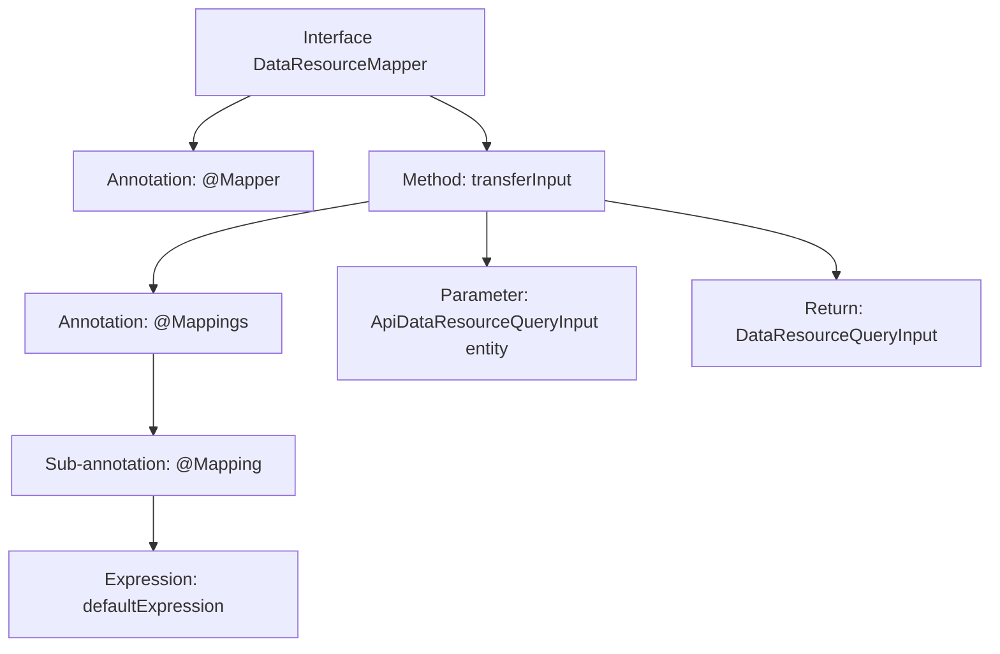

# Basic Information

|      |      |
|------|------|
| Name | DataResourceMapper |
| Language | .java |
| Code Path | WeFe/manager/manager-service/src/main/java/com/welab/wefe/manager/service/mapper/DataResourceMapper.java |
| Package Name | com.welab.wefe.manager.service.mapper |
| Dependencies | ['com.welab.wefe.common.data.mongodb.dto.dataresource.DataResourceQueryInput', 'com.welab.wefe.manager.service.dto.dataresource.ApiDataResourceQueryInput', 'org.mapstruct.Mapper', 'org.mapstruct.Mapping', 'org.mapstruct.Mappings'] |
| Brief Description | The Mapper interface converts ApiDataResourceQueryInput to DataResourceQueryInput, with dataResourceType default-mapped to the DataResourceType enum list. |

# Description

This is a Java interface class using the MapStruct framework, named DataResourceMapper. It defines a mapping method called transferInput, which converts an ApiDataResourceQueryInput object into a DataResourceQueryInput object. The method utilizes the @Mappings and @Mapping annotations, where the mapping of the dataResourceType field employs a default expression that converts all values of the DataResourceType enum into a list using Java stream operations. The entire mapping process contains no explicit code implementation and relies entirely on annotation configuration.

# Class Summary

| Name   | Type  | Description |
|-------|------|-------------|
| DataResourceMapper | interface | The Mapper interface DataResourceMapper uses the @Mappings annotation to convert ApiDataResourceQueryInput to DataResourceQueryInput, with the default mapping of the dataResourceType field to the DataResourceType enum list. |

## Class DataResourceMapper

|      |      |
|------|------|
| Access Modifier | @Mapper;public |
| Type | interface |
| Name | DataResourceMapper |
| Description | The Mapper interface DataResourceMapper uses the @Mappings annotation to convert ApiDataResourceQueryInput to DataResourceQueryInput, with the default mapping of the dataResourceType field to the DataResourceType enum list. |

### UML Class Diagram

This class diagram illustrates a Mapper interface and its associated data transfer objects. DataResourceMapper is a Spring mapping interface marked with @Mapper, defining a method to convert ApiDataResourceQueryInput to DataResourceQueryInput. The conversion process utilizes the DataResourceType enumeration class for default value mapping of data source types. The clear dependency relationships between the interface and input/output DTOs demonstrate a typical design pattern in the data transformation layer.

### Internal Method Call Graph

This flowchart illustrates the structure of the DataResourceMapper interface, focusing on the annotation hierarchy of the transferInput method. The interface is marked as a mapper with @Mapper, while the method uses @Mappings to encapsulate @Mapping annotations, which include a defaultExpression employing Java Stream for enum processing. The method accepts an ApiDataResourceQueryInput parameter and returns a DataResourceQueryInput type, fully demonstrating the typical annotation configuration of a MyBatis mapping interface.

### Field List

| Name  | Type  | Description |
|-------|-------|------|

### Method List

| Name  | Type  | Description |
|-------|-------|------|
| transferInput | DataResourceQueryInput | The mapping method converts ApiDataResourceQueryInput to DataResourceQueryInput, where the dataResourceType field defaults to a list of all values in the DataResourceType enum. |

