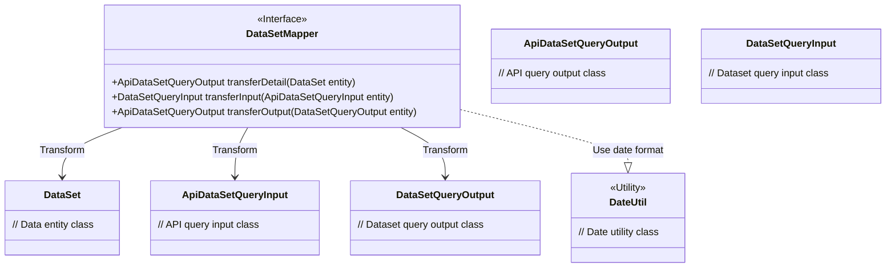
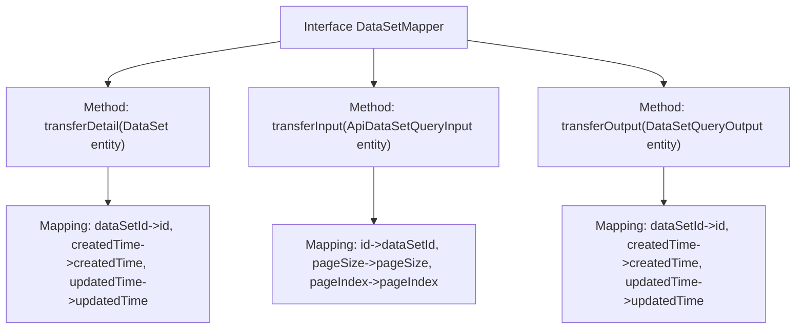

# Basic Information

|      |      |
|------|------|
| Name | DataSetMapper |
| Language | .java |
| Code Path | WeFe/manager/manager-service/src/main/java/com/welab/wefe/manager/service/mapper/DataSetMapper.java |
| Package Name | com.welab.wefe.manager.service.mapper |
| Dependencies | ['com.welab.wefe.common.data.mongodb.dto.dataset.DataSetQueryInput', 'com.welab.wefe.common.data.mongodb.dto.dataset.DataSetQueryOutput', 'com.welab.wefe.common.data.mongodb.entity.union.DataSet', 'com.welab.wefe.common.util.DateUtil', 'com.welab.wefe.manager.service.dto.dataset.ApiDataSetQueryInput', 'com.welab.wefe.manager.service.dto.dataset.ApiDataSetQueryOutput', 'org.mapstruct.Mapper', 'org.mapstruct.Mapping', 'org.mapstruct.Mappings'] |
| Brief Description | The DataSetMapper interface defines three data transformation methods: transferDetail converts DataSet to ApiDataSetQueryOutput, transferInput converts ApiDataSetQueryInput to DataSetQueryInput, and transferOutput converts DataSetQueryOutput to ApiDataSetQueryOutput, including field mapping and date formatting. |

# Description

This is a Mapper interface using MapStruct, which defines three data conversion methods. The transferDetail method converts a DataSet entity to ApiDataSetQueryOutput, mapping dataSetId to id and formatting the time fields. The transferInput method converts ApiDataSetQueryInput to DataSetQueryInput, mapping id to dataSetId, and setting default values for pagination parameters. The transferOutput method converts DataSetQueryOutput to ApiDataSetQueryOutput, similarly mapping dataSetId to id and formatting the time fields. All methods define field mapping rules through the @Mappings annotation.

# Class Summary

| Name   | Type  | Description |
|-------|------|-------------|
| DataSetMapper | interface | The DataSetMapper interface defines three data transformation methods: transferDetail converts DataSet to ApiDataSetQueryOutput, transferInput converts ApiDataSetQueryInput to DataSetQueryInput, and transferOutput converts DataSetQueryOutput to ApiDataSetQueryOutput, all involving field mapping and date formatting. |

## Class DataSetMapper

|      |      |
|------|------|
| Access Modifier | @Mapper;public |
| Type | interface |
| Name | DataSetMapper |
| Description | The DataSetMapper interface defines three data transformation methods: transferDetail converts DataSet to ApiDataSetQueryOutput, transferInput converts ApiDataSetQueryInput to DataSetQueryInput, and transferOutput converts DataSetQueryOutput to ApiDataSetQueryOutput, all involving field mapping and date formatting. |

### UML Class Diagram

This code defines a MapStruct mapping interface `DataSetMapper` containing three data transformation methods: converting `DataSet` to `ApiDataSetQueryOutput`, `ApiDataSetQueryInput` to `DataSetQueryInput`, and `DataSetQueryOutput` to `ApiDataSetQueryOutput`. The interface uses `@Mapper` and `@Mapping` annotations to define field mapping rules, including date format conversion and default value settings. The class diagram illustrates the transformation relationships between this interface and six related data classes, with `DateUtil` serving as a utility class providing date format constants.

### Internal Method Call Graph

This code demonstrates a Mapper interface using MapStruct annotations, primarily implementing three object conversion functions: converting DataSet to ApiDataSetQueryOutput, ApiDataSetQueryInput to DataSetQueryInput, and DataSetQueryOutput to ApiDataSetQueryOutput. Each conversion method defines field mapping rules through the @Mappings annotation, including field renaming, date formatting, and default value settings. The flowchart clearly illustrates the interface's three core methods and their corresponding field mapping relationships, reflecting a typical design pattern in the data transformation layer.

### Field List

| Name  | Type  | Description |
|-------|-------|------|

### Method List

| Name  | Type  | Description |
|-------|-------|------|
| transferDetail | ApiDataSetQueryOutput | Map the DataSet entity to ApiDataSetQueryOutput, with fields including id (original dataSetId), createdTime, and updatedTime (date formatted as YYYY-MM-DD HH:MM:SS). |
| transferInput | DataSetQueryInput | Convert ApiDataSetQueryInput to DataSetQueryInput, with field mappings including converting id to dataSetId, and default values of 10 and 0 for pageSize and pageIndex respectively. |
| transferOutput | ApiDataSetQueryOutput | Convert DataSetQueryOutput to ApiDataSetQueryOutput, mapping fields including dataSetId to id, with createdTime and updatedTime converted according to the specified date format. |

