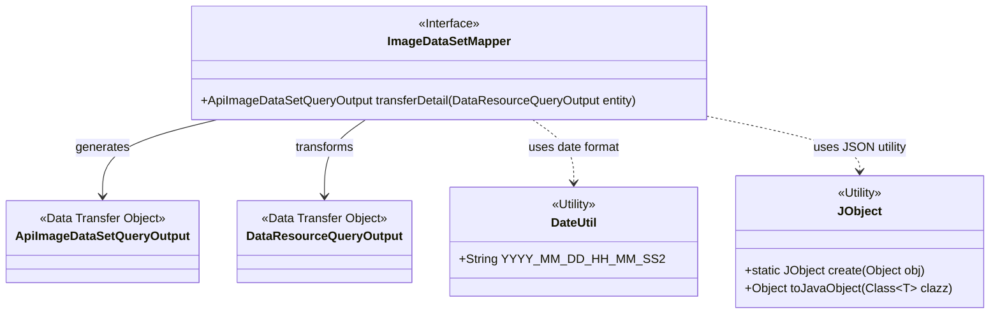
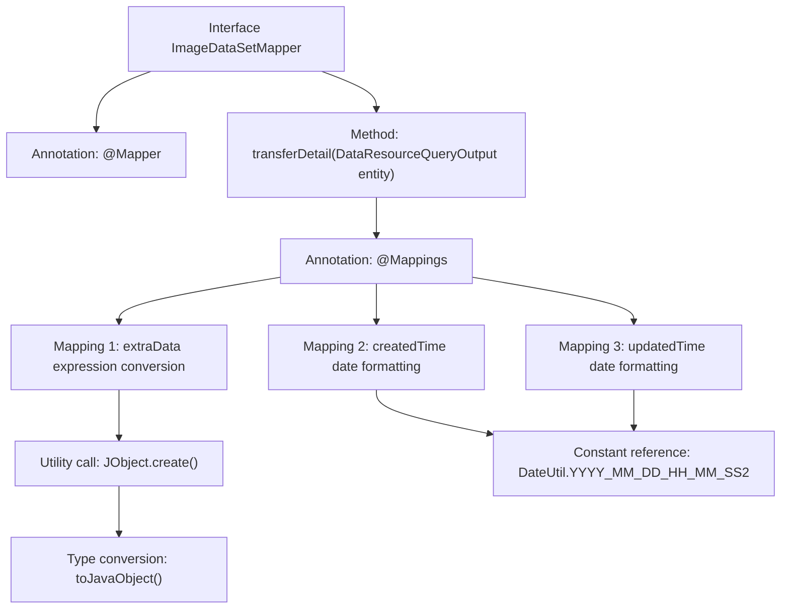

# Basic Information

|      |      |
|------|------|
| Name | ImageDataSetMapper |
| Language | .java |
| Code Path | WeFe/manager/manager-service/src/main/java/com/welab/wefe/manager/service/mapper/ImageDataSetMapper.java |
| Package Name | com.welab.wefe.manager.service.mapper |
| Dependencies | ['com.welab.wefe.common.data.mongodb.dto.dataresource.DataResourceQueryOutput', 'com.welab.wefe.common.util.DateUtil', 'com.welab.wefe.manager.service.dto.dataresource.ApiImageDataSetQueryOutput', 'org.mapstruct.Mapper', 'org.mapstruct.Mapping', 'org.mapstruct.Mappings'] |
| Brief Description | The ImageDataSetMapper interface uses the @Mapper annotation and defines field mapping rules through @Mappings, including the JObject conversion of extraData and date formatting of createdTime and updatedTime, to transform DataResourceQueryOutput into ApiImageDataSetQueryOutput. |

# Description

This is a Java interface named ImageDataSetMapper that utilizes the MapStruct framework for object property mapping and conversion. The interface includes a transferDetail method, which converts a DataResourceQueryOutput type to an ApiImageDataSetQueryOutput type. Through the @Mappings annotation, three mapping rules are defined: converting entity.getImageDataSet() to a JObject and then to an ExtraData object, and transforming the createdTime and updatedTime fields according to a specified date format. This interface is primarily used for handling the conversion of image dataset query results.

# Class Summary

| Name   | Type  | Description |
|-------|------|-------------|
| ImageDataSetMapper | interface | The ImageDataSetMapper interface uses the @Mapper annotation and defines field mapping rules via @Mappings, including JSON conversion for extraData and date format conversion, transforming DataResourceQueryOutput into ApiImageDataSetQueryOutput. |

## Class ImageDataSetMapper

|      |      |
|------|------|
| Access Modifier | @Mapper;public |
| Type | interface |
| Name | ImageDataSetMapper |
| Description | The ImageDataSetMapper interface uses the @Mapper annotation and defines field mapping rules via @Mappings, including JSON conversion for extraData and date format conversion, transforming DataResourceQueryOutput into ApiImageDataSetQueryOutput. |

### UML Class Diagram

This code describes a MapStruct mapping interface `ImageDataSetMapper` that converts `DataResourceQueryOutput` entities into `ApiImageDataSetQueryOutput` data transfer objects. The interface configures field mapping rules through annotations, including JSON data conversion and date formatting, leveraging the `DateUtil` date utility class and `JObject` JSON processing utility class. This design achieves decoupled transformation from the data layer to the API layer, supporting complex field type conversions and formatting requirements.

### Internal Method Call Graph

This flowchart illustrates the structure and mapping relationships of the ImageDataSetMapper interface. As a MapStruct mapping interface, it defines three conversion rules through the @Mappings annotation: converting entity.getImageDataSet() to JObject and then to ExtraData object, along with date formatting for createdTime and updatedTime fields. The process clearly presents the complete path from interface definition to specific conversion logic, including utility method calls and constant reference relationships.

### Field List

| Name  | Type  | Description |
|-------|-------|------|

### Method List

| Name  | Type  | Description |
|-------|-------|------|
| transferDetail | ApiImageDataSetQueryOutput | The code uses the @Mappings annotation to define object property mapping rules, including converting the entity's imageDataSet to an extraData object, and formatting the createdTime and updatedTime fields. Ultimately, it transforms DataResourceQueryOutput into ApiImageDataSetQueryOutput. |

