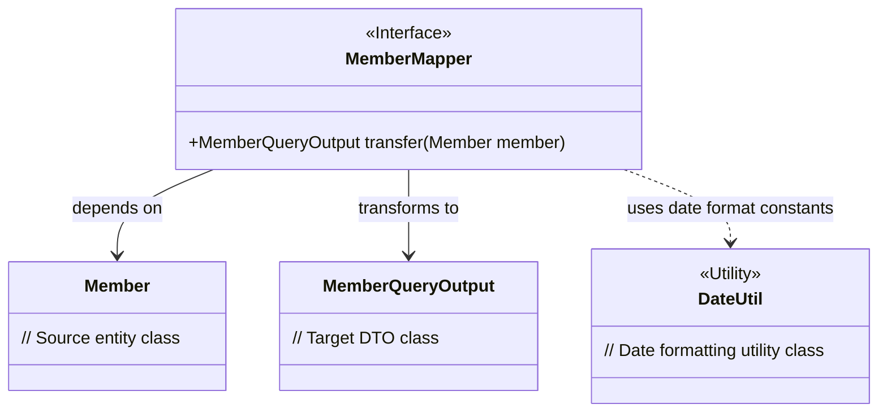
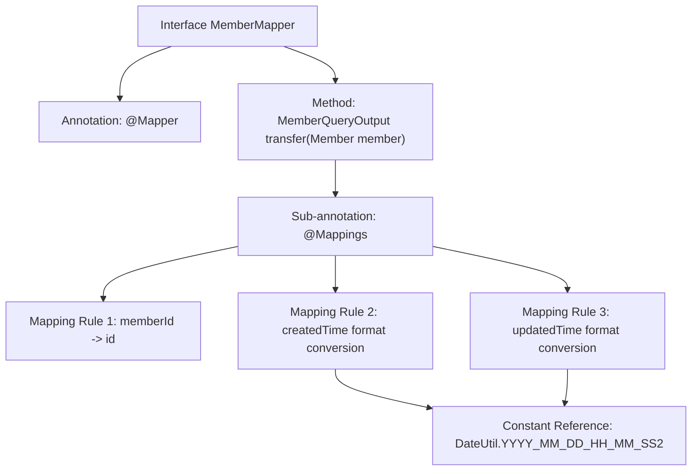

# Basic Information

|      |      |
|------|------|
| Name | MemberMapper |
| Language | .java |
| Code Path | WeFe/manager/manager-service/src/main/java/com/welab/wefe/manager/service/mapper/MemberMapper.java |
| Package Name | com.welab.wefe.manager.service.mapper |
| Dependencies | ['com.welab.wefe.common.data.mongodb.entity.union.Member', 'com.welab.wefe.common.util.DateUtil', 'com.welab.wefe.manager.service.dto.member.MemberQueryOutput', 'org.mapstruct.Mapper', 'org.mapstruct.Mapping', 'org.mapstruct.Mappings'] |
| Brief Description | The Mapper interface MemberMapper defines a transfer method that converts a Member object into a MemberQueryOutput object, maps memberId to id, and formats the createdTime and updatedTime fields. |

# Description

The code defines an interface named MemberMapper, marked with the @Mapper annotation. The interface includes a transfer method used to convert a Member object into a MemberQueryOutput object. The method configures three field mapping rules through the @Mappings annotation: mapping memberId to id, mapping createdTime and updatedTime to fields with the same names respectively, and specifying the date format as YYYY_MM_DD_HH_MM_SS2.

# Class Summary

| Name   | Type  | Description |
|-------|------|-------------|
| MemberMapper | interface | The Mapper interface converts the Member object to MemberQueryOutput, maps memberId to id, and formats createdTime and updatedTime according to the specified format. |

## Class MemberMapper

|      |      |
|------|------|
| Access Modifier | @Mapper;public |
| Type | interface |
| Name | MemberMapper |
| Description | The Mapper interface converts the Member object to MemberQueryOutput, maps memberId to id, and formats createdTime and updatedTime according to the specified format. |

### UML Class Diagram

This code demonstrates a MemberMapper interface using MapStruct for object mapping, which defines a conversion method from the Member entity to the MemberQueryOutput DTO. The interface is marked with the @Mapper annotation and uses @Mapping annotations to specify field mapping rules, particularly for formatting date fields. The class diagram clearly illustrates the relationships between the interface and related entity classes, DTO classes, and the utility class DateUtil, showcasing the collaborative approach of components during the object conversion process.

### Internal Method Call Graph

This flowchart illustrates the structure of a MapStruct mapping interface, with its core being the definition of object property conversion rules through the @Mappings annotation. The interface is marked as a mapper using @Mapper, and the transfer method implements the conversion from Member to MemberQueryOutput, including three field mappings: direct copying of memberId to id, and date format conversions for createdTime/updatedTime, both using a unified date format constant.

### Field List

| Name  | Type  | Description |
|-------|-------|------|

### Method List

| Name  | Type  | Description |
|-------|-------|------|
| transfer | MemberQueryOutput | Convert the Member object to a MemberQueryOutput object, mapping memberId to id, and formatting createdTime and updatedTime according to the specified format. |

