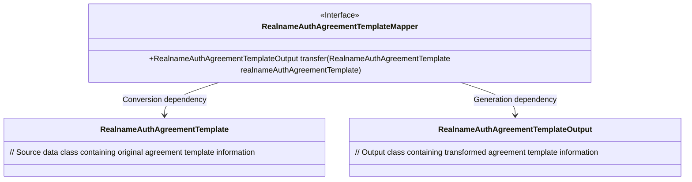
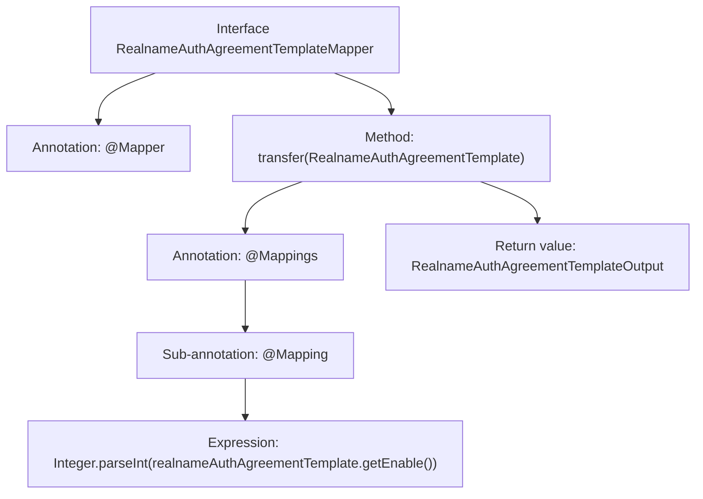

# Basic Information

|      |      |
|------|------|
| Name | RealnameAuthAgreementTemplateMapper |
| Language | .java |
| Code Path | WeFe/manager/manager-service/src/main/java/com/welab/wefe/manager/service/mapper/RealnameAuthAgreementTemplateMapper.java |
| Package Name | com.welab.wefe.manager.service.mapper |
| Dependencies | ['com.welab.wefe.common.data.mongodb.entity.union.RealnameAuthAgreementTemplate', 'com.welab.wefe.manager.service.dto.agreement.RealnameAuthAgreementTemplateOutput', 'org.mapstruct.Mapper', 'org.mapstruct.Mapping', 'org.mapstruct.Mappings'] |
| Brief Description | This is a Mapper interface using MapStruct that converts a RealnameAuthAgreementTemplate object into a RealnameAuthAgreementTemplateOutput object, where the enable field is converted to an integer type through an expression. |

# Description

This code snippet defines an interface named RealnameAuthAgreementTemplateMapper, marked with the @Mapper annotation. The interface contains a transfer method, which uses @Mappings and @Mapping annotations to convert a RealnameAuthAgreementTemplate object into a RealnameAuthAgreementTemplateOutput object. During the conversion, the enable field of the source object is transformed from a string type to an integer type.

# Class Summary

| Name   | Type  | Description |
|-------|------|-------------|
| RealnameAuthAgreementTemplateMapper | interface | The Mapper interface converts RealnameAuthAgreementTemplate to RealnameAuthAgreementTemplateOutput, where the enable field is transformed from a string to an integer through parsing. |

## Class RealnameAuthAgreementTemplateMapper

|      |      |
|------|------|
| Access Modifier | @Mapper;public |
| Type | interface |
| Name | RealnameAuthAgreementTemplateMapper |
| Description | The Mapper interface converts RealnameAuthAgreementTemplate to RealnameAuthAgreementTemplateOutput, where the enable field is transformed from a string to an integer through parsing. |

### UML Class Diagram

This code demonstrates a MapStruct mapping interface for converting RealnameAuthAgreementTemplate entities into RealnameAuthAgreementTemplateOutput objects. The interface is marked with @Mapper annotation and uses @Mapping annotation for field type conversion (String to Integer). The class diagram clearly illustrates the transformation relationships between the Mapper interface and input/output classes, reflecting a typical design pattern in the data transformation layer.

### Internal Method Call Graph

This code represents a Mapper interface using the MapStruct framework, primarily designed for object property conversion. The @Mappings and @Mapping annotations define the transformation rules from RealnameAuthAgreementTemplate to RealnameAuthAgreementTemplateOutput, with special handling for the string-to-integer conversion of the enable field. The flowchart illustrates the interface structure, method call chain, and hierarchical relationships of annotations.

### Field List

| Name  | Type  | Description |
|-------|-------|------|

### Method List

| Name  | Type  | Description |
|-------|-------|------|
| transfer | RealnameAuthAgreementTemplateOutput | Convert RealnameAuthAgreementTemplate to RealnameAuthAgreementTemplateOutput, where the enable field is assigned by parsing the string as an integer. |

