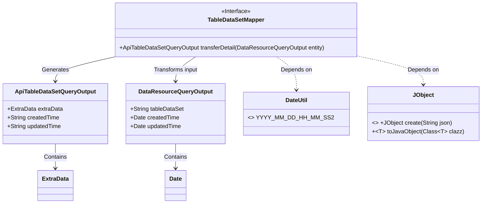
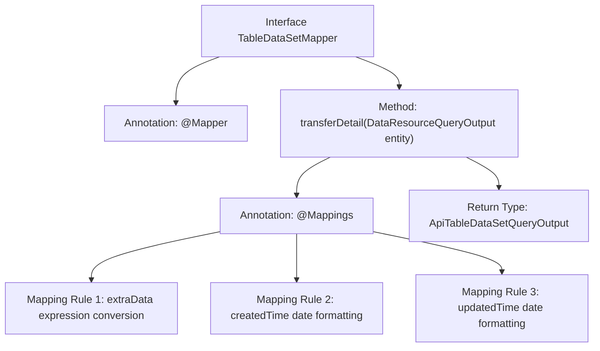

# Basic Information

|      |      |
|------|------|
| Name | TableDataSetMapper |
| Language | .java |
| Code Path | WeFe/manager/manager-service/src/main/java/com/welab/wefe/manager/service/mapper/TableDataSetMapper.java |
| Package Name | com.welab.wefe.manager.service.mapper |
| Dependencies | ['com.welab.wefe.common.data.mongodb.dto.dataresource.DataResourceQueryOutput', 'com.welab.wefe.common.util.DateUtil', 'com.welab.wefe.manager.service.dto.dataresource.ApiTableDataSetQueryOutput', 'org.mapstruct.Mapper', 'org.mapstruct.Mapping', 'org.mapstruct.Mappings'] |
| Brief Description | The Mapper interface TableDataSetMapper uses the @Mappings annotation to convert DataResourceQueryOutput to ApiTableDataSetQueryOutput, including extraData conversion and date formatting. |

# Description

This is a Mapper interface using the MapStruct framework, designed to convert a DataResourceQueryOutput object into an ApiTableDataSetQueryOutput object. The interface defines three mapping rules via the @Mappings annotation: converting entity.getTableDataSet() into a JObject and then into an ExtraData object; transforming the createdTime and updatedTime fields according to a specified date format. This interface provides standardized handling for object property conversion.

# Class Summary

| Name   | Type  | Description |
|-------|------|-------------|
| TableDataSetMapper | interface | The Mapper interface converts DataResourceQueryOutput to ApiTableDataSetQueryOutput, handling JSON conversion of extraData and date formatting. |

## Class TableDataSetMapper

|      |      |
|------|------|
| Access Modifier | @Mapper;public |
| Type | interface |
| Name | TableDataSetMapper |
| Description | The Mapper interface converts DataResourceQueryOutput to ApiTableDataSetQueryOutput, handling JSON conversion of extraData and date formatting. |

### UML Class Diagram

This code demonstrates a MapStruct Mapper interface whose primary function is converting a DataResourceQueryOutput object into an ApiTableDataSetQueryOutput object. The @Mapping annotation facilitates field mapping and format conversion, where the extraData field is deserialized via JObject, and timestamp fields are formatted using the DateUtil constant. The class diagram clearly illustrates the transformation relationships between the interface and data classes, as well as dependencies on utility classes.

### Internal Method Call Graph

This flowchart illustrates the structure of the TableDataSetMapper interface, focusing on the mapping logic of the transferDetail method. Three field conversion rules are configured via the @Mappings annotation: converting entity.getTableDataSet() to an ExtraData object, and applying date formatting to the createdTime and updatedTime fields. The method ultimately returns an ApiTableDataSetQueryOutput type object, demonstrating a typical annotation configuration approach for MyBatis mappers.

### Field List

| Name  | Type  | Description |
|-------|-------|------|

### Method List

| Name  | Type  | Description |
|-------|-------|------|
| transferDetail | ApiTableDataSetQueryOutput | The code uses MapStruct for mapping, converting DataResourceQueryOutput to ApiTableDataSetQueryOutput. The extraData is transformed via JObject, while createdTime and updatedTime are formatted as YYYY-MM-DD HH:MM:SS. |

