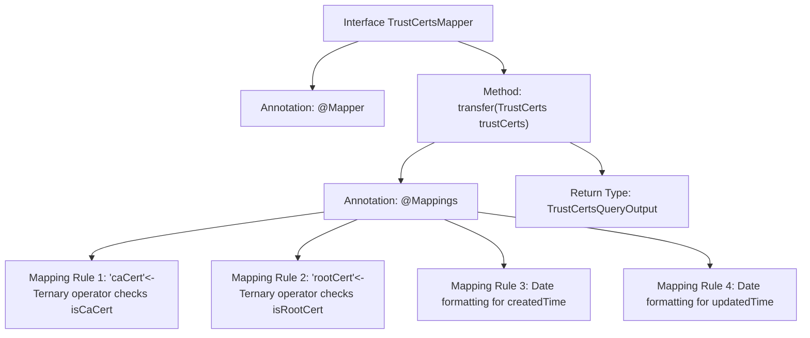

# Basic Information

|      |      |
|------|------|
| Name | TrustCertsMapper |
| Language | .java |
| Code Path | WeFe/manager/manager-service/src/main/java/com/welab/wefe/manager/service/mapper/TrustCertsMapper.java |
| Package Name | com.welab.wefe.manager.service.mapper |
| Dependencies | ['com.welab.wefe.common.data.mongodb.entity.union.TrustCerts', 'com.welab.wefe.common.util.DateUtil', 'com.welab.wefe.manager.service.dto.cert.TrustCertsQueryOutput', 'org.mapstruct.Mapper', 'org.mapstruct.Mapping', 'org.mapstruct.Mappings'] |
| Brief Description | The Mapper interface TrustCertsMapper converts TrustCerts objects into TrustCertsQueryOutput, including boolean value conversion and date formatting. |

# Description

This is a Mapper interface named TrustCertsMapper, used to convert TrustCerts objects into TrustCertsQueryOutput objects. The interface is annotated with @Mapper, indicating it is a mapper. The method transfer defines multiple field mapping rules through the @Mappings annotation: converting the string "1" of the isCaCert field to a boolean value true/false assigned to the caCert field; converting the string "1" of the isRootCert field to a boolean value true/false assigned to the rootCert field; and transforming the createdTime and updatedTime fields according to the specified date format.

# Class Summary

| Name   | Type  | Description |
|-------|------|-------------|
| TrustCertsMapper | interface | The Mapper interface TrustCertsMapper converts TrustCerts to TrustCertsQueryOutput, including boolean conversion for caCert and rootCert, as well as date formatting. |


## Class TrustCertsMapper

|      |      |
|------|------|
| Access Modifier | @Mapper;public |
| Type | interface |
| Name | TrustCertsMapper |
| Description | The Mapper interface TrustCertsMapper converts TrustCerts to TrustCertsQueryOutput, including boolean conversion for caCert and rootCert, as well as date formatting. |


### UML Class Diagram

```mermaid
classDiagram
    class TrustCertsMapper {
        <<Interface>>
        +TrustCertsQueryOutput transfer(TrustCerts trustCerts)
    }
    // The TrustCertsMapper interface uses MapStruct annotations for object conversion
    class TrustCerts {
        // Original certificate data class
    }
    class TrustCertsQueryOutput {
        // Converted certificate output class
    }
    class DateUtil {
        <<Utility>>
        // Date formatting utility class
    }

    TrustCertsMapper --> TrustCerts : Dependency
    TrustCertsMapper --> TrustCertsQueryOutput : Dependency
    TrustCertsMapper ..> DateUtil : Uses date format constants
```

This code demonstrates a TrustCertsMapper interface utilizing the MapStruct framework, primarily responsible for converting TrustCerts objects into TrustCertsQueryOutput objects. The interface implements field mapping logic through @Mapping annotations, including boolean conversion and date formatting. DateUtil provides standardized date format constants, reflecting precise control over data formats during object conversion. The class diagram clearly illustrates the dependency relationships between the interface and data classes, as well as the utility class reference relationships.


### Internal Method Call Graph



This code demonstrates a Mapper interface using the MapStruct framework, primarily designed to convert a TrustCerts object into a TrustCertsQueryOutput object. Through the @Mappings annotation, four field mapping rules are defined: two boolean conversions (determining CA certificate and root certificate status based on the string "1"), along with formatting conversions for two date fields. The flowchart clearly presents the interface structure, core conversion method, and hierarchical relationships of its internal mapping rules, reflecting critical data processing logic during object transformation.

### Field List

| Name  | Type  | Description |
|-------|-------|------|

### Method List

| Name  | Type  | Description |
|-------|-------|------|
| transfer | TrustCertsQueryOutput | Mapping Configuration: Convert the TrustCerts object to TrustCertsQueryOutput, including boolean conversion for caCert and rootCert, and date formatting for createdTime and updatedTime. |


