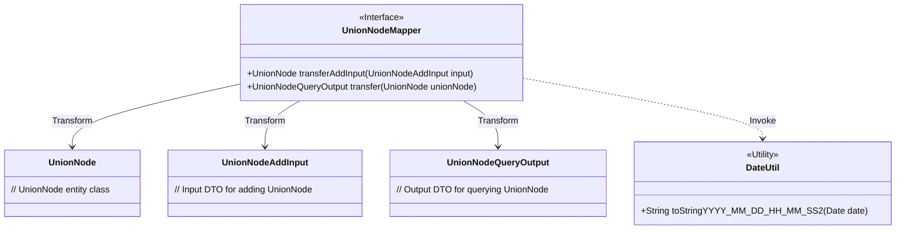
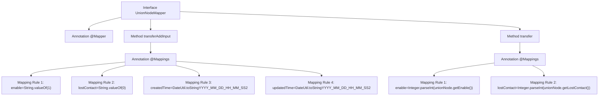

# Basic Information

|      |      |
|------|------|
| Name | UnionNodeMapper |
| Language | .java |
| Code Path | WeFe/manager/manager-service/src/main/java/com/welab/wefe/manager/service/mapper/UnionNodeMapper.java |
| Package Name | com.welab.wefe.manager.service.mapper |
| Dependencies | ['com.welab.wefe.common.data.mongodb.entity.union.UnionNode', 'com.welab.wefe.manager.service.dto.union.UnionNodeAddInput', 'com.welab.wefe.manager.service.dto.union.UnionNodeQueryOutput', 'org.mapstruct.Mapper', 'org.mapstruct.Mapping', 'org.mapstruct.Mappings'] |
| Brief Description | The UnionNodeMapper interface includes two methods: transferAddInput converts UnionNodeAddInput to UnionNode, setting default values and the current time; transfer converts UnionNode to UnionNodeQueryOutput, transforming enable and lostContact into integer types. |

# Description

The UnionNodeMapper is an interface annotated with @Mapper, containing two mapping methods. The first method, transferAddInput, converts UnionNodeAddInput to UnionNode, with default values set via the @Mappings annotation: enable is set to the string "1", lostContact to the string "0", and createdTime and updatedTime to formatted strings of the current time. The second method, transfer, converts UnionNode to UnionNodeQueryOutput, transforming enable and lostContact from string to integer types. Both methods utilize expressions for type conversion and value processing.

# Class Summary

| Name   | Type  | Description |
|-------|------|-------------|
| UnionNodeMapper | interface | The UnionNodeMapper interface defines two methods: transferAddInput converts UnionNodeAddInput to UnionNode and sets default values; transfer converts UnionNode to UnionNodeQueryOutput and transforms field types. |

## Class UnionNodeMapper

|      |      |
|------|------|
| Access Modifier | @Mapper;public |
| Type | interface |
| Name | UnionNodeMapper |
| Description | The UnionNodeMapper interface defines two methods: transferAddInput converts UnionNodeAddInput to UnionNode and sets default values; transfer converts UnionNode to UnionNodeQueryOutput and transforms field types. |

### UML Class Diagram

This code demonstrates a MapStruct-based mapping interface `UnionNodeMapper`, whose primary function is to perform data conversion between `UnionNode`, `UnionNodeAddInput`, and `UnionNodeQueryOutput`. The interface utilizes `@Mapping` annotations to handle special field processing, including string-to-numeric conversion for `enable`/`lostContact` and date formatting for `createdTime`/`updatedTime`. The date formatting relies on the external `DateUtil` utility class. This design achieves decoupling between DTOs and entities while ensuring type safety and format consistency.

### Internal Method Call Graph

This flowchart illustrates the structure and mapping relationships of the UnionNodeMapper interface. The interface contains two core methods: transferAddInput converts UnionNodeAddInput to UnionNode, setting default values and current timestamps; transfer converts UnionNode to UnionNodeQueryOutput, performing string-to-integer conversions. Each method defines multiple field transformation rules through the @Mappings annotation, involving type conversions and date formatting operations, demonstrating a typical pattern of object property mapping.

### Field List

| Name  | Type  | Description |
|-------|-------|------|

### Method List

| Name  | Type  | Description |
|-------|-------|------|
| transfer | UnionNodeQueryOutput | Convert the UnionNode object to a UnionNodeQueryOutput object, mapping the enable and lostContact fields from string type to integer type. |
| transferAddInput | UnionNode | Mapping configuration: Convert UnionNodeAddInput to UnionNode, set enable to 1, lostContact to 0, and createdTime and updatedTime to the current time. |

