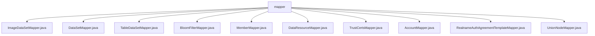

# Basic Information

|      |      |
|------|------|
| Name | mapper |
| Language | .java |
| Code Path | WeFe/manager/manager-service/src/main/java/com/welab/wefe/manager/service/mapper |
| Package Name | docs.manager.manager-service.src.main.java.com.welab.wefe.manager.service.mapper |
| Brief Description | Multiple MapStruct mapping interfaces for converting between different types of objects, including functionalities such as field mapping, time formatting, and type conversion. |

# Description

## Overview  
This module is a collection of Java object mapping converters implemented using the MapStruct framework. Its core responsibility is to standardize the attribute conversion between different business objects (similar to the adapter pattern). The interface specification uniformly employs the @Mapper annotation for declaration, with @Mappings defining field mapping rules. It supports type conversion (e.g., string to boolean), date formatting, and nested object handling. Key data structures include various Input/Output DTOs (e.g., ApiDataSetQueryOutput) and entity classes (e.g., UnionNode). The only external dependency is the MapStruct framework. For example, BloomFilterMapper converts JObject to ExtraData, while MemberMapper handles time conversion in the YYYY_MM_DD_HH_MM_SS2 format.

## Primary Business Scenarios  
The module primarily serves the standardized output of data query results, covering 10+ business scenarios such as image/table datasets, Bloom filters, and member information. The typical interaction pattern involves converting database entities into API response objects. For instance, DataSetMapper implements a three-stage conversion from DataSet to ApiDataSetQueryOutput (ID mapping, time formatting, and pagination default values). All Mappers follow the same paradigm: 1) field name mapping; 2) type conversion; 3) default value handling. For example, UnionNodeMapper converts the string "1" to an integer via expressions, and RealnameAuthAgreementTemplateMapper handles type conversion for the enable field, forming a comprehensive object conversion solution.

### Package Internal Structure View

This flowchart illustrates the file structure relationships within the mapper directory of the manager-service project. The root node is the mapper folder, which contains 11 Mapper interface files, including ImageDataSetMapper, DataSetMapper, and other data access layer components. These files collectively form the project's data persistence layer, handling database operations for different types of datasets and system entities.

# File List

| Name   | Type  | Description |
|-------|------|-------------|
| [ImageDataSetMapper.java](ImageDataSetMapper.md) | file | The ImageDataSetMapper interface uses the @Mapper annotation and defines field mapping rules via @Mappings, including the JObject conversion of extraData and date formatting of createdTime and updatedTime, to transform DataResourceQueryOutput into ApiImageDataSetQueryOutput. |
| [DataSetMapper.java](DataSetMapper.md) | file | The DataSetMapper interface defines three data transformation methods: transferDetail converts DataSet to ApiDataSetQueryOutput, transferInput converts ApiDataSetQueryInput to DataSetQueryInput, and transferOutput converts DataSetQueryOutput to ApiDataSetQueryOutput, including field mapping and date formatting. |
| [TableDataSetMapper.java](TableDataSetMapper.md) | file | The Mapper interface TableDataSetMapper converts DataResourceQueryOutput to ApiTableDataSetQueryOutput via the @Mappings annotation, including extraData conversion and date formatting. |
| [BloomFilterMapper.java](BloomFilterMapper.md) | file | The BloomFilterMapper interface uses the @Mapper annotation and defines field mapping rules through @Mappings, including JObject conversion for extraData and date formatting, to transform DataResourceQueryOutput into ApiBloomFilterQueryOutput. |
| [MemberMapper.java](MemberMapper.md) | file | The Mapper interface MemberMapper defines a transfer method that converts a Member object to a MemberQueryOutput object, maps memberId to id, and formats the createdTime and updatedTime fields. |
| [DataResourceMapper.java](DataResourceMapper.md) | file | The Mapper interface converts ApiDataResourceQueryInput to DataResourceQueryInput, with dataResourceType default-mapped to the DataResourceType enum list. |
| [TrustCertsMapper.java](TrustCertsMapper.md) | file | The Mapper interface TrustCertsMapper converts TrustCerts objects into TrustCertsQueryOutput, including boolean value conversion and date formatting. |
| [AccountMapper.java](AccountMapper.md) | file | The Mapper interface defines three methods: converting LoginOutput to Account, converting Account to RegisterInput, and converting QueryAccountOutput to Account. |
| [RealnameAuthAgreementTemplateMapper.java](RealnameAuthAgreementTemplateMapper.md) | file | This is a Mapper interface using MapStruct that converts a RealnameAuthAgreementTemplate object to a RealnameAuthAgreementTemplateOutput object, where the enable field is converted to an integer type through an expression. |
| [UnionNodeMapper.java](UnionNodeMapper.md) | file | The UnionNodeMapper interface contains two methods: transferAddInput converts UnionNodeAddInput to UnionNode, setting default values and the current time; transfer converts UnionNode to UnionNodeQueryOutput, transforming enable and lostContact into integer types. |

