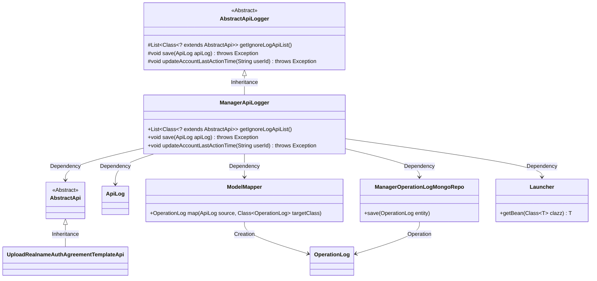
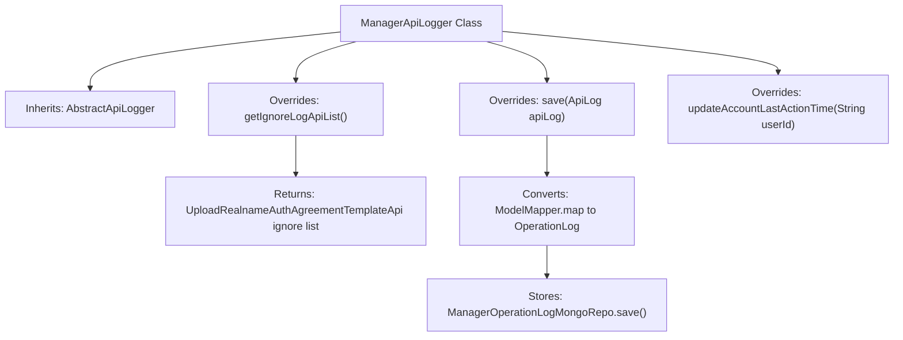

# Basic Information

|      |      |
|------|------|
| Name | ManagerApiLogger |
| Language | .java |
| Code Path | WeFe/manager/manager-service/src/main/java/com/welab/wefe/manager/service/operation/ManagerApiLogger.java |
| Package Name | com.welab.wefe.manager.service.operation |
| Dependencies | ['com.welab.wefe.common.data.mongodb.entity.common.OperationLog', 'com.welab.wefe.common.data.mongodb.repo.ManagerOperationLogMongoRepo', 'com.welab.wefe.common.web.Launcher', 'com.welab.wefe.common.web.api.base.AbstractApi', 'com.welab.wefe.common.web.delegate.api_log.AbstractApiLogger', 'com.welab.wefe.common.web.delegate.api_log.ApiLog', 'com.welab.wefe.common.web.util.ModelMapper', 'com.welab.wefe.manager.service.api.agreement.UploadRealnameAuthAgreementTemplateApi', 'org.springframework.stereotype.Component', 'java.util.Arrays', 'java.util.List'] |
| Brief Description | The ManagerApiLogger inherits from AbstractApiLogger, ignores logs from UploadRealnameAuthAgreementTemplateApi, converts ApiLog to OperationLog and stores it in MongoDB, with the updateAccountLastActionTime method left unimplemented. |

# Description

This is a Spring component class named ManagerApiLogger, which inherits from the abstract class AbstractApiLogger. It primarily implements three functionalities: 1. Defining a list of APIs to be excluded from logging via the getIgnoreLogApiList method, currently only excluding the UploadRealnameAuthAgreementTemplateApi class; 2. Persisting ApiLog objects into a MongoDB database by converting them into OperationLog models through the save method; 3. The empty updateAccountLastActionTime method remains unimplemented for updating the user's last action time. The class utilizes Spring's dependency injection to obtain a ManagerOperationLogMongoRepo instance for database operations.

# Class Summary

| Name   | Type  | Description |
|-------|------|-------------|
| ManagerApiLogger | class | ManagerApiLogger inherits from AbstractApiLogger, ignores logs from UploadRealnameAuthAgreementTemplateApi, converts ApiLog to OperationLog and stores it in MongoDB, without updating the account's last operation time. |

## Class ManagerApiLogger

|      |      |
|------|------|
| Access Modifier | @Component;public |
| Type | class |
| Name | ManagerApiLogger |
| Description | ManagerApiLogger inherits from AbstractApiLogger, ignores logs from UploadRealnameAuthAgreementTemplateApi, converts ApiLog to OperationLog and stores it in MongoDB, without updating the account's last operation time. |

### UML Class Diagram

Class Diagram Description: The diagram illustrates that ManagerApiLogger inherits from the abstract class AbstractApiLogger and implements functionalities such as log filtering, saving, and time updating. After converting log objects via ModelMapper, it utilizes ManagerOperationLogMongoRepo for storage. Core classes like AbstractApi, ApiLog, OperationLog and their relationships are included, demonstrating the object conversion and persistence operations in the log processing workflow.

### Internal Method Call Graph

This flowchart illustrates the core structure of the ManagerApiLogger class, which inherits from AbstractApiLogger and implements three key methods. The getIgnoreLogApiList() method returns a list of APIs to be excluded from logging; the save() method converts ApiLog to OperationLog and stores it via MongoDB; the updateAccountLastActionTime() method currently lacks concrete logic. Annotated with @Component, the class serves as a Spring-managed component, embodying the design principle of separating logging and storage responsibilities.

### Field List

| Name  | Type  | Description |
|-------|-------|------|

### Method List

| Name  | Type  | Description |
|-------|-------|------|
| save | void | Rewrite the save method to convert ApiLog into OperationLog and persist it via MongoRepo. |
| getIgnoreLogApiList | List<Class<? extends AbstractApi>> | This method returns the list of APIs that ignore logging, which only includes the UploadRealnameAuthAgreementTemplateApi class. |
| updateAccountLastActionTime | void | Empty method, the functionality to update the user account's last operation time has not been implemented. |

