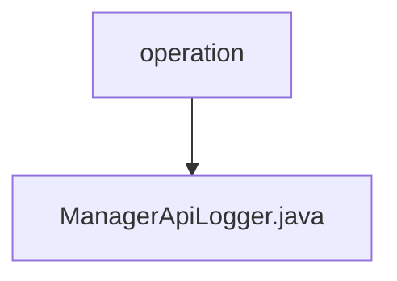

# Basic Information

|      |      |
|------|------|
| Name | operation |
| Language | .java |
| Code Path | WeFe/manager/manager-service/src/main/java/com/welab/wefe/manager/service/operation |
| Package Name | docs.manager.manager-service.src.main.java.com.welab.wefe.manager.service.operation |
| Brief Description | The ManagerApiLogger inherits from AbstractApiLogger, ignores logs from UploadRealnameAuthAgreementTemplateApi, converts ApiLog to OperationLog and stores it in MongoDB, with the updateAccountLastActionTime method left unimplemented. |

# Description

This is a Spring component class named ManagerApiLogger, which inherits from the AbstractApiLogger abstract class. It primarily implements three functionalities: 1. Defining the list of APIs to be excluded from logging via the getIgnoreLogApiList method, currently only excluding the UploadRealnameAuthAgreementTemplateApi class; 2. Persisting ApiLog objects into a MongoDB database by converting them into OperationLog models through the save method; 3. The empty updateAccountLastActionTime method has not yet implemented the functionality to update the user's last action time. The class utilizes Spring's dependency injection to obtain a ManagerOperationLogMongoRepo instance for database operations.

### Package Internal Structure View

This flowchart illustrates the hierarchical relationship between the operation package in the manager-service module of the WeFe project and its contained file ManagerApiLogger.java. The operation serves as the parent directory node, while ManagerApiLogger.java acts as its child node, clearly presenting the positional relationship of the Java class file within the project structure. Such a structure is commonly found in Maven or Gradle-built Java projects, where the operation package may contain multiple class files related to service operations.

# File List

| Name   | Type  | Description |
|-------|------|-------------|
| [ManagerApiLogger.java](ManagerApiLogger.md) | file | ManagerApiLogger inherits from AbstractApiLogger, ignores logs for UploadRealnameAuthAgreementTemplateApi, converts ApiLog to OperationLog and stores it in MongoDB, with the updateAccountLastActionTime method unimplemented. |

