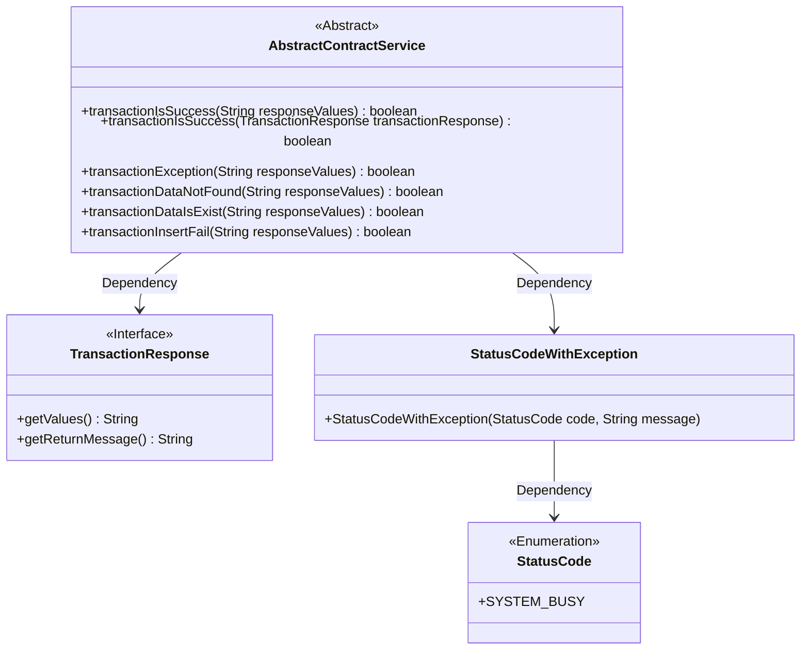
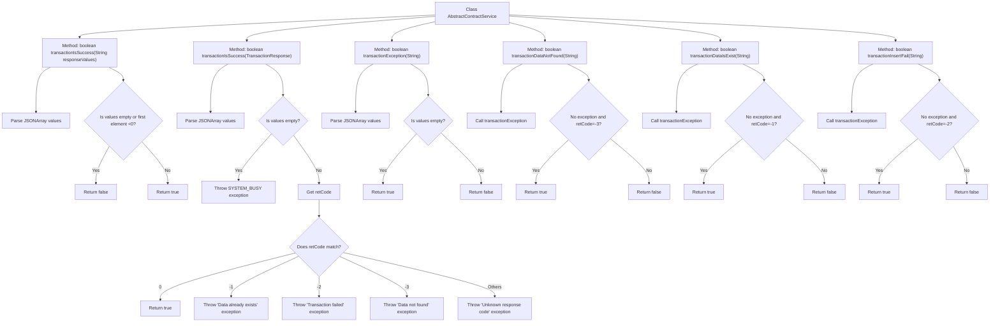

# Basic Information

|      |      |
|------|------|
| Name | AbstractContractService |
| Language | .java |
| Code Path | WeFe/manager/manager-service/src/main/java/com/welab/wefe/manager/service/service/AbstractContractService.java |
| Package Name | com.welab.wefe.manager.service.service |
| Dependencies | ['com.alibaba.fastjson.JSONArray', 'com.welab.wefe.common.StatusCode', 'com.welab.wefe.common.exception.StatusCodeWithException', 'com.welab.wefe.common.util.JObject', 'org.fisco.bcos.sdk.transaction.model.dto.TransactionResponse'] |
| Brief Description | The `AbstractContractService` class provides multiple methods to check the status of blockchain transactions, including success, failure, and the presence or absence of data. It determines the result by parsing JSON response values and throws errors in case of exceptions. |

# Description

The `AbstractContractService` class provides multiple methods for checking blockchain transaction execution results. Its primary functionalities include determining whether a transaction succeeded, handling transaction exceptions, and detecting specific error states. The `transactionIsSuccess` method has two overloaded versions: one directly parses the response string, while the other processes a `TransactionResponse` object and throws exceptions for different error codes. Additional helper methods can detect specific scenarios such as non-existent data, pre-existing data, and insertion failures. All methods perform checks by parsing JSON-formatted response values, ensuring the accuracy and comprehensiveness of transaction status verification.

# Class Summary

| Name   | Type  | Description |
|-------|------|-------------|
| AbstractContractService | class | The AbstractContractService class provides multiple methods to check the status of blockchain transactions, including success, exceptions, non-existent data, existing data, and insertion failures, by parsing JSON response values to determine the results. |

## Class AbstractContractService

|      |      |
|------|------|
| Access Modifier | public |
| Type | class |
| Name | AbstractContractService |
| Description | The AbstractContractService class provides multiple methods to check the status of blockchain transactions, including success, exceptions, non-existent data, existing data, and insertion failures, by parsing JSON response values to determine the results. |

### UML Class Diagram

Class Diagram Description:
AbstractContractService is an abstract class that provides multiple transaction state judgment methods, primarily handling blockchain transaction response results. It depends on the TransactionResponse interface to obtain transaction data and processes exceptions through StatusCodeWithException. The core functionalities of this class include: determining whether a transaction is successful, checking if data exists, handling insertion failure scenarios, etc. All methods parse JSON-formatted response values, throwing specific exceptions or returning boolean results based on different error codes.

### Internal Method Call Graph

This flowchart illustrates the logical flows of multiple transaction status judgment methods in the AbstractContractService class. The core method transactionIsSuccess has two overloaded versions handling string responses and TransactionResponse objects respectively, while other methods like transactionDataNotFound rely on transactionException for basic validation. All methods parse JSON response data and check specific status codes to determine transaction states across scenarios, including normal success, data existence, transaction failure, etc. The exception handling flow throws system busy exceptions with status codes.

### Field List

| Name  | Type  | Description |
|-------|-------|------|

### Method List

| Name  | Type  | Description |
|-------|-------|------|
| transactionIsSuccess | boolean | Check if the response value is a valid JSON array and its first element is non-negative. Return success if satisfied, otherwise return failure. |
| transactionIsSuccess | boolean | Check if the transaction response is successful: Parse the JSON array, where a return code of 0 indicates success, and non-zero codes throw corresponding exceptions (data already exists, transaction failed, data does not exist, or unknown error). |
| transactionDataNotFound | boolean | Check if the response data indicates no transaction data found: return true when non-exceptional and the first value is -3. |
| transactionDataIsExist | boolean | Check if transaction data exists: Parse the JSON array to confirm there are no exceptions and the first element is -1. |
| transactionException | boolean | Check if the response value is an invalid JSON array, and return true if it is empty or null. |
| transactionInsertFail | boolean | Check transaction insertion failure: Return true when parsing a JSON array, if it's a non-transactional exception and the first element is -2. |

