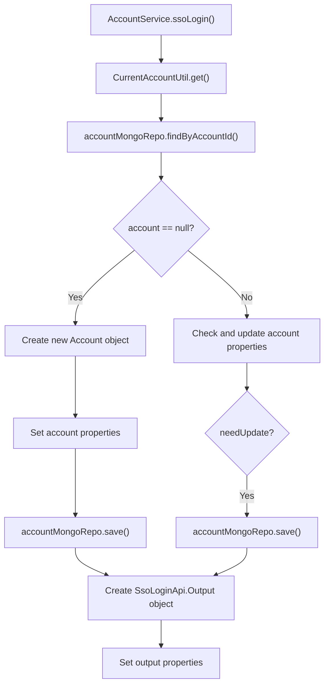

# Basic Information

|      |      |
|------|------|
| Name | AccountService |
| Language | .java |
| Code Path | WeFe/manager/manager-service/src/main/java/com/welab/wefe/manager/service/service/AccountService.java |
| Package Name | com.welab.wefe.manager.service.service |
| Dependencies | ['com.welab.wefe.common.SecurityUtil', 'com.welab.wefe.common.data.mongodb.entity.manager.Account', 'com.welab.wefe.common.data.mongodb.repo.AccountMongoRepo', 'com.welab.wefe.common.exception.StatusCodeWithException', 'com.welab.wefe.common.util.Sha1', 'com.welab.wefe.common.util.StringUtil', 'com.welab.wefe.common.web.service.account.SsoAccountInfo', 'com.welab.wefe.common.web.util.CurrentAccountUtil', 'com.welab.wefe.common.web.util.DatabaseEncryptUtil', 'com.welab.wefe.common.wefe.enums.AuditStatus', 'com.welab.wefe.manager.service.api.account.SsoLoginApi', 'org.springframework.beans.factory.annotation.Autowired', 'org.springframework.stereotype.Service', 'org.springframework.transaction.annotation.Transactional', 'java.util.Date', 'java.util.UUID'] |
| Brief Description | The AccountService class provides SSO login functionality, checks and creates or updates account information, and returns output containing ID, token, phone number, and nickname. It uses MongoDB to store account data, ensuring data consistency and encryption security. |

# Description

The content describes a Spring service class named AccountService, designed to handle Single Sign-On (SSO) functionality. The service class utilizes MongoDB to store account information and ensures operational consistency through transaction management. Key logic includes: checking whether an account exists, creating a new account with initial attributes (such as encrypted phone number, random password salt, etc.) if it does not exist; or updating account details (such as nickname, phone number, email, etc.) if it exists. Finally, it returns a login output object containing the user ID, token, phone number, and nickname. The entire process involves data encryption, state management, and field validation.

# Class Summary

| Name   | Type  | Description |
|-------|------|-------------|
| AccountService | class | The AccountService class provides SSO login functionality, storing account information in MongoDB. If the account does not exist, it creates a new account and sets initial attributes; if it exists, it updates inconsistent nicknames, phone numbers, and emails. Finally, it returns an output object containing the account ID, token, phone number, and nickname. |


## Class AccountService

|      |      |
|------|------|
| Access Modifier | @Service;@Transactional(transactionManager = "transactionManagerManager", readOnly = true, rollbackFor = Exception.class);public |
| Type | class |
| Name | AccountService |
| Description | The AccountService class provides SSO login functionality, storing account information in MongoDB. If the account does not exist, it creates a new account and sets initial attributes; if it exists, it updates inconsistent nicknames, phone numbers, and emails. Finally, it returns an output object containing the account ID, token, phone number, and nickname. |


### UML Class Diagram

```mermaid
classDiagram
    class AccountService {
        -AccountMongoRepo accountMongoRepo
        +ssoLogin() SsoLoginApi$Output
    }

    class AccountMongoRepo {
        +findByAccountId(String id) Account
        +save(Account account) Account
    }

    class Account {
        -String accountId
        -String phoneNumber
        -String salt
        -String password
        -String nickname
        -String email
        -boolean superAdminRole
        -boolean adminRole
        -AuditStatus auditStatus
        -boolean enable
        -boolean cancelled
        -boolean needUpdatePassword
        -Date lastActionTime
        -String updatedBy
        -long updateTime
        +setter/getter methods...
    }

    class SsoLoginApi$Output {
        -String id
        -String token
        -String phoneNumber
        -String nickname
        +setter/getter methods...
    }

    class CurrentAccountUtil {
        <<Utility>>
        +get() SsoAccountInfo
    }

    class SsoAccountInfo {
        -String id
        -String phoneNumber
        -String name
        -String email
        +setter/getter methods...
    }

    AccountService --> AccountMongoRepo : Dependency
    AccountService --> CurrentAccountUtil : Invoke
    AccountService --> SsoLoginApi$Output : Create
    AccountMongoRepo --> Account : Operate
    CurrentAccountUtil --> SsoAccountInfo : Return
```

This code illustrates the implementation of an SSO login service AccountService, which interacts with the Account entity in MongoDB via AccountMongoRepo and retrieves current account information through the CurrentAccountUtil utility class. When an account does not exist, it creates a new one; when it exists, it updates the account information, ultimately returning an SsoLoginApi.Output object containing login details. The entire process involves account validation, encrypted storage, and status management functionalities.


### Internal Method Call Graph



This code represents the `ssoLogin` method in the `AccountService` class, which primarily handles single sign-on logic. It first retrieves the current account information, then queries whether the account exists in MongoDB. If it doesn't exist, a new account is created and saved; if it exists, the account information is checked and updated. Finally, it constructs and returns an output object containing the account information. The entire process includes account creation, updating, and querying operations, with conditional judgments for various property updates.

### Field List

| Name  | Type  | Description |
|-------|-------|------|
| accountMongoRepo | AccountMongoRepo | Using @Autowired to automatically inject an instance of AccountMongoRepo. |

### Method List

| Name  | Type  | Description |
|-------|-------|------|
| ssoLogin | SsoLoginApi.Output | To implement single sign-on functionality, if the account does not exist, create a new account and set its attributes; if it exists, update inconsistent information. Finally, return an output object containing the ID, token, phone number, and nickname. |


