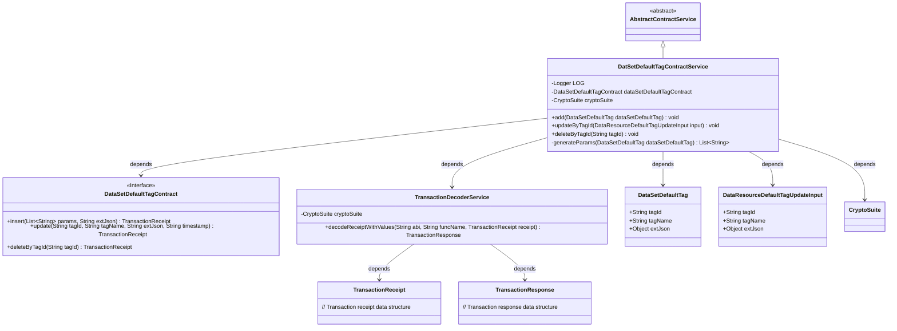
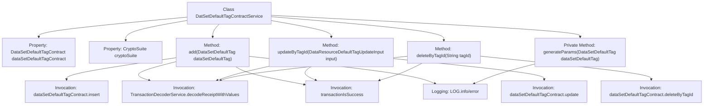

# Basic Information

|      |      |
|------|------|
| Name | DatSetDefaultTagContractService |
| Language | .java |
| Code Path | WeFe/manager/manager-service/src/main/java/com/welab/wefe/manager/service/service/DatSetDefaultTagContractService.java |
| Package Name | com.welab.wefe.manager.service.service |
| Dependencies | ['com.welab.wefe.common.StatusCode', 'com.welab.wefe.common.data.mongodb.entity.union.DataSetDefaultTag', 'com.welab.wefe.common.exception.StatusCodeWithException', 'com.welab.wefe.common.util.DateUtil', 'com.welab.wefe.common.util.JObject', 'com.welab.wefe.common.util.StringUtil', 'com.welab.wefe.manager.service.contract.DataSetDefaultTagContract', 'com.welab.wefe.manager.service.dto.tag.DataResourceDefaultTagUpdateInput', 'org.fisco.bcos.sdk.crypto.CryptoSuite', 'org.fisco.bcos.sdk.model.TransactionReceipt', 'org.fisco.bcos.sdk.transaction.codec.decode.TransactionDecoderService', 'org.fisco.bcos.sdk.transaction.model.dto.TransactionResponse', 'org.slf4j.Logger', 'org.slf4j.LoggerFactory', 'org.springframework.beans.factory.annotation.Autowired', 'org.springframework.stereotype.Service', 'java.util.ArrayList', 'java.util.Date', 'java.util.List'] |
| Brief Description | The DatSetDefaultTagContractService provides functionalities for adding, deleting, and modifying default dataset tags through smart contract operations, including transaction processing, logging, and exception handling. |

# Description

The DatSetDefaultTagContractService is a service class that inherits from AbstractContractService, designed to manage contract operations for dataset default tags. It includes three primary methods: `add` for adding new tags, `updateByTagId` for updating tag information, and `deleteByTagId` for removing tags. Each method sends transactions and processes transaction receipts, utilizing TransactionDecoderService to decode responses and verify transaction success. The class incorporates logging and exception handling to ensure traceability and error management. The `generateParams` method is used to generate the parameter lists required for tag operations.

# Class Summary

| Name   | Type  | Description |
|-------|------|-------------|
| DatSetDefaultTagContractService | class | The DatSetDefaultTagContractService provides functionalities for adding, deleting, and modifying default dataset tags through blockchain transactions, including exception handling and logging. |

## Class DatSetDefaultTagContractService

|      |      |
|------|------|
| Access Modifier | @Service;public |
| Type | class |
| Name | DatSetDefaultTagContractService |
| Description | The DatSetDefaultTagContractService provides functionalities for adding, deleting, and modifying default dataset tags through blockchain transactions, including exception handling and logging. |

### UML Class Diagram

This code implements a blockchain-based dataset default tag contract service, inheriting from an abstract contract service class. Its main functionalities include adding, updating, and deleting dataset default tags by invoking smart contract interfaces to execute blockchain transactions, with transaction decoding services used to parse transaction receipts. The class diagram illustrates the dependency relationships between the service class and smart contract interfaces, cryptographic suites, data models, and transaction processing components, reflecting the layered architecture characteristics of blockchain applications.

### Internal Method Call Graph

This code represents the implementation of the DatSetDefaultTagContractService class, which inherits from AbstractContractService. Its primary functionalities include adding (add), updating (updateByTagId), and deleting (deleteByTagId) dataset default tags, as well as generating parameter lists (generateParams). Each operation invokes smart contract methods, decodes transaction receipts via TransactionDecoderService, and ultimately verifies transaction success. The process involves logging and handles potential exceptions. All operations follow blockchain transaction processing workflows, including parameter generation, contract invocation, receipt decoding, and result verification steps.

### Field List

| Name  | Type  | Description |
|-------|-------|------|
| LOG = LoggerFactory.getLogger(DatSetDefaultTagContractService.class) | Logger | The class DatSetDefaultTagContractService defines a static immutable log object LOG. |
| cryptoSuite | CryptoSuite | Use @Autowired to automatically inject an instance of the CryptoSuite encryption tool. |
| dataSetDefaultTagContract | DataSetDefaultTagContract | Default label contract instance for auto-injected datasets. |

### Method List

| Name  | Type  | Description |
|-------|-------|------|
| add | void | This method is used to add default dataset labels by invoking the contract to insert data, processing transaction receipts and checking results, while capturing exceptions and logging them. |
| updateByTagId | void | The method updateByTagId updates tag information via a smart contract, processes transaction receipts, and checks the result, throwing an exception upon failure. |
| deleteByTagId | void | This method deletes dataset tags by tagId, invokes the smart contract and parses the transaction receipt, throwing an exception upon failure. |
| generateParams | List<String> | Method for generating parameter list: Accepts a DataSetDefaultTag object and returns a string list containing tag ID, name, and two current timestamps. |

