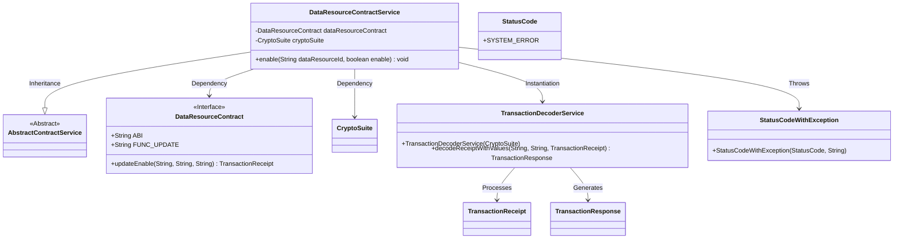
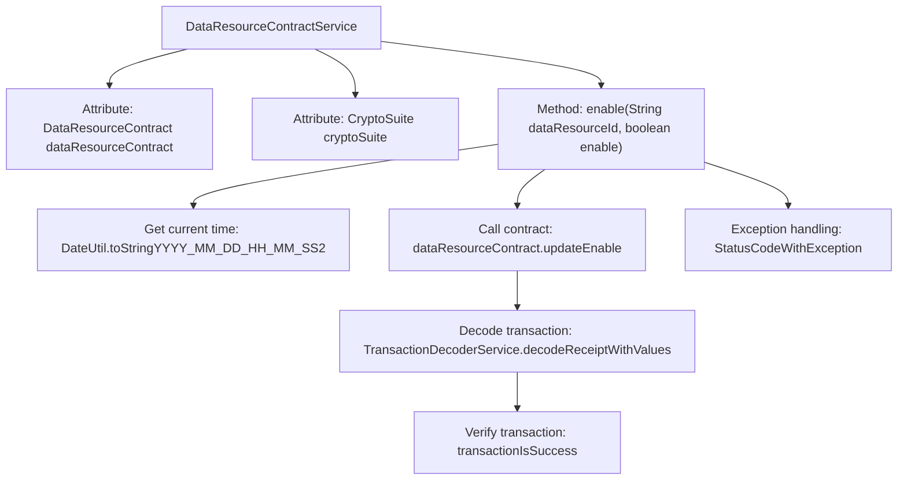

# Basic Information

|      |      |
|------|------|
| Name | DataResourceContractService |
| Language | .java |
| Code Path | WeFe/manager/manager-service/src/main/java/com/welab/wefe/manager/service/service/DataResourceContractService.java |
| Package Name | com.welab.wefe.manager.service.service |
| Dependencies | ['com.welab.wefe.common.StatusCode', 'com.welab.wefe.common.exception.StatusCodeWithException', 'com.welab.wefe.common.util.DateUtil', 'com.welab.wefe.manager.service.contract.DataResourceContract', 'org.fisco.bcos.sdk.crypto.CryptoSuite', 'org.fisco.bcos.sdk.model.TransactionReceipt', 'org.fisco.bcos.sdk.transaction.codec.decode.TransactionDecoderService', 'org.fisco.bcos.sdk.transaction.model.dto.TransactionResponse', 'org.springframework.beans.factory.annotation.Autowired', 'org.springframework.stereotype.Service', 'java.util.Date'] |
| Brief Description | The DataResourceContractService class updates the data resource activation status via smart contracts, processes transaction receipts, and checks the results, throwing a system error in case of exceptions. |

# Description

The content describes a service class named DataResourceContractService, which inherits from AbstractContractService. It injects two dependencies, DataResourceContract and CryptoSuite, via @Autowired. The class includes an enable method for updating the enabled status of a data resource. This method takes the data resource ID and an enable flag as parameters, constructs a timestamp for the update, invokes the smart contract to update the status, and processes the transaction receipt to verify whether the operation was successful. If an exception occurs, it throws a StatusCodeWithException with a system error message. The entire process involves date formatting, smart contract interaction, and transaction result decoding.

# Class Summary

| Name   | Type  | Description |
|-------|------|-------------|
| DataResourceContractService | class | The DataResourceContractService class updates the data resource activation status via smart contracts, processes transaction receipts, and checks the results, throwing a system error in case of exceptions. |

## Class DataResourceContractService

|      |      |
|------|------|
| Access Modifier | @Service;public |
| Type | class |
| Name | DataResourceContractService |
| Description | The DataResourceContractService class updates the data resource activation status via smart contracts, processes transaction receipts, and checks the results, throwing a system error in case of exceptions. |

### UML Class Diagram

This code represents a blockchain-based data resource contract service class, primarily designed to update the enablement status of data resources through smart contracts. The class diagram illustrates that DataResourceContractService inherits from AbstractContractService and relies on DataResourceContract and CryptoSuite to execute blockchain transactions. When the enable method is invoked, it creates a transaction receipt and decodes the response via TransactionDecoderService, throwing a StatusCodeWithException if an error occurs. The entire process involves blockchain transaction handling, response decoding, and exception management mechanisms.

### Internal Method Call Graph

This flowchart illustrates the execution process of the core method `enable` in the `DataResourceContractService` class. The method first obtains the current time as a timestamp, then invokes the smart contract to update the data resource status, followed by parsing the blockchain transaction receipt through the transaction decoding service, and finally verifies whether the transaction was successful. The entire process includes an exception handling mechanism, where any step failure will throw a `StatusCodeWithException` containing error information. The flow clearly reflects the typical processing sequence of blockchain smart contract calls, encompassing key stages such as transaction initiation, receipt parsing, and status verification.

### Field List

| Name  | Type  | Description |
|-------|-------|------|
| cryptoSuite | CryptoSuite | Automatically inject cipher suite instances. |
| dataResourceContract | DataResourceContract | Automatically inject the DataResourceContract instance. |

### Method List

| Name  | Type  | Description |
|-------|-------|------|
| enable | void | The method `enable` updates the data resource activation status via blockchain contracts, processes transaction receipts, and checks the results, throwing an exception upon failure. |

